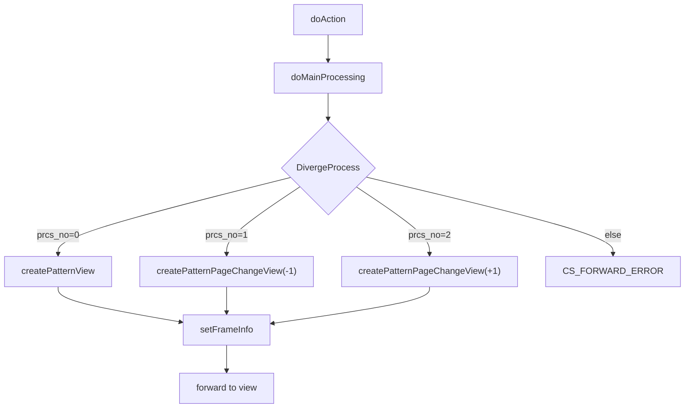

# GKB001S006Controller  

## 1. 概要  
`GKB001S006Controller` は **学齢簿（学生名簿）表示** を行う Web 層のコントローラです。  
Spring MVC の `@Controller` として登録され、`BaseSessionSyncController` を継承してセッション同期処理を共通化しています。  

> **対象読者**  
- 本モジュールを初めて触る開発者  
- 学齢簿画面の機能追加・不具合修正を行うエンジニア  

---

## 2. パッケージ・インポート  

| パッケージ | 主な役割 |
|-----------|----------|
| `jp.co.jip.gkb000.app.base` | 基底クラス・ActionForm 系列 |
| `jp.co.jip.gkb000.service.gkb000` | 学齢簿・区域外管理・メッセージ取得サービス |
| `jp.co.jip.gkb000.common.helper` | 画面表示用ヘルパークラス（`GakureiboSyokaiView` など） |
| `jp.co.jip.wizlife.fw.kka000` | 和暦⇔西暦変換ユーティリティ |
| `org.apache.commons.lang3.math.NumberUtils` | 文字列 → 数値変換ユーティリティ |
| `javax.inject.Inject` | DI 用アノテーション |

---

## 3. クラス構成  

```java
@Controller
public class GKB001S006Controller extends BaseSessionSyncController {
    // DI されたサービス
    @Inject GKB000_GetGakureiboJohoService gkb000_GetGakureiboJohoService;
    @Inject GKB000_GetMessageService      gkb000_GetMessageService;
    @Inject GKB000_GetKuikigaiService      gkb000_GetKuikigaiService;
    @Inject GKB000CommonUtil               gkb000CommonUtil;
    @Inject KKA000CommonUtil               kka000CommonUtil;

    private static final String REQUEST_MAPPING_PATH = "/GKB001S006Controller";
    ...
}
```

- **継承元**: `BaseSessionSyncController`（セッションタイムアウト判定・共通フレーム処理を提供）  
- **DI コンポーネント**: 学齢簿取得、メッセージ取得、区域外管理取得、ユーティリティ系  

---

## 4. 主な定数  

| 定数 | 内容 |
|------|------|
| `REQUEST_MAPPING_PATH` | 本コントローラの URL パス（`/GKB001S006Controller`） |

---

## 5. 主要メソッドとフロー  

### 5.1 エントリポイント  

| メソッド | URL | 役割 |
|----------|-----|------|
| `doAction` | `REQUEST_MAPPING_PATH.do` | Spring のハンドラメソッド。`execute` メソッドへ委譲し、`ActionMapping` に基づく処理を実行。 |

### 5.2 メイン処理 (`doMainProcessing`)  

```java
public ModelAndView doMainProcessing(ActionMapping mapping,
                                     ActionForm form,
                                     HttpServletRequest req,
                                     HttpServletResponse res,
                                     ModelAndView mv) throws Exception {
    String strPrcsAns = DivergeProcess(form, req);   // ① 分岐処理
    setFrameInfo(strPrcsAns, form, req, res);       // ② フレーム情報設定
    return mapping.findForward(strPrcsAns).toModelAndView(mv);
}
```

#### 5.2.1 分岐処理 `DivergeProcess`  

| `prcs_no` | 処理内容 |
|-----------|----------|
| `0` | 初期表示 → `createPatternView` |
| `1` | 前履歴ボタン → `createPatternPageChangeView(..., -1)` |
| `2` | 次履歴ボタン → `createPatternPageChangeView(..., +1)` |
| それ以外 | エラー (`CS_FORWARD_ERROR`) |

#### 5.2.2 初期表示 `createPatternView`  

1. **処理日取得** → 和暦→西暦変換  
2. **学齢簿配列取得** `getArrayGakureibo`（サービス呼び出し）  
3. **最新学齢簿を表示用オブジェクトへ変換** `gkb000CommonUtil.setDispDataGakureibo`  
4. **セッション保存**  
   - `GKB_001_02_VECTOR`（学齢簿配列）  
   - `GKB_001_02_VIEW`（表示用オブジェクト）  
5. **成功/エラー** を返す  

#### 5.2.3 履歴ページ遷移 `createPatternPageChangeView`  

- `intPlus` に応じてページ番号を増減  
- 表示用オブジェクトを再生成し、**区域外管理リスト** を取得して `GKB_001_05_VIEW` に保存  

### 5.3 サービス呼び出し  

| メソッド | 呼び出すサービス | 取得データ |
|----------|----------------|------------|
| `getArrayGakureibo` | `GKB000_GetGakureiboJohoService` | 学齢簿 `Vector` |
| `getNewKuikigaiKanri` | `GKB000_GetKuikigaiService` | 区域外管理 `KuikigaiKanriListView` |

### 5.4 フレーム情報設定 `setFrameInfo`  

- 成功時は **戻る** と **再表示** の URL・ターゲットを `ResultFrameInfo` に格納し、`CasConstants.CAS_FRAME_INFO` に保存。  
- 失敗時はボタン無効化。  

### 5.5 エラーハンドリング `setError`  

1. エラー番号リストを作成 → `GKB000_GetMessageService` でメッセージ取得  
2. `ErrorMessageForm` に格納し、`setModelMessage` で画面に表示  
3. `CS_FORWARD_ERROR` を返す  

---

## 6. セッションキー一覧  

| キー | 内容 |
|------|------|
| `GKB_001_02_VECTOR` | 学齢簿配列 (`Vector`) |
| `GKB_001_02_VIEW`   | 学齢簿表示オブジェクト (`GakureiboSyokaiView`) |
| `GKB_001_05_VIEW`   | 区域外管理表示オブジェクト (`KuikigaiKanriListView`) |
| `GKB_SCREENHISTORY` | 画面遷移履歴 (`ArrayList`) |
| `GKB_DSPRIREKI`     | 履歴文字列（画面表示用） |
| `CasConstants.CAS_FRAME_INFO` | フレーム制御情報 (`ResultFrameInfo`) |
| `KyoikuConstants.CS_INPUT_PROCESSDATE` | 処理日（和暦文字列） |

---

## 7. 処理フロー（Mermaid）  



---

## 8. 変更・拡張時の留意点  

| 項目 | 注意点 |
|------|--------|
| **セッションキー** | キー名は他クラスと衝突しやすい。追加・変更時は全体検索 (`grep`) で影響範囲を確認。 |
| **履歴ページング** | `Vector` のインデックスは 0 基準。`intPage` が 1 基準で計算されている点に注意。 |
| **和暦⇔西暦変換** | `KKA000CommonUtil.getWareki2Seireki` が例外を投げる可能性あり。入力形式が不正な場合の例外ハンドリングを追加すると堅牢になる。 |
| **エラーメッセージ取得** | `setError` はメッセージ取得に外部サービスを呼び出すため、ネットワーク障害時のフォールバックが無い。必要に応じてキャッシュやデフォルトメッセージを検討。 |
| **DI コンポーネント** | 新たにサービスを追加する場合は `@Inject` の順序・スコープに注意。テスト時はモック化が必須。 |
| **テスト** | `doMainProcessing` の分岐ロジックはユニットテストで `prcs_no` の全パターンを網羅すべき。セッション操作は `MockHttpServletRequest` で代替可能。 |

---

## 9. 関連 Wiki へのリンク例  

```markdown
[createPatternView](http://localhost:3000/projects/test_new/wiki?file_path=code/java/Controller_GKB001S006Controller.java#L150)
[setError](http://localhost:3000/projects/test_new/wiki?file_path=code/java/Controller_GKB001S006Controller.java#L720)
```

> **※** `#Lxxx` は行番号を指すアンカーです。実際の Wiki システムがサポートしていれば利用してください。

---

## 10. まとめ  

`GKB001S006Controller` は学齢簿の表示・履歴遷移を担う中心的なコントローラです。  
- **分岐ロジック** (`DivergeProcess`) が処理の入口  
- **サービス呼び出し** でデータ取得、**ヘルパークラス** で画面用 DTO に変換  
- **セッション** に複数のオブジェクトを格納し、フレーム情報で戻り・再表示を制御  

この構造を把握すれば、画面項目の追加、履歴ロジックの変更、エラーメッセージのローカライズなどの拡張がスムーズに行えます。  

---  

*本 Wiki は日本語で記述し、Markdown と Mermaid による可視化を採用しています。*