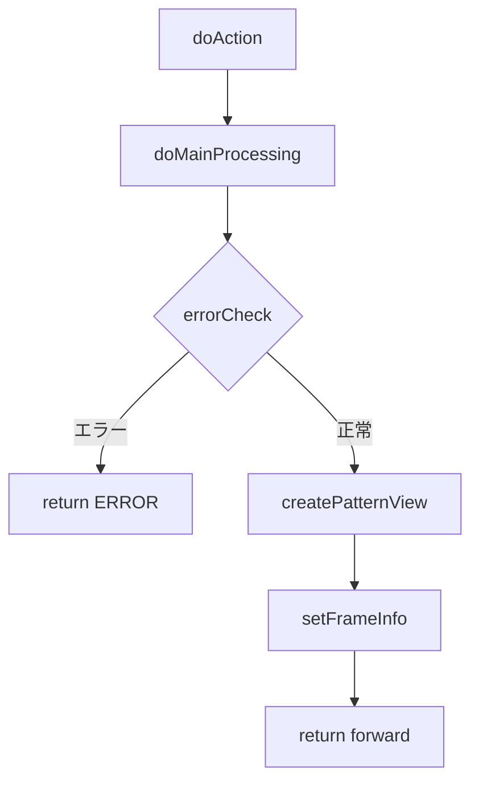

# GKB002S003HogosyaSetaiListController Wiki  

**ファイルパス**  
`/projects/test_new/code/java/Controller_GKB002S003HogosyaSetaiListController.java`

---

## 目次
1. [概要](#概要)  
2. [エントリーポイント](#エントリーポイント)  
3. [主要フロー](#主要フロー)  
4. [主要メソッド解説](#主要メソッド解説)  
5. [画面制御情報の設定](#画面制御情報の設定)  
6. [セッション管理](#セッション管理)  
7. [エラーハンドリング](#エラーハンドリング)  
8. [外部依存コンポーネント](#外部依存コンポーネント)  
9. [設計上の留意点・改善ポイント](#設計上の留意点改善ポイント)  

---

## 概要
`GKB002S003HogosyaSetaiListController` は、**保護者情報一覧画面** を表示する Spring MVC コントローラです。  
学齢簿（子どもの情報）から対象保護者（16 歳以上）を抽出し、ページング付きで画面に渡します。  
画面遷移は `BaseSessionSyncController` を継承し、セッション同期処理を共通化しています。

---

## エントリーポイント
| URL | メソッド | 説明 |
|-----|----------|------|
| `/GKB002S003HogosyaSetaiListController.do` | `doAction` | Spring の `@RequestMapping` により呼び出され、`execute` → `doMainProcessing` へ委譲 |

```java
@RequestMapping(REQUEST_MAPPING_PATH + ".do")
@Override
public ModelAndView doAction(@ModelAttribute(MODELATTRIBUTE_NAME) ActionForm form,
                             HttpServletRequest request,
                             HttpServletResponse response,
                             ModelAndView mv) throws Exception {
    return this.execute(
        actionMappingConfigContext.getActionMappingByPath(REQUEST_MAPPING_PATH),
        form, request, response, mv);
}
```

---

## 主要フロー


1. **`doAction`** → `execute`（`BaseSessionSyncController` の共通ロジック）  
2. **`doMainProcessing`**  
   - `errorCheck` でセッション・タイムアウト等を検証  
   - 正常なら `createPatternView` で保護者情報を加工  
   - 加工結果をセッションに格納し、`setFrameInfo` でフレーム情報（戻る/再表示リンク）を設定  
   - `forward`（`success` / `error`）を `ActionMapping` に渡して画面遷移  

---

## 主要メソッド解説

### `createPatternView(ActionForm frm, HttpServletRequest req)`
- **目的**: 学齢簿から対象保護者情報を取得し、ページング用データ構造を作成してセッションに保存する。  
- **主な処理**  
  1. 学齢簿配列 (`GKB_011_01_VECTOR`) と表示情報 (`GKB_011_01_VIEW`) を取得  
  2. 現在表示中の学齢簿エントリを取得し、対象保護者（16 歳以上）を `getArraySetaiList` で抽出  
  3. ページング計算（`intMaxRow`, `intPageCount`, `intRowStart` など）  
  4. 取得した保護者情報を `HogosyaListView` に変換し、表示用配列 `arrayHogosyaDisp` に格納  
  5. 前/次ページボタン、ページコンボボックスの有効/無効状態を `HogosyaListParaView` に設定  
  6. すべての結果をセッションキー `GKB_000_03_VECTOR`, `GKB_000_03_VIEW`, `GKB_000_03_CONTROL` に保存  

### `setDispDataSetai(SetaiList setaiList, int intRow)`
- **目的**: 1 件の世帯情報 (`SetaiList`) を画面表示用 DTO (`HogosyaListView`) にマッピング。  
- **ポイント**  
  - `nullToSpace` 系ユーティリティで NPE 回避  
  - 性別・生年月日・住所等は共通ヘルパ (`gkb000CommonUtil`, `kka000CommonUtil`) で整形  
  - 班名は `gaa000CommonDao.editHan` で加工  

### `getArraySetaiList(HttpServletRequest req, long lngKojinNo, String strProcessDay)`
- **目的**: 指定個人番号（子ども）に紐づく世帯情報を取得し、16 歳以上の保護者だけを抽出。  
- **実装**  
  - `GKB000_GetSetaiJohoService` の `perform` で全世帯情報取得  
  - `CommonFunction.getOver16JudgmentDay` で年齢判定（処理日基準）  

### `errorCheck(HttpServletRequest req)`
- **チェック項目**  
  1. セッションタイムアウト  
  2. 学齢簿配列・表示情報の有無  
  3. 処理日 (`CS_INPUT_PROCESSDATE`) の有無・有効性  

### `setFrameInfo(String forward, ActionForm frm, HttpServletRequest request, HttpServletResponse response)`
- **目的**: 画面フレーム情報（戻る・再表示リンク）を `ResultFrameInfo` に設定し、セッション `CAS_FRAME_INFO` に格納。  
- **成功時**:  
  - 戻るリンク → `GKB001S001Controller.do`（保護者検索画面）  
  - 再表示リンク → `GKB002S002HogosyaSetaiListChangeController.do`（一覧変更画面）  
- **失敗時**: 両リンクを空にし、ボタン非活性化  

### `setError(HttpServletRequest req, int intErrorNo)`
- **目的**: エラーメッセージ取得サービス (`GKB000_GetMessageService`) を呼び出し、`ErrorMessageForm` に格納して画面に表示。  

---

## 画面制御情報の設定
- **クラス**: `ResultFrameInfo`（`jp.co.jip.wizlife.fw.bean.view`）  
- **キー**: `CasConstants.CAS_FRAME_INFO`（セッション）  
- **使用箇所**: `setFrameInfo`（成功/失敗分岐）  

---

## セッション管理
| キー | 内容 | 生成/取得箇所 |
|------|------|---------------|
| `GKB_011_01_VECTOR` | 学齢簿配列（`Vector<Gakureibo>`） | 前画面から設定 |
| `GKB_011_01_VIEW`   | 学齢簿表示情報 (`GakureiboSyokaiView`) | `createPatternView` で取得 |
| `GKB_000_03_VECTOR` | 保護者（世帯）配列 (`Vector<SetaiList>`) | `getArraySetaiList` |
| `GKB_000_03_VIEW`   | 表示用保護者配列 (`Vector<HogosyaListView>`) | `createPatternView` |
| `GKB_000_03_CONTROL`| 画面制御情報 (`HogosyaListParaView`) | `createPatternView` |
| `GKB_SCREENHISTORY` | 画面遷移履歴 (`ArrayList<ScreenHistory>`) | `setFrameInfo` |
| `GKB_DSPRIREKI`     | 履歴文字列（画面表示用） | `setFrameInfo` |
| `CS_INPUT_PROCESSDATE` | 処理日（文字列） | 前画面から設定 |

---

## エラーハンドリング
- **タイムアウト** → `KyoikuMsgConstants.EQ_ERROR_TIMEOUT`  
- **学齢簿未取得** → `KyoikuMsgConstants.EQ_GAKUREIBO_01`  
- **処理日未設定** → `KyoikuMsgConstants.EQ_GAKUREIBO_67`  
- エラーメッセージは `GKB000_GetMessageService` で取得し、`ErrorMessageForm` に格納して画面に表示。

---

## 外部依存コンポーネント
| コンポーネント | 用途 |
|----------------|------|
| `GKB000_GetSetaiJohoService` | 世帯情報取得（DB 呼び出し） |
| `GKB000_GetMessageService`   | エラーメッセージ取得 |
| `GAA000CommonDao`            | 旧自治体・地区・行政区・班・小中学校区取得 |
| `GKB000CommonUtil`           | セッション操作・ユーティリティ |
| `KKA000CommonUtil`           | 和暦・西暦変換、日付フォーマット |
| `CommonGakureiboIdo`         | 学齢簿画面情報の共通処理 |
| `CommonFunction`             | 文字列操作・年齢判定ロジック |
| `ResultFrameInfo`            | フレーム制御情報（戻る/再表示リンク） |

---

## 設計上の留意点・改善ポイント

| 項目 | 現状 | 改善提案 |
|------|------|----------|
| **ページングロジック** | 手動で `intRowStart`/`intNextRow` を計算し、配列走査 | Spring の `Pageable` もしくは `Slice` を利用すればコードが簡潔になる |
| **ベクタ使用** | `Vector`（スレッドセーフ）を多用 | `ArrayList` に置き換えても問題なければパフォーマンス向上 |
| **エラーハンドリング** | `e.printStackTrace()` のみ | ロガー (`SLF4J` 等) で統一的に出力し、スタックトレースをユーザーに漏らさない |
| **ハードコーディング** | `intMaxRow = KyoikuConstants.CS_HOGOSYALIST_MAXROW` など定数は外部化済みだが、ページサイズ変更はコード修正が必要 | 設定ファイル（`application.yml`）で動的に取得できるようにする |
| **セッションキーの文字列** | 文字列リテラルが散在 | `enum` でキーを管理し、タイプセーフに |
| **日付処理** | `SimpleDateFormat` と `new Date(System.currentTimeMillis())` を直接使用 | `java.time` 系 (`LocalDate`, `DateTimeFormatter`) に置換し、スレッド安全性を確保 |
| **依存注入** | `@Inject` を使用しているが、Spring の `@Autowired` と併用されていない | プロジェクト全体で統一した DI アノテーションに揃える |
| **コメント** | 日本語コメントが多いが、英語ドキュメントが無い | 国際化を考慮し、英語コメント/JavaDoc も併記すると他チームへの共有が容易になる |

---

## 参考リンク
- [GKB002S003HogosyaSetaiListController ソースコード](http://localhost:3000/projects/test_new/wiki?file_path=D:/code-wiki/projects/test_new/code/java/Controller_GKB002S003HogosyaSetaiListController.java)  

---  

*この Wiki は Code Wiki エージェントが自動生成したものです。内容の正確性は必ずコードベースと照らし合わせてご確認ください。*