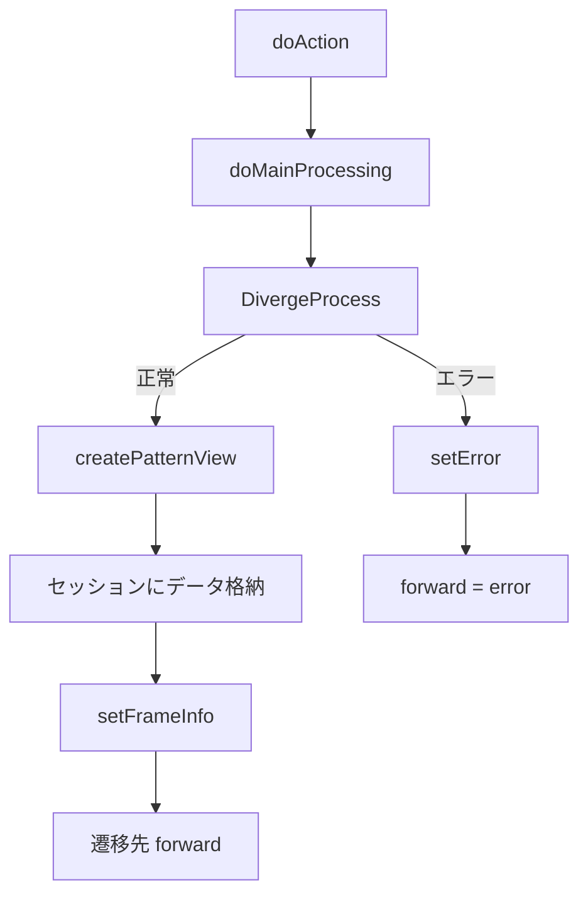

# GKB002S005Controller（就学履歴表示） Wiki

**ファイルパス**  
`D:\code-wiki\projects\test_new\code\java\Controller_GKB002S005Controller.java`

---

## 目次
1. [概要](#概要)  
2. [URL マッピングとエントリーポイント](#url-マッピングとエントリーポイント)  
3. [依存コンポーネント](#依存コンポーネント)  
4. [主要フロー](#主要フロー)  
5. [主要メソッド解説](#主要メソッド解説)  
6. [画面制御情報 (FrameInfo) の設定](#画面制御情報-frameinfo-の設定)  
7. [エラーハンドリング](#エラーハンドリング)  
8. [セッション管理](#セッション管理)  
9. [設計上の留意点・改善ポイント](#設計上の留意点改善ポイント)  
10. [関連クラス・リンク](#関連クラスリンク)  

---

## 概要
`GKB002S005Controller` は **就学履歴** の表示・追加・修正・削除を行う Spring MVC コントローラです。  
`BaseSessionSyncController` を継承し、セッション同期処理を共通化しています。  
画面遷移は `doAction` → `doMainProcessing` → `DivergeProcess` → `createPatternView` の流れで実装されています。

---

## URL マッピングとエントリーポイント
| パス | メソッド | 説明 |
|------|----------|------|
| `/GKB002S005Controller.do` | `doAction` | Spring のエントリーポイント。`actionMappingConfigContext` からマッピング情報を取得し `execute` を呼び出す。 |

```java
@RequestMapping(REQUEST_MAPPING_PATH + ".do")
@Override
public ModelAndView doAction(@ModelAttribute(MODELATTRIBUTE_NAME) ActionForm form,
                             HttpServletRequest request,
                             HttpServletResponse response,
                             ModelAndView mv) throws Exception {
    return this.execute(
        actionMappingConfigContext.getActionMappingByPath(REQUEST_MAPPING_PATH),
        form, request, response, mv);
}
```

---

## 依存コンポーネント
| フィールド | 型 | 用途 |
|------------|----|------|
| `service` | `GKB000_GetWkKuikigaiService` | 区域外管理（就学履歴）データ取得 |
| `messageService` | `GKB000_GetMessageService` | エラーメッセージ取得 |
| `gkb000CommonUtil` | `GKB000CommonUtil` | セッション操作・ユーティリティ |
| `kka000CommonUtil` | `KKA000CommonUtil` | 和暦変換・日付フォーマット |

---

## 主要フロー


1. **`doAction`**  
   - `execute` に委譲し、共通処理（トランザクション、例外ハンドリング等）を実行。

2. **`doMainProcessing`**  
   - `DivergeProcess` で画面モード（表示/追加/修正/削除）を判定。  
   - `setFrameInfo` でフレーム制御情報を設定し、`forward`（`success` / `error`）を決定。

3. **`DivergeProcess`**  
   - `errorCheck` → エラーがあれば即 `error`。  
   - `intMode`（`prcsMode`）に応じて `createPatternView` を呼び出すか、`setError` で不正操作を通知。

4. **`createPatternView`**  
   - 学齢簿情報 (`GakureiboSyokaiView`) を取得し、就学履歴配列 (`Vector`) を生成。  
   - 件数に応じて画面制御情報 (`KuikigaiKanriListParaView`) と表示用データ (`KuikigaiKanriListView`) を作成。  
   - 必要なオブジェクトをセッションに格納。

5. **`setFrameInfo`**  
   - 成功時は「戻る」/「再表示」リンクを設定。失敗時はボタン無効化。

---

## 主要メソッド解説

### `errorCheck(ActionForm frm, HttpServletRequest req)`
- **目的**: 入力・セッション状態の妥当性を検証。  
- **主なチェック項目**  
  - セッションタイムアウト  
  - 必要セッション (`GKB_011_01_VIEW`) が存在しない  
  - `prcsMode` が 0〜5 の範囲外  
  - 更新系（`prcsMode == 5`）で必須項目（就学種別コード、開始日）が未入力  
- **戻り値**: `true` → エラーあり（`setError` が呼ばれる）  

### `createPatternView(HttpServletRequest req, GKB002S005Form sRirekiForm)`
- **流れ**  
  1. 学齢簿情報取得 (`GakureiboSyokaiView`)  
  2. `getKuikigaiKanri` で就学履歴配列取得  
  3. 件数取得 (`getSRirekiCount`)  
  4. 画面制御情報 (`KuikigaiKanriListParaView`) 作成  
  5. 表示用データ (`KuikigaiKanriListView`) 作成  
  6. 必要なオブジェクトをセッションに格納  

### `getKuikigaiKanri(HttpServletRequest req, String kojinNo, String rirekiRenban)`
- **外部サービス呼び出し**: `service.perform(inBean)`  
- **取得データ**: `Vector`（`KuikigaiKanriList`） → `KuikigaiKanriListView` に変換  
- **ダミーデータ**: 件数が 10 の倍数でない場合、空レコードで埋める（画面レイアウト固定のため）。

### `getSRirekiParaView(GakureiboSyokaiView giv, int intCount)`
- **戻り値**: `KuikigaiKanriListParaView`（ボタン有効/無効フラグ）  
- **ロジック**  
  - `intCount == 10` → 追加ボタン無効  
  - `intCount == 0` → 修正・削除ボタン無効  

### `getsRirekiForm(Vector arrayShuRireki, GKB002S005Form sRirekiForm, int intCount)`
- **目的**: 画面表示用の `KuikigaiKanriListView` を生成。  
- **モード別処理**  
  - `prcsMode == 1/2`（追加系） → 空データで初期化  
  - それ以外 → フォームの現在値をそのまま設定  
- **ラベル設定**: `prcsMode` に応じて「追加」「修正」「削除」ラベルを付与。

### `setError(HttpServletRequest req, int errNum)` / `setError(HttpServletRequest req, ArrayList list)`
- **エラーメッセージ取得**: `messageService.perform(inBean)`  
- **結果格納**: `ErrorMessageForm` → `setModelMessage`（親クラス実装）  
- **戻り値**: `KyoikuConstants.CS_FORWARD_ERROR`（`error`）  

---

## 画面制御情報 (FrameInfo) の設定
`setFrameInfo` は **フレーム遷移**（戻る・再表示）を制御します。

| 成功時 (`forward == CS_FORWARD_SUCCESS`) | 失敗時 |
|----------------------------------------|--------|
| `frameReturnAction` → `/GKB002S004GakureiboIdoController.do` | `frameReturnAction` 空 |
| `frameRefreshAction` → `/GKB002S005Controller.do` | `frameRefreshAction` 空 |
| `target` = `_self`, `linktype` = `link` | 同上 |

この情報は `CasConstants.CAS_FRAME_INFO` キーでセッションに保存され、フロントエンドのフレーム制御ロジックが参照します。

---

## エラーハンドリング
1. **入力エラー** → `errorCheck` で検出 → `setError` にエラー番号リストを渡す。  
2. **サービス例外** → `catch (Exception e)` でスタックトレース出力し、`setError` にフォールバック。  
3. **不正操作** (`prcsMode` が範囲外) → `setError` → `error` forward。  

エラーメッセージは `KyoikuMsgConstants` に定義されたコードを使用し、`GKB000_GetMessageService` でローカライズされた文字列に変換されます。

---

## セッション管理
| キー | 内容 | 用途 |
|------|------|------|
| `GKB_011_01_VIEW` | `GakureiboSyokaiView`（学齢簿） | 画面表示元データ |
| `GKB_011_05_VECTOR` | `Vector`（就学履歴配列） | 画面リスト表示 |
| `GKB_011_05_VIEW` | `GKB002S005Form`（現在のフォーム） | 入力保持 |
| `GKB_011_05_CONTROL` | `KuikigaiKanriListParaView`（ボタン制御） | UI 有効/無効 |
| `GKB_PARA_VIEW` | `KuikigaiKanriListView`（表示用データ） | 画面描画 |
| `CAS_FRAME_INFO` | `ResultFrameInfo`（フレーム遷移情報） | 戻る/再表示リンク |

`gkb000CommonUtil` 系ユーティリティで `getSession` / `setSession` / `isSession` / `isTimeOut` をラップしています。

---

## 設計上の留意点・改善ポイント
| 項目 | 現状 | 改善案 |
|------|------|--------|
| **型安全** | `Vector`、`ArrayList`（ジェネリック未使用） | `List<...>` に置き換えてコンパイル時チェックを強化 |
| **例外処理** | `catch (Exception e){ e.printStackTrace(); }` | ロガー (`SLF4J` 等) で統一的に記録し、ユーザー向けメッセージは別途ハンドリング |
| **ハードコーディング** | `if (arrayShuRireki.size() <= 10)` など件数固定 | 定数化 (`PAGE_SIZE = 10`) し、将来的な変更に備える |
| **セッション依存** | 多数のキーが暗黙的に必要 | キー定義クラス (`SessionKeys`) を作り、`enum` で管理 |
| **重複ロジック** | `setError` が2つのオーバーロードでほぼ同一 | 共通ロジックをプライベートメソッドに集約 |
| **テスト容易性** | 直接 `service.perform` を呼び出す | `service` をインタフェース化し、モック注入で単体テストを容易に |
| **日本語コメント** | コメントは日本語だがコードは英語混在 | コメントと変数名を統一（日本語→英語）し、国際化チームでも可読性向上 |

---

## 関連クラス・リンク
| クラス | パッケージ | 説明 |
|--------|------------|------|
| `GKB002S005Form` | `jp.co.jip.gkb0000.app.gkb0020.form` | 画面フォーム |
| `GakureiboSyokaiView` | `jp.co.jip.gkb000.common.helper` | 学齢簿表示用ヘルパ |
| `KuikigaiKanriListView` | `jp.co.jip.gkb000.common.helper` | 就学履歴表示ヘルパ |
| `KuikigaiKanriListParaView` | `jp.co.jip.gkb000.common.helper` | 画面制御情報ヘルパ |
| `GKB000_GetWkKuikigaiService` | `jp.co.jip.gkb000.service.gkb000` | 区域外管理データ取得サービス |
| `GKB000_GetMessageService` | `jp.co.jip.gkb000.service.gkb000` | メッセージ取得サービス |
| `GKB000CommonUtil` | `jp.co.jip.gkb000.common.util` | セッション・ユーティリティ |
| `KKA000CommonUtil` | `jp.co.jip.wizlife.fw.kka000.dao` | 和暦変換・日付フォーマット |

**リンク例**（他 Wiki ページへ）  
```
[Controller_GKB002S005Controller.java](http://localhost:3000/projects/test_new/wiki?file_path=D:/code-wiki/projects/test_new/code/java/Controller_GKB002S005Controller.java)
```

--- 

*本 Wiki は Code Wiki プロジェクトの標準テンプレートに沿って作成されています。変更や追加が必要な場合は、該当ファイルのコメントや設計資料を参照し、適宜更新してください。*