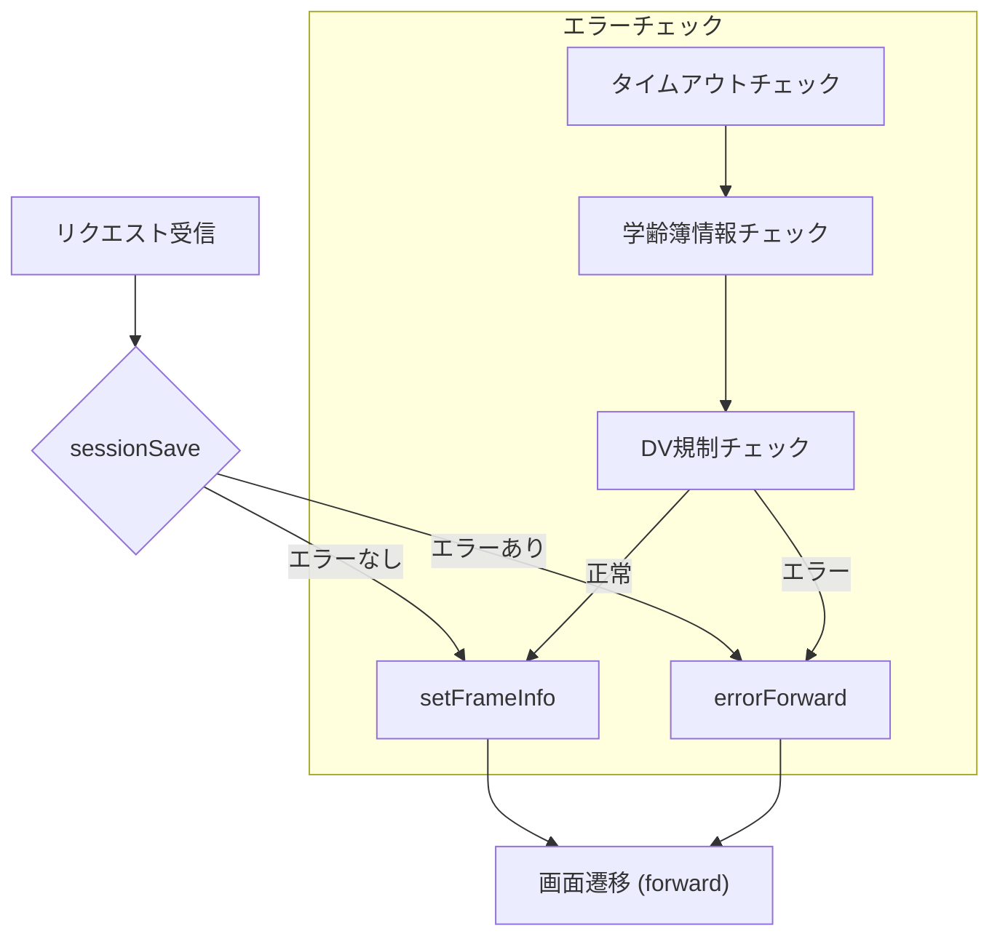

# GakureiboPrintOutController（帳票発行画面コントローラ）

## 1. 概要
`GakureiboPrintOutController` は、学齢簿（学籍情報）に基づく帳票（印刷物）発行画面を表示・制御する Web 層のコントローラです。  
Spring MVC の `@Controller` として登録され、`/GakureiboPrintOutController.do` へのリクエストをハンドリングします。

> **対象読者**  
> - 本モジュールを初めて触る開発者  
> - 既存の帳票発行ロジックを拡張・保守したいエンジニア  

---

## 2. 主な機能
| 機能 | 説明 |
|------|------|
| **画面表示** | 学齢簿情報を元に帳票発行画面を初期化し、必要なセッション情報を設定 |
| **エラーチェック** | セッションタイムアウト、学齢簿情報欠損、DV（データベース）規制チェックを実施 |
| **ログ出力** | 帳票発行操作を監査ログに記録 |
| **画面遷移情報設定** | 「戻る」「再表示」リンクを動的に生成し、フレーム情報に格納 |
| **教育委員会コード取得** | 教育委員会リストを取得し、画面に表示できる形でセッションに保持 |

---

## 3. URL マッピング

| HTTP メソッド | パス | メソッド |
|---------------|------|----------|
| `GET` / `POST` | `/GakureiboPrintOutController.do` | `doAction` → `execute` → `doMainProcessing` |

```java
@RequestMapping(REQUEST_MAPPING_PATH + ".do")
@Override
public ModelAndView doAction(@ModelAttribute(MODELATTRIBUTE_NAME) ActionForm form,
                             HttpServletRequest request,
                             HttpServletResponse response,
                             ModelAndView mv) throws Exception {
    return this.execute(
        actionMappingConfigContext.getActionMappingByPath(REQUEST_MAPPING_PATH),
        form, request, response, mv);
}
```

---

## 4. 依存コンポーネント（DI）

| フィールド | 型 | 用途 |
|------------|----|------|
| `gkb000_GetMessageService` | `GKB000_GetMessageService` | エラーメッセージ取得 |
| `kka000CommonUtil` | `KKA000CommonUtil` | 和暦⇔西暦変換、教育委員会コード取得 |
| `gaa000CommonDao` | `GAA000CommonDao` | 外字登録・DV規制取得 |
| `kka000CommonDao` | `KKA000CommonDao` | 教育委員会・CT情報取得 |
| `gkb000CommonUtil` | `GKB000CommonUtil` | セッション操作・ユーティリティ |

---

## 5. 主要メソッドの流れ

### 5.1 `doMainProcessing`
1. **セッション保存** → `sessionSave`  
2. **フレーム情報設定** → `setFrameInfo`  
3. **遷移先決定** → `mapping.findForward(strPrcsAns)`

```java
String strPrcsAns = sessionSave(frm, req);
setFrameInfo(strPrcsAns, frm, req, res);
return (mapping.findForward(strPrcsAns)).toModelAndView(mv);
```

### 5.2 `sessionSave`
- **エラーチェック** (`errorCheck`) → エラーがあれば画面遷移を変更  
- **学齢簿情報取得** (`GakureiboSyokaiView` をセッションから取得)  
- **学齢簿情報の初期化**（処理モード・帳票選択番号等）  
- **外字登録情報取得** (`gaa000CommonDao.getGaijiMitouroku`)  
- **帳票発行情報 (`PrintOutView`) の初期化**  
- **教育委員会コード取得**（`KKA000CommonDao.getCtList` → `CodeHelper` でリスト化）  
- **監査ログ作成** (`createLog`)  
- **成功コード返却** (`KyoikuConstants.CS_FORWARD_SUCCESS`)

### 5.3 `errorCheck`
| チェック項目 | 判定ロジック |
|--------------|--------------|
| セッションタイムアウト | `gkb000CommonUtil.isTimeOut(req)` |
| 学齢簿情報欠損 | `gkb000CommonUtil.isSession(req, "GKB_011_01_VIEW")` |
| DV規制（保護者・児童） | `gaa000CommonDao.getDVShikaku` → 区分に応じて警告/エラー設定 |

### 5.4 `setFrameInfo`
- 成功時は **戻る** と **再表示** の URL を動的生成し、`ResultFrameInfo` に格納  
- 失敗時はボタンを無効化  
- 画面履歴 (`ScreenHistory`) と表示文字列 (`GKB_DSPRIREKI`) をセッションに保存  

---

## 6. ログ出力

```java
private int createLog(String kojinNo, String setaiNo,
                      int shiyoKbn, int naiyoKbn,
                      String dokujiCode,
                      HttpServletRequest request) {
    try {
        kka000CommonDao.accessLog("GKB", dokujiCode, naiyoKbn,
                                 kojinNo, setaiNo,
                                 null, dokujiCode, "00");
    } catch (Exception e) {
        e.printStackTrace();
    }
    return 0;
}
```

- **目的**：帳票発行操作の監査証跡を残す  
- **変更履歴**：2024/09/10 に `Long` → `String` へパラメータ型変更（新 WizLIFE2 次開発対応）

---

## 7. エラーメッセージ取得

`setError` は `GKB000_GetMessageService` を呼び出し、取得したエラーメッセージ・警告メッセージを `ErrorMessageForm` に格納し、モーダルダイアログとして画面に表示します。

```java
GKB000_GetMessageInBean inBean = new GKB000_GetMessageInBean();
inBean.setMessageNoList(list);
GKB000_GetMessageOutBean res = gkb000_GetMessageService.perform(inBean);
```

---

## 8. 重要な定数・ヘルパークラス

| クラス/定数 | 用途 |
|------------|------|
| `KyoikuConstants` | 画面遷移コード、セッションキー、処理日フォーマット |
| `KyoikuMsgConstants` | エラー・警告メッセージ番号 |
| `CommonGakureiboIdo` | 学齢簿情報の共通処理（`setGakureiboPara` 等） |
| `PrintOutView` | 帳票発行画面で使用する日付情報等を保持 |
| `CodeHelper` | 教育委員会コード（コード・名称）を保持する DTO |

---

## 9. 変更履歴（抜粋）

| 日付 | 担当 | 内容 |
|------|------|------|
| 2024/09/10 | zczl.cuicy | 新 WizLIFE2 次開発に伴うパラメータ型変更、ログ呼び出し修正 |
| 2024/11/11 | ZCZL.wangyibo | DV規制取得ロジックを `GetDVShikakuParam` に置換（故障対応） |
| 2023/12/15 | ZCZL.LIUFANGYUAN | 初版リリース（GKB_0.2.000.000） |

---

## 10. 処理フロー（Mermaid）



---

## 11. 参照リンク（Wiki 形式）

- **`GakureiboPrintOutForm`**  
  [GakureiboPrintOutForm](http://localhost:3000/projects/test_new/wiki?file_path=code/java/form/GakureiboPrintOutForm.java)

- **`GakureiboSyokaiView`**  
  [GakureiboSyokaiView](http://localhost:3000/projects/test_new/wiki?file_path=common/helper/GakureiboSyokaiView.java)

- **`PrintOutView`**  
  [PrintOutView](http://localhost:3000/projects/test_new/wiki?file_path=helper/PrintOutView.java)

---

## 12. 今後の改善ポイント

| 項目 | 現状 | 改善案 |
|------|------|--------|
| **例外ハンドリング** | `catch (Exception e){ e.printStackTrace(); }` が散在 | 共通例外ハンドラへ委譲し、ログ出力とユーザ通知を統一 |
| **DI のスコープ** | `@Inject` でフィールドインジェクション | コンストラクタインジェクションへ変更し、テスト容易性向上 |
| **ハードコーディング** | `"GKB"`、`"00HAKKO"` 等が文字列リテラル | 定数クラスに集約し、変更時の影響範囲を限定 |
| **セッションキーの管理** | 文字列リテラルで直接使用 | `enum` または `Constants` に統一し、タイプセーフに |
| **ロジック分割** | `sessionSave` が 300 行超 | 学齢簿取得、外字取得、教育委員会取得等を別サービスへ切り出し |

---

> **まとめ**  
`GakureiboPrintOutController` は帳票発行画面のエントリーポイントとして、学齢簿情報の取得・整形・エラーチェック・画面遷移情報設定を一手に担っています。コードは比較的凝縮されているため、上記の改善ポイントを踏まえてリファクタリングすると、保守性・テスト容易性が大幅に向上します。