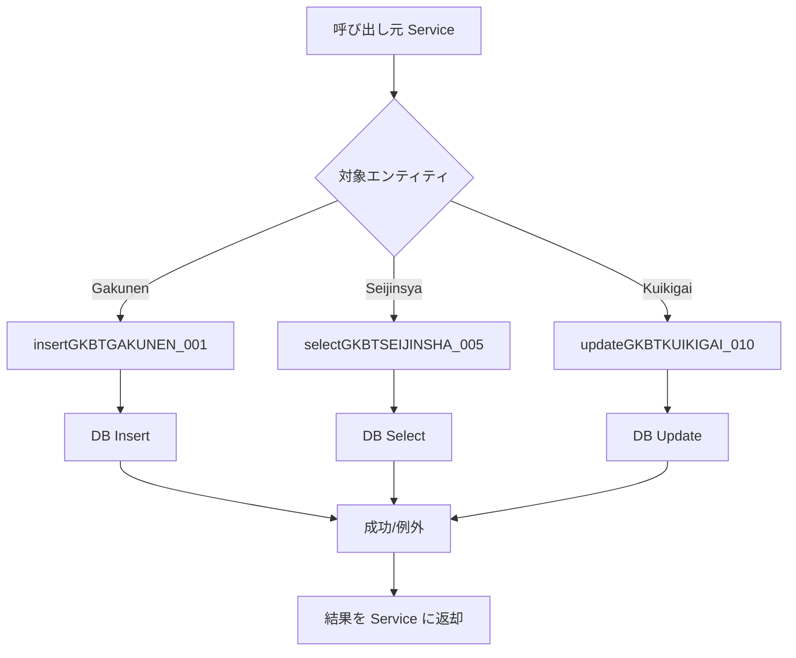

# GKB000EntityRepository（Java インタフェース）

## 📖 概要
`GKB000EntityRepository` は、**Spring Framework の `@Repository`** として定義されたデータアクセス層のインタフェースです。  
本リポジトリは、`jp.co.jip.gkb000.common.entity` パッケージにある 13 種類のエンティティに対して **CRUD（Create‑Read‑Update‑Delete）** 操作を提供します。  

> **なぜこのインタフェースが必要か**  
> - ビジネスロジックから永続化処理を分離し、テスト容易性と保守性を向上させる。  
> - 各エンティティごとに統一されたメソッド命名規則（`insertXXX_###`, `selectXXX_###`, `updateXXX_###`, `deleteXXX_###`）で、コードベース全体の可読性を確保する。  

---

## 🏗️ 設計方針・決定事項

| 項目 | 内容 |
|------|------|
| **命名規則** | `insert/ select/ update/ delete` + エンティティ名 + 3 桁のシーケンス番号。変更履歴が追いやすく、SQL マッピングファイル（MyBatis 等）と対応しやすい。 |
| **戻り値** | `select` 系はエンティティまたは `ArrayList<Map<String, Object>>`（検索結果リスト）を返す。`insert`/`update`/`delete` は `void` とし、例外でエラーを伝搬。 |
| **パラメータ** | 主キー検索は `Integer`、複合検索は `HashMap<String, Object>` を使用。 |
| **拡張性** | 新規エンティティ追加時は同様の 4 つのメソッドを追加すれば、既存コードに影響を与えずに拡張可能。 |
| **変更履歴** | ファイル冒頭に詳細な変更履歴をコメントで残すことで、リリースごとの差分が一目で分かる。 |

---

## 📂 パッケージ構成

```
jp.co.jip.gkb000.common.repository
└─ GKB000EntityRepository.java   ← 本インタフェース
```

エンティティは `jp.co.jip.gkb000.common.entity` パッケージに格納され、以下のように分類されます。

| エンティティ | 主な用途 |
|--------------|----------|
| `GkbtGakunenEntity` | 学年情報 |
| `GkbtSeijinsyaEntity` | 生徒情報 |
| `GkbtKuikigaiEntity` | 区域外学校情報 |
| `GkbtTyugakoEntity` | 中学校情報 |
| `GkbtYogogakoEntity` | 幼稚園情報 |
| `GkbtYuyojiyuEntity` | 受給資格情報 |
| `GkbtZokugaraEntity` | 続柄情報 |
| `GkbtGenjiyuEntity` | 現実援助情報 |
| `GkbtIdobunEntity` | 井戸分情報 |
| `GkbtMenjojiyuEntity` | 面接援助情報 |
| `GkbtTokusokuEntity` | 特速情報 |
| `GkbtSyogakoEntity` | 小学校情報 |
| `Gkbt...`（その他） | 各種補助情報 |

---

## 🔧 主なメソッド一覧

> **命名規則**: `操作対象エンティティ_番号`  
> **例**: `insertGKBTGAKUNEN_001`

| 操作 | メソッド名 | パラメータ | 戻り値 | 説明 |
|------|------------|------------|--------|------|
| **INSERT** | `insertGKBTGAKUNEN_001` | `GkbtGakunenEntity record` | `void` | 学年情報を新規登録 |
| **SELECT** | `selectGKBTGAKUNEN_002` | `Integer gakunenCd` | `GkbtGakunenEntity` | 学年コードで検索 |
| **UPDATE** | `updateGKBTGAKUNEN_003` | `GkbtGakunenEntity record` | `void` | 学年情報を更新 |
| **DELETE** | `deleteGKBTGAKUNEN_004` | `Integer gakunenCd` | `void` | 学年情報を削除 |
| … | … | … | … | 同様の CRUD が各エンティティに対して実装されています。 |

### 代表的な検索系メソッド（リスト取得）

| メソッド | パラメータ | 戻り値 | 補足 |
|----------|------------|--------|------|
| `selectGKBTYOGOGAKKO_050` | `HashMap<String, Object> param` | `ArrayList<Map<String, Object>>` | 条件検索（幼稚園情報） |
| `selectGKBTYOGOGAKKO_051` | `HashMap<String, Object> param` | `ArrayList<Map<String, Object>>` | 追加検索（幼稚園情報） |
| `selectGKBTSHOGAKKO_052` | `HashMap<String, Object> param` | `ArrayList<Map<String, Object>>` | 小学校情報のリスト取得 |
| `selectGKBTCHUGAKKO_017` | `HashMap<String, Object> param` | `ArrayList<Map<String, Object>>` | 中学校情報のリスト取得 |

### 論理削除チェック系（2025/10/28 追加）

| メソッド | パラメータ | 戻り値 | 説明 |
|----------|------------|--------|------|
| `selectGKBTSHOGAKKO_053` | `HashMap<String, Object> param` | `String` | 小学校コードが論理削除対象か判定 |
| `selectGKBTCHUGAKKO_054` | `Map<String, Object> param` | `String` | 中学校コードが論理削除対象か判定 |
| `selectGKBTKUIKIGAI_055` | `Map<String, Object> param` | `String` | 区域外学校コードが論理削除対象か判定 |
| `selectGKBTYOGOGAKKO_056` | `Map<String, Object> param` | `String` | 幼稚園コードが論理削除対象か判定 |
| `selectGKBTKUNISIRITSUGAKKO_057` | `Map<String, Object> param` | `String` | 国・私立学校コードが論理削除対象か判定 |

---

## 📈 変更履歴（抜粋）

| 日付 | 担当 | 内容 |
|------|------|------|
| 2024/06/04 | ZCZL.zhaoyan | 新 WizLIFE 2 次開発向けメソッド追加 |
| 2024/06/14 | ZCZL.wanghaonan | 中学校関連メソッドのシグネチャ変更 |
| 2025/10/28 | ZCZL.dy | 論理削除チェックメソッド（#17003）追加 |

（完全な履歴はファイル冒頭のコメントをご参照ください）

---

## 🛠️ 使用例

```java
@Service
public class GakunenService {

    @Autowired
    private GKB000EntityRepository repository;

    public GkbtGakunenEntity getGakunen(Integer cd) {
        return repository.selectGKBTGAKUNEN_002(cd);
    }

    public void addGakunen(GkbtGakunenEntity entity) {
        repository.insertGKBTGAKUNEN_001(entity);
    }

    // 省略: update / delete も同様に呼び出し
}
```

---

## ⚠️ 潜在的な課題と改善ポイント

| 課題 | 現状 | 改善案 |
|------|------|--------|
| **例外処理が暗黙的** | `void` メソッドは例外で失敗を通知 | `Optional<T>` やカスタム例外で失敗情報を明示化 |
| **メソッド数が膨大** | エンティティごとに 4 つの CRUD + 追加検索 → 100+ メソッド | 共通インタフェース（`CrudRepository<T, ID>`）を継承し、ジェネリクスで統一化 |
| **命名に番号が付く** | `insertXXX_001` のように番号が増えると可読性低下 | メソッド名だけで機能が分かるようにリファクタリング（例: `insertGakunen`） |
| **検索結果が `Map<String,Object>`** | 型安全性が低い | DTO クラスを導入し、型安全な検索結果を返す |

---

## 📚 関連 Wiki ページへのリンク例

```
[insertGKBTGAKUNEN_001](http://localhost:3000/projects/test_new/wiki?file_path=D:/code-wiki/projects/test_new/code/java/Repository_GKB000EntityRepository.java)
```

---

## 🗺️ 全体像（Mermaid フローチャート）



---

## 📌 まとめ

- `GKB000EntityRepository` は **エンティティ単位の CRUD** を統一インタフェースで提供し、ビジネスロジックから永続化処理を切り離す役割を担います。  
- 命名規則とコメントベースの変更履歴により、**コードベースの可視性と保守性** が高められています。  
- 将来的には **ジェネリック化** と **例外ハンドリングの明示化** を検討し、コード量削減と型安全性向上を図ることが推奨されます。  