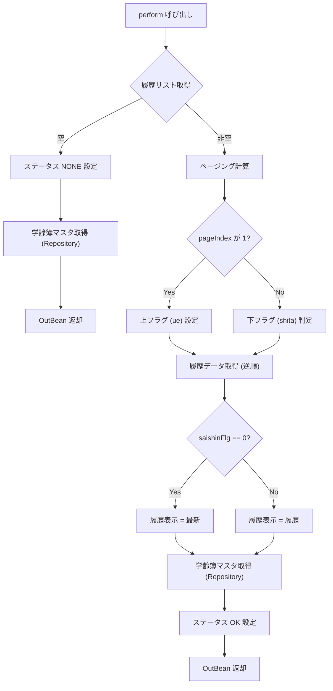

# 📄 `Service_GKB001S024_GakureiboSyukakkuHistoryService.java` Wiki

**ファイルパス**  
`D:/code-wiki/projects/test_new/code/java/Service_GKB001S024_GakureiboSyukakkuHistoryService.java`

---

## 目次
1. [概要](#概要)  
2. [クラス構成](#クラス構成)  
3. [主要メソッド](#主要メソッド)  
4. [処理フロー](#処理フロー)  
5. [変更履歴](#変更履歴)  
6. [設計上の留意点・改善ポイント](#設計上の留意点改善ポイント)  
7. [関連リンク](#関連リンク)  

---

## 概要
`GKB001S024_GakureiboSyukakkuHistoryService` は、**学齢簿（がくれいぼ）情報取得サービス**です。  
- 受け取った個人番号（`kojinNo`）に紐づく「学齢簿就学変更履歴」を取得し、ページング付きで返却します。  
- 履歴が無い場合は「なし」ステータスを返し、同時に `GKBTGAKUREIBO_006` テーブルから最新の学齢簿データも取得します。  

> **対象読者**  
新規にこのモジュールを担当する開発者、もしくは学齢簿関連機能の保守・拡張を行うエンジニア向けに、**「何をするクラスか」** と **「どのように動くか」** を中心に解説します。

---

## クラス構成
```java
@Service
public class GKB001S024_GakureiboSyukakkuHistoryService {

    // 定数
    private static final String NEW      = "最新";
    private static final String RIREKI   = "履歴";
    private static final String NONE     = "なし";

    // DI コンポーネント
    @Inject
    private GKB001S024_GakureiboSyukakkuHistoryDao gKB001S024_GakureiboSyukakkuHistoryDao;

    @Inject
    private GKB0010Repository gkb0010Repository;   // 2025/12/16 追加

    // ★ メインロジック
    public GKB001S024_GakureiboSyukakkuHistoryOutBean perform(
            GKB001S024_GakureiboSyukakkuHistoryInBean inBean) { … }
}
```

- **`@Service`**: Spring のサービスコンポーネントとして登録。  
- **`GKB001S024_GakureiboSyukakkuHistoryDao`**: 履歴リスト取得用 DAO。  
- **`GKB0010Repository`**: 学齢簿マスタ取得用リポジトリ（2025 追加）。  

---

## 主要メソッド

### `perform(GKB001S024_GakureiboSyukakkuHistoryInBean inBean)`

| 項目 | 内容 |
|------|------|
| **概要** | 個人番号から履歴リストを取得し、ページング・ステータス付与した `OutBean` を返す。 |
| **入力** | `GKB001S024_GakureiboSyukakkuHistoryInBean` <br>・`kojinNo` : 個人番号 <br>・`pageIndex` : 取得したいページ（1 起算） |
| **出力** | `GKB001S024_GakureiboSyukakkuHistoryOutBean` <br>・`result.status` : `CN_STATUS_OK` / `CN_STATUS_NONE` <br>・`rirekiDisp` : 「最新」 or 「履歴」 or 「なし」 <br>・`count` / `total` : 現在ページ・総ページ数 <br>・`ue` / `shita` : 上・下ページングフラグ <br>・`gakureiboShokaiHistoryData` : 取得した履歴データ <br>・`gkbtgakureiboData` : 学齢簿マスタデータ |
| **例外** | 現在は例外スローしない（ステータスでエラーを表現）。 |
| **主なロジック** | 1. DAO から履歴リスト取得 <br>2. 履歴が無い場合は `NONE` ステータスを設定し、リポジトリから学齢簿マスタ取得 <br>3. ページング計算（`pageIndex` が null または範囲外の場合は最大ページ） <br>4. `ue` / `shita` フラグ設定 <br>5. `saishinFlg` が `"0"` なら「最新」、それ以外は「履歴」 <br>6. `count` / `total` を文字列で設定 <br>7. ステータス `CN_STATUS_OK` を付与して返却 |
| **変更点** | - `pageIndex` の型を `int` → `Integer` に変更（2024/09/25） <br> - ページングロジックのオフセット修正（`pageIndex - 1`） <br> - `GKB0010Repository` から学齢簿マスタ取得を追加（2025/12/16） |

#### コード抜粋（要点）
```java
List<GakureiboShokaiHistoryData> rirekiRenbanList =
        gKB001S024_GakureiboSyukakkuHistoryDao.getGakureiboShokaiHistoryList(inBean.getKojinNo());

if (rirekiRenbanList.isEmpty()) {
    // 履歴なし → NONE ステータス
    res.getResult().setStatus(KyoikuConstants.CN_STATUS_NONE);
    res.setRirekiDisp(NONE);
    …
    // 学齢簿マスタ取得 (2025 追加)
    GkbtgakureiboData gakureiboData = gkb0010Repository.selectGKBTGAKUREIBO_006(inBean.getKojinNo());
    res.setGkbtgakureiboData(gakureiboData);
    return res;
}

// ページング計算
Integer pageIndex = inBean.getPageIndex();
if (pageIndex == null || pageIndex > rirekiRenbanList.size()) {
    pageIndex = rirekiRenbanList.size();
}
if (pageIndex - 1 == 0) {
    res.setUe(true);   // 上フラグ
} else if (rirekiRenbanList.size() == pageIndex) {
    res.setShita(true); // 下フラグ
}

// 履歴データ取得（逆順）
GakureiboShokaiHistoryData historyData =
        rirekiRenbanList.get(rirekiRenbanList.size() - pageIndex);
if (StringUtils.equals("0", historyData.getSaishinFlg())) {
    res.setRirekiDisp(NEW);
} else {
    res.setRirekiDisp(RIREKI);
}
```

---

## 処理フロー



---

## 変更履歴

| 日付 | 担当 | 内容 | バージョン |
|------|------|------|------------|
| 2024/09/25 | zczl.cuicy | `pageIndex` を `int` → `Integer` に変更、ページングロジック修正、`NEW`/`RIREKI` 表示ロジック更新 | 0.3.000.006 (IT_GKB_00151) |
| 2025/12/16 | ZCZL.chengjx | `GKB0010Repository` から学齢簿マスタ取得ロジック追加（新 WizLIFE 保守対応 QA23166） | 1.0.404.000 |
| 2024/06/12 | zczl.wangj | 初版リリース | GKB_0.3.000.000 |

---

## 設計上の留意点・改善ポイント

| 項目 | 説明 | 推奨アクション |
|------|------|----------------|
| **ページングロジックの可読性** | `pageIndex - 1 == 0` などマジックナンバーが散在。 | `int zeroBasedIndex = pageIndex - 1;` など変数化し、コメントで意図を明示。 |
| **例外ハンドリング** | 現在はステータスでエラー表現のみ。DAO/Repository が例外を投げた場合の対策が未実装。 | `try‑catch` で `DataAccessException` 等を捕捉し、`CN_STATUS_ERROR` などのステータスを返す。 |
| **テストカバレッジ** | 履歴が 0 件、1 件、複数件、`pageIndex` が範囲外などのケースが分岐多数。 | 境界値テストとモック DAO/Repository を用いた単体テストを充実させる。 |
| **定数の国際化** | `"最新"`, `"履歴"`, `"なし"` がハードコード。 | `MessageSource` で外部化し、将来的な多言語対応を容易に。 |
| **依存注入の統一** | `@Inject` と `@Autowired` が混在しないか確認。 | プロジェクト全体で `@Autowired`（Spring 標準）か `@Inject`（JSR‑330）を統一。 |
| **リポジトリ呼び出しの重複** | 履歴が無い場合とある場合で同じ `selectGKBTGAKUREIBO_006` を呼び出しているが、コードが重複。 | 取得ロジックをプライベートメソッドに抽出し、DRY 原則を適用。 |

---

## 関連リンク

- **DAO**: `GKB001S024_GakureiboSyukakkuHistoryDao`  
  `[GKB001S024_GakureiboSyukakkuHistoryDao](http://localhost:3000/projects/test_new/wiki?file_path=code/java/GKB001S024_GakureiboSyukakkuHistoryDao.java)`

- **リポジトリ**: `GKB0010Repository`  
  `[GKB0010Repository](http://localhost:3000/projects/test_new/wiki?file_path=code/java/GKB0010Repository.java)`

- **定数クラス**: `KyoikuConstants`  
  `[KyoikuConstants](http://localhost:3000/projects/test_new/wiki?file_path=code/java/KyoikuConstants.java)`

- **入力/出力 Bean**  
  - `GKB001S024_GakureiboSyukakkuHistoryInBean`  
    `[InBean](http://localhost:3000/projects/test_new/wiki?file_path=code/java/GKB001S024_GakureiboSyukakkuHistoryInBean.java)`  
  - `GKB001S024_GakureiboSyukakkuHistoryOutBean`  
    `[OutBean](http://localhost:3000/projects/test_new/wiki?file_path=code/java/GKB001S024_GakureiboSyukakkuHistoryOutBean.java)`

---

> **この Wiki は自動生成されたドラフトです。**  
> 内容の正確性や最新情報は、実際のコードベースと合わせてご確認ください。必要に応じて追記・修正をお願いします。