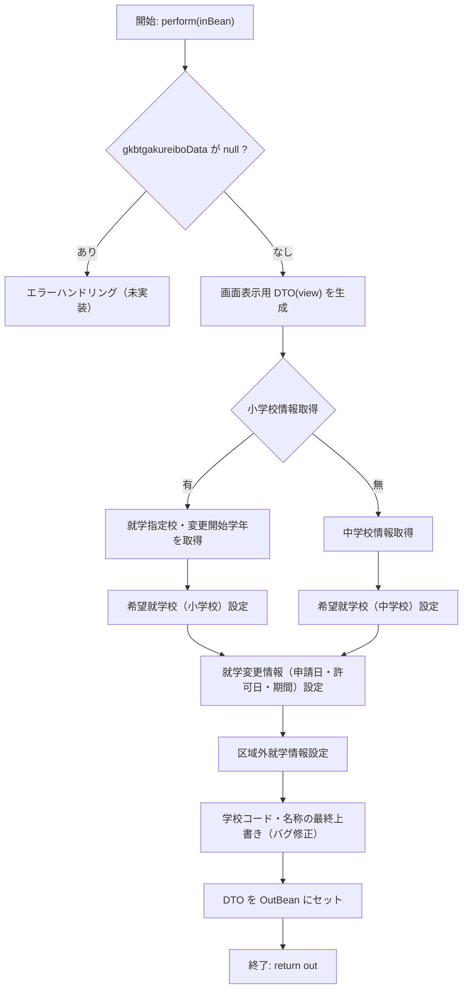

## 📄 GKB002S023_GakureiboInitService  
**パッケージ** `jp.co.jip.gkb0000.domain.service.gkb0020`  

### 1. 概要
学年履歴（就学学校変更）に関する **初期化処理** を行うサービスクラスです。  
入力（`GKB002S023_GakureiboInitInBean`）から学齢簿データと児童基本情報を取得し、画面表示用の `GkbtgakureiboSyuugakuHennkoData` を組み立てて返します。

### 2. 主な責務
| メソッド | 目的 |
|----------|------|
| `perform(InBean)` | 入力データを元に、就学指定校・就学変更情報・区域外就学情報などを **表示用 DTO** に変換 |
| `getDate(int)` | 和暦日付（`X99.99.99` 形式）へフォーマット |
| `nullToZero(String)` | 空文字列 → `0` に変換（数値化の安全装置） |

### 3. 依存コンポーネント
| フィールド | 役割 |
|------------|------|
| `GKB002S021_GakureiboDao` | 学齢簿（過去データ）取得（本クラスでは未使用） |
| `KKA000CommonUtil / KKA000CommonDao` | 日付変換・共通マスタ取得 |
| `GKB000CommonUtil / GKB000CommonDao` | 学校名・学年名取得ロジック |
| `GKB002S023_SyugakkuHennkouDao` | 区域外就学時の学校コード取得 |
| `KKA100GetCTDao` | 事業コード取得（本クラスでは使用なし） |

### 4. `perform` の処理フロー


#### 重要ロジックポイント
1. **「0」コードの特別扱い**  
   - `ShiteiSyogakoCd` / `ShiteiTyugakoCd` が `"0"` の場合だけ名称取得を行う（過去の「小学0年」表示バグ対策）。
2. **就学変更開始学年の取得**  
   - `HenkoGakunenSyogakoName` / `HenkoGakunenTyugakoName` は、**就学指定校コードが `"0"`** かつ **変更学年コードが `"0"`** のときのみ取得。  
   - これにより、無効なデータが画面に表示されるのを防止。
3. **希望就学校の区分判定**  
   - `KiboGakkoKbnCd`（学校区分）に応じて、小・中学校の名称取得ロジックを分岐。
4. **区域外就学のフォールバック**  
   - `KyoikuConstants.GYOMU_CODE_GKB` で学区管理区分を取得し、`seigyoKbn` が空の場合は `"0"`（住所）にデフォルト。
   - `GKB002S023_SyugakkuHennkouDao` から取得したリストで、**最初のレコード** を就学指定校として使用。

### 5. 設計上の決定・トレードオフ
| 項目 | 内容 |
|------|------|
| **コードのハードコーディング** | 学校区分 (`"1"`, `"2"`, `"3"` …) を文字列リテラルで比較。将来的に定数化が望ましい。 |
| **エラーハンドリング** | `gkbtgakureiboData` が `null` の場合の処理が未実装。呼び出し側で例外が発生する可能性あり。 |
| **データ取得の二重ロジック** | 変更履歴取得と区域外就学取得で似たようなロジックが重複。共通ヘルパーに切り出す余地あり。 |
| **日付フォーマット** | `KKA000CommonUtil.format` に依存。和暦変換ロジックが外部に隠蔽されているため、テストが難しい。 |

### 6. 改善ポイント
1. **定数化**  
   - 学校区分コードや `"0"` の意味を `enum` または `static final` 定数に置き換える。
2. **例外処理の追加**  
   - `gkbtgakureiboData == null` 時に `IllegalArgumentException` などを投げ、呼び出し側に明示的に通知。
3. **ロジック分割**  
   - 小・中学校の情報取得ロジックを `private` メソッドに切り出し、テスト容易性を向上。
4. **ユニットテスト**  
   - `nullToZero`、`getDate`、各分岐パスに対するテストケースを追加。

### 7. 変更履歴（コードコメント抜粋）

| 日付 | 担当 | 内容 |
|------|------|------|
| 2024/10/21 | zczl.cuicy | 仕様変更に伴うロジック修正 |
| 2025/04/27 | zczl.zhanghf | 「小学0年」表示バグ修正 |
| 2025/05/27 | ZCZL.DY | 就学指定校修正（二次対応） |
| 2025/06/12 | ZCZL.DY | 二次対応依頼（GK_QA16455） |
| 2025/10/11 | ZCZL.DY | 教育保守チケット対応（チェック修正） |

### 8. 使用例（疑似コード）

```java
@Service
public class SampleCaller {
    @Inject
    private GKB002S023_GakureiboInitService initService;

    public void demo() {
        GKB002S023_GakureiboInitInBean in = new GKB002S023_GakureiboInitInBean();
        // 必要なデータを in にセット …
        GKB002S023_GakureiboInitOutBean out = initService.perform(in);
        GkbtgakureiboSyuugakuHennkoData view = out.getGkbtgakureiboSyuugakuHennkoData();
        // view の各フィールドを画面に表示
    }
}
```

### 9. 関連 Wiki リンク
- [GKB002S021_GakureiboDao](http://localhost:3000/projects/test_new/wiki?file_path=jp/co/jip/gkb0000/domain/gkb0020/dao/GKB002S021_GakureiboDao.java)  
- [GKB002S023_SyugakkuHennkouDao](http://localhost:3000/projects/test_new/wiki?file_path=jp/co/jip/gkb0000/domain/gkb0020/dao/GKB002S023_SyugakkuHennkouDao.java)  

---  

*このドキュメントは Code Wiki プロジェクトの標準に従い、**日本語**で作成されています。*