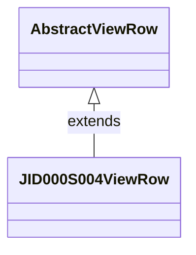

# 📄 **JID000S004ViewRow クラス Wiki**  
**ファイルパス**: `D:/code-wiki/projects/test_new/code/java/View_JID000S004ViewRow.java`  

---  

## 目次
1. [概要](#概要)  
2. [継承関係](#継承関係)  
3. [主なフィールド](#主なフィールド)  
4. [主要メソッド](#主要メソッド)  
5. [利用例](#利用例)  
6. [設計上の判断・トレードオフ](#設計上の判断)  
7. [考えられる課題と改善案](#課題と改善案)  

---  

## 概要
`JID000S004ViewRow` は、世帯照会画面（**JID000S004**）で使用される **ViewRow**（画面表示用データ保持オブジェクト）です。  
画面上の各項目（氏名、性別、生年月日、カード番号 など）を **String** 型で保持し、`AbstractViewRow` が提供する `toViewValue` ヘルパーで表示用に整形します。  

> **Why?**  
> - 画面ロジックとビジネスロジックを分離し、表示データだけを集約することで、テスト容易性と保守性を向上させます。  
> - 変更履歴から分かるように、WizLIFE 2 次開発で新規項目（例: 法定代理人氏名、出生年月日不詳表記）を追加した際にも、既存構造を壊さずに拡張できる設計です。  

---  

## 継承関係

- `AbstractViewRow`（プロジェクト共通の基底クラス）  
  - `toViewValue(String)` / `toViewValue(String, int)` で文字列の null 安全化・長さ制限を実装。  

---  

## 主なフィールド
| フィールド | 型 | 説明 |
|------------|----|------|
| `dsp_no` | `String` | 明細欄番号 |
| `shimei_kana` | `String` | 氏名（かな） |
| `shimei_kanji` | `String` | 氏名（漢字） |
| `touroku_kbn` | `String` | 登録区分 |
| `kofu_kbn` | `String` | 交付状態 |
| `kojin_no` | `String` | 個人番号 |
| `card_no` | `String` | カード番号 |
| `seinengapi` | `String` | 生年月日 |
| `seinengapi_chk` | `String` | 生年月日（チェック用） |
| `seibetsu` | `String` | 性別 |
| `zokugara_mei` | `String` | 続柄名 |
| `hakko_error` | `int` | エラー区分（0: OK） |
| `haishi_bi` | `String` | 廃止日 |
| `gunzenkun` | `int` | 予備フラグ |
| `hoteiDairininShimei` | `String` | 法定代理人氏名 |
| `seinengapiFushoHyoki` | `String` | 生年月日不詳表記（2023 追加） |

> **Note**: すべての文字列フィールドは `toViewValue` で null 安全化され、必要に応じて長さ制限（例: 18 文字）も適用されます。  

---  

## 主要メソッド
（全メソッドは **getter / setter** のペアです。リンクは同一ページ内のアンカーです）

| メソッド | 説明 |
|----------|------|
| `setDsp_no(String)` / `getDsp_no()` | 明細番号の設定・取得 |
| `setShimei_kana(String)` / `getShimei_kana()` | 氏名（かな） |
| `setShimei_kanji(String)` / `getShimei_kanji()` | 氏名（漢字） |
| `setTouroku_kbn(String)` / `getTouroku_kbn()` | 登録区分 |
| `setKofu_kbn(String)` / `getKofu_kbn()` | 交付状態 |
| `setKojin_no(String)` / `getKojin_no()` | 個人番号 |
| `setCard_no(String)` / `getCard_no()` | カード番号（取得は加工なし） |
| `setSeinengapi(String)` / `getSeinengapi()` | 生年月日 |
| `setSeinengapi_chk(String)` / `getSeinengapi_chk()` | 生年月日（チェック用） |
| `setSeibetsu(String)` / `getSeibetsu()` | 性別 |
| `setZokugara_mei(String)` / `getZokugara_mei()` | 続柄名 |
| `setHakko_error(int)` / `getHakko_error()` | エラー区分 |
| `setHaishi_bi(String)` / `getHaishi_bi()` | 廃止日 |
| `setGunzenkun(int)` / `getGunzenkun()` | 予備フラグ |
| `setHoteiDairininShimei(String)` / `getHoteiDairininShimei()` | 法定代理人氏名 |
| `setSeinengapiFushoHyoki(String)` / `getSeinengapiFushoHyoki()` | 生年月日不詳表記（2023 追加） |

### 例: `getShimei_kana` の実装
```java
/**
 * 明細欄氏名かなの取得
 *
 * @return 明細欄氏名かな
 */
public String getShimei_kana() {
    return toViewValue(shimei_kana, 18);
}
```
- `toViewValue(value, 18)` は **null → 空文字** 変換と **最大 18 文字** に切り詰める処理を行います。  

---  

## 利用例
以下は、コントローラやサービス層で `JID000S004ViewRow` を生成し、画面に渡す典型的なコード例です。  

```java
// 例: コントローラでの使用
public JID000S004ViewRow buildViewRow(EntityFamilyMember member) {
    JID000S004ViewRow row = new JID000S004ViewRow();

    row.setDsp_no(member.getSeqNo());
    row.setShimei_kana(member.getKanaName());
    row.setShimei_kanji(member.getKanjiName());
    row.setSeibetsu(member.getGender());
    row.setSeinengapi(member.getBirthDate());
    row.setKojin_no(member.getPersonalId());
    row.setCard_no(member.getCardNumber());

    // 追加項目（WizLIFE 2次開発）
    row.setHoteiDairininShimei(member.getLegalRepresentativeName());
    row.setSeinengapiFushoHyoki(member.getBirthDateUnknownFlag());

    return row;
}
```

- **ポイント**: 画面側は `row.getXXX()` で取得した文字列をそのまま表示でき、`AbstractViewRow` が null 安全化・長さ制限を保証します。  

---  

## 設計上の判断（Why?）

| 判断 | 背景・メリット |
|------|----------------|
| **ViewRow を POJO に分離** | 画面ロジックとビジネスロジックの責務を分離し、テストが容易になる。 |
| **全フィールドを `String` に統一** | 画面表示は文字列が基本。数値や日付は文字列化して保持し、フォーマットは `toViewValue` に委譲。 |
| **`toViewValue` で長さ制限** | UI の文字数制限（例: 18 文字）をコード側で統一的に管理。ハードコーディングを防止。 |
| **追加項目はフィールド・getter/setter を追加** | 変更履歴にあるように、機能追加時に既存構造を壊さずに拡張できる。 |
| **`serialVersionUID` を固定** | `AbstractViewRow` が `Serializable` を実装しているため、バージョン互換性を保証。 |

---  

## 考えられる課題と改善案

| 課題 | 現状 | 改善案 |
|------|------|--------|
| **型安全性の欠如** | すべて `String` で保持し、日付や数値は文字列のまま。 | `LocalDate` や `int` など、適切な型に置き換え、`toViewValue` で文字列化する層を分離。 |
| **バリデーションが分散** | setter でのチェックが無く、入力不正が UI に流れる可能性。 | `setXXX` に簡易バリデーション（長さ・フォーマット）を追加、もしくはビルダー/バリデータクラスを導入。 |
| **冗長な getter/setter** | フィールド数が増えるとコード量が膨らむ。 | Lombok の `@Getter/@Setter` などコード生成ツールの導入を検討。 |
| **文字列長制限がハードコード** | `toViewValue(value, 18)` の数値が散在。 | 定数（例: `MAX_NAME_LENGTH = 18`）を定義し、統一的に使用。 |
| **国際化対応** | コメントは日本語のみ。 | 将来的に多言語対応が必要なら、リソースバンドルでラベル・メッセージを外部化。 |

---  

## 参考リンク
- **クラス定義**: [JID000S004ViewRow](http://localhost:3000/projects/test_new/wiki?file_path=D:/code-wiki/projects/test_new/code/java/View_JID000S004ViewRow.java)  
- **基底クラス**: `AbstractViewRow`（同プロジェクト内の該当ファイルへのリンクを追加してください）  

---  

*この Wiki は Code Wiki プロジェクトの標準テンプレートに従い、**新規開発者が迅速にコードを把握できるよう** 作成されています。*