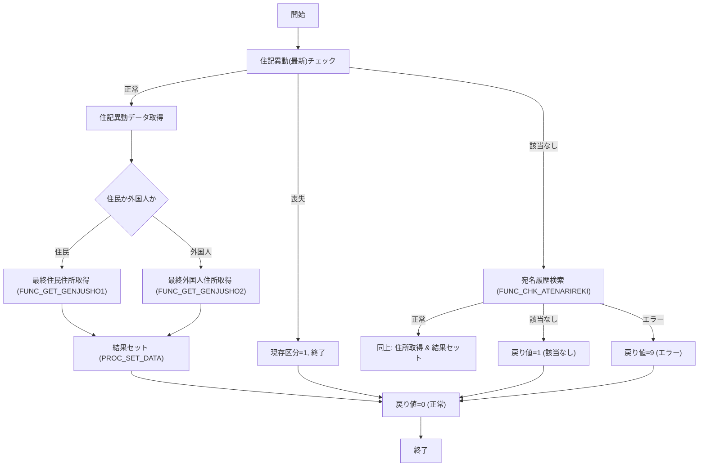

# GKBFKGZSHNT – 現存者判定サブルーチン  

**ファイル**: `code/plsql/GKBFKGZSHNT.SQL`  

---

## 目次
1. [概要](#概要)  
2. [呼び出しシグネチャ](#呼び出しシグネチャ)  
3. [引数・戻り値の説明](#引数・戻り値の説明)  
4. [処理フロー](#処理フロー)  
5. [主要ロジック詳細](#主要ロジック詳細)  
6. [エラーハンドリング](#エラーハンドリング)  
7. [変更履歴](#変更履歴)  
8. [設計上の留意点・改善ポイント](#設計上の留意点改善ポイント)  
9. [関連リファレンス](#関連リファレンス)  

---

## 概要
`GKBFKGZSHNT` は、**基準日時点で対象者が現存しているか** を判定し、住所・氏名・電話番号等の情報を出力パラメータとして返す PL/SQL 関数です。  
教育系システム（GKB）で使用され、住民票・宛名履歴・外国人情報を横断的に検索し、**現存区分** と **人格区分** を決定します。

---

## 呼び出しシグネチャ
```plsql
FUNCTION GKBFKGZSHNT(
    i_IKOJIN_NO          IN  NUMBER,
    i_IKIJUN_BI          IN  NUMBER,
    o_IGENZON_KBN        OUT PLS_INTEGER,
    o_JINKAKU_KBN        OUT PLS_INTEGER,
    o_VYUBIN_NO          OUT NVARCHAR2,
    o_VCHOMEI            OUT NVARCHAR2,
    o_VBANCHI            OUT NVARCHAR2,
    o_VKATAGAKI          OUT NVARCHAR2,
    o_VSHIMEI_KANA       OUT NVARCHAR2,
    o_VSHIMEI_KANJI      OUT NVARCHAR2,
    o_SEINENGAPI         OUT PLS_INTEGER,
    o_SEIBETSU           OUT PLS_INTEGER,
    o_IGYOSEIKU_CD       OUT PLS_INTEGER,
    o_VGYOSEIKU_NM       OUT NVARCHAR2,
    o_ICHUGAKU_CD        OUT PLS_INTEGER,
    o_VCHUGAKU_NM        OUT NVARCHAR2,
    o_ISHOGAKU_CD        OUT PLS_INTEGER,
    o_VSHOGAKU_NM        OUT NVARCHAR2,
    o_VTEL_NO            OUT NVARCHAR2,
    o_ISANTEIDANTAI_CD   OUT PLS_INTEGER,
    o_VSANTEIDANTAI_NM   OUT NVARCHAR2,
    o_VCUSTOM_BC         OUT NVARCHAR2
) RETURN PLS_INTEGER;
```

---

## 引数・戻り値の説明

| パラメータ | 方向 | データ型 | 意味 |
|------------|------|----------|------|
| `i_IKOJIN_NO` | IN | NUMBER | 個人番号（主キー） |
| `i_IKIJUN_BI` | IN | NUMBER | 基準日（西暦8桁） |
| `o_IGENZON_KBN` | OUT | PLS_INTEGER | **現存区分**（0＝現存、1＝喪失） |
| `o_JINKAKU_KBN` | OUT | PLS_INTEGER | **人格区分**（0＝住民、1＝外国人） |
| `o_VYUBIN_NO` | OUT | NVARCHAR2 | 郵便番号 |
| `o_VCHOMEI` | OUT | NVARCHAR2 | 町名 |
| `o_VBANCHI` | OUT | NVARCHAR2 | 番地 |
| `o_VKATAGAKI` | OUT | NVARCHAR2 | 肩書 |
| `o_VSHIMEI_KANA` | OUT | NVARCHAR2 | 氏名（かな） |
| `o_VSHIMEI_KANJI` | OUT | NVARCHAR2 | 氏名（漢字） |
| `o_SEINENGAPI` | OUT | PLS_INTEGER | 生年月日（8桁） |
| `o_SEIBETSU` | OUT | PLS_INTEGER | 性別 |
| `o_IGYOSEIKU_CD` | OUT | PLS_INTEGER | 行政区コード |
| `o_VGYOSEIKU_NM` | OUT | NVARCHAR2 | 行政区名 |
| `o_ICHUGAKU_CD` | OUT | PLS_INTEGER | 中学校区コード |
| `o_VCHUGAKU_NM` | OUT | NVARCHAR2 | 中学校区名 |
| `o_ISHOGAKU_CD` | OUT | PLS_INTEGER | 小学校区コード |
| `o_VSHOGAKU_NM` | OUT | NVARCHAR2 | 小学校区名 |
| `o_VTEL_NO` | OUT | NVARCHAR2 | 電話番号 |
| `o_ISANTEIDANTAI_CD` | OUT | PLS_INTEGER | 算定団体コード |
| `o_VSANTEIDANTAI_NM` | OUT | NVARCHAR2 | 算定団体名 |
| `o_VCUSTOM_BC` | OUT | NVARCHAR2 | カスタムバーコード |
| **戻り値** |  | PLS_INTEGER | `0` 正常、`1` 該当なし、`9` その他エラー |

---

## 処理フロー


---

## 主要ロジック詳細

| ロジック | 主な処理 | 参照先 |
|----------|----------|--------|
| **定数宣言** | 正常 (`c_IOK=0`)、該当なし (`c_INOTFOUND=1`)、エラー (`c_IERR=9`) | 先頭 |
| **変数宣言** | 入出力用ローカル変数を宣言 | 変数宣言部 |
| **FUNC_JICHINAME** | 算定団体コードから旧自治体名称取得（`GAAPK0030.FJICHINAME`） | 関数 |
| **PROC_INITIALIZE** | 出力変数をデフォルト値にリセット | 手続き |
| **PROC_SET_DATA** | ローカル変数 → OUT パラメータへコピー、外部マスタ呼び出しで名称取得 | 手続き |
| **FUNC_CHK_JUKIIDO_SAISHIN** | 住記異動テーブルの最新レコードで **喪失** 判定（`JUMIN_NAKUNARU`） | 関数 |
| **FUNC_CHK_JUKIIDO** | 基準日時点での住記異動データ取得（住所・区分等） | 関数 |
| **FUNC_CHK_ATENARIREKI** | 宛名履歴テーブルから最新レコード取得 | 関数 |
| **FUNC_GET_GENJUSHO1 / 2** | 住民・外国人それぞれの最終住所取得 | 関数 |
| **メイン処理** | 1. 初期化 2. 喪失チェック 3. 住記異動取得 4. 必要に応じて最終住所取得 5. 結果セット 6. エラーハンドリング | `BEGIN ... END` ブロック |

---

## エラーハンドリング

| 例外 | 返却コード | コメント |
|------|------------|----------|
| `NO_DATA_FOUND`（検索結果なし） | `c_INOTFOUND (1)` | 該当データが無いことを示す |
| その他例外 (`WHEN OTHERS`) | `c_IERR (9)` | 想定外エラー |
| メインブロックの `WHEN OTHERS` | `c_IERR (9)` | 例外が捕捉されなかった場合の最終フォールバック |

---

## 変更履歴

| バージョン | 日付 | 作者 | 内容 |
|------------|------|------|------|
| 0.2.000.000 | 2024/01/22 | ZCZL.GUOXU | 初版作成 |
| 0.3.000.100 | 2024/08/08 | ZCZL.wanghj | マージ作業、コメント追加 |
| 0.0.000.000-02.02-02.02 | 2024/08/08 | ZCZL.wanghj | 更新開始 |

---

## 設計上の留意点・改善ポイント

1. **SQL インジェクション対策**  
   - 現在は PL/SQL 内で直接 `SELECT ... INTO` を使用。外部からの入力は `i_IKOJIN_NO` と `i_IKIJUN_BI` のみで、バインド変数として安全ですが、将来的に動的 SQL が増える場合は `EXECUTE IMMEDIATE USING` を検討。

2. **エラーロギング**  
   - `WHEN OTHERS` で単にエラーコードを返すだけなので、障害解析が困難。`DBMS_OUTPUT.PUT_LINE` や専用ログテーブルへの書き込みを追加すると運用が楽になる。

3. **定数の外部化**  
   - エラーコードやマジックナンバーはパッケージ定数として切り出すと、他モジュールとの整合性が保ちやすい。

4. **パフォーマンス**  
   - 複数テーブル結合 (`GABTATENAKIHON`, `GABTJUKIIDO` 等) が頻出。インデックス最適化や、必要ならビュー化してクエリプランを固定化するとスループット向上が期待できる。

5. **テストカバレッジ**  
   - 現在はロジックが長く分岐が多い。単体テスト用にパッケージ化し、`UTL_CALL_STACK` で呼び出し履歴を取得できるようにすると、リグレッション防止に有効。

---

## 関連リファレンス

- **GAAPK0030**: 行政区・学校区名称取得パッケージ  
  `[GAAPK0030.FGYOSEIKUMEI](http://localhost:3000/projects/test_new/wiki?file_path=code/plsql/GAAPK0030.SQL)`  
- **GAAPK0010**: カスタムバーコード生成  
  `[GAAPK0010.FCUSTOM_BC](http://localhost:3000/projects/test_new/wiki?file_path=code/plsql/GAAPK0010.SQL)`  
- **GABTJUKIIDO**: 住記異動マスタテーブル（テーブル定義）  
  `[GABTJUKIIDO テーブル定義](http://localhost:3000/projects/test_new/wiki?file_path=code/sql/tables/GABTJUKIIDO.sql)`  

---

*この Wiki は Code Wiki プロジェクトの自動生成テンプレートに基づき作成されました。内容に誤りや改善点があれば、プルリクエストでご提案ください。*