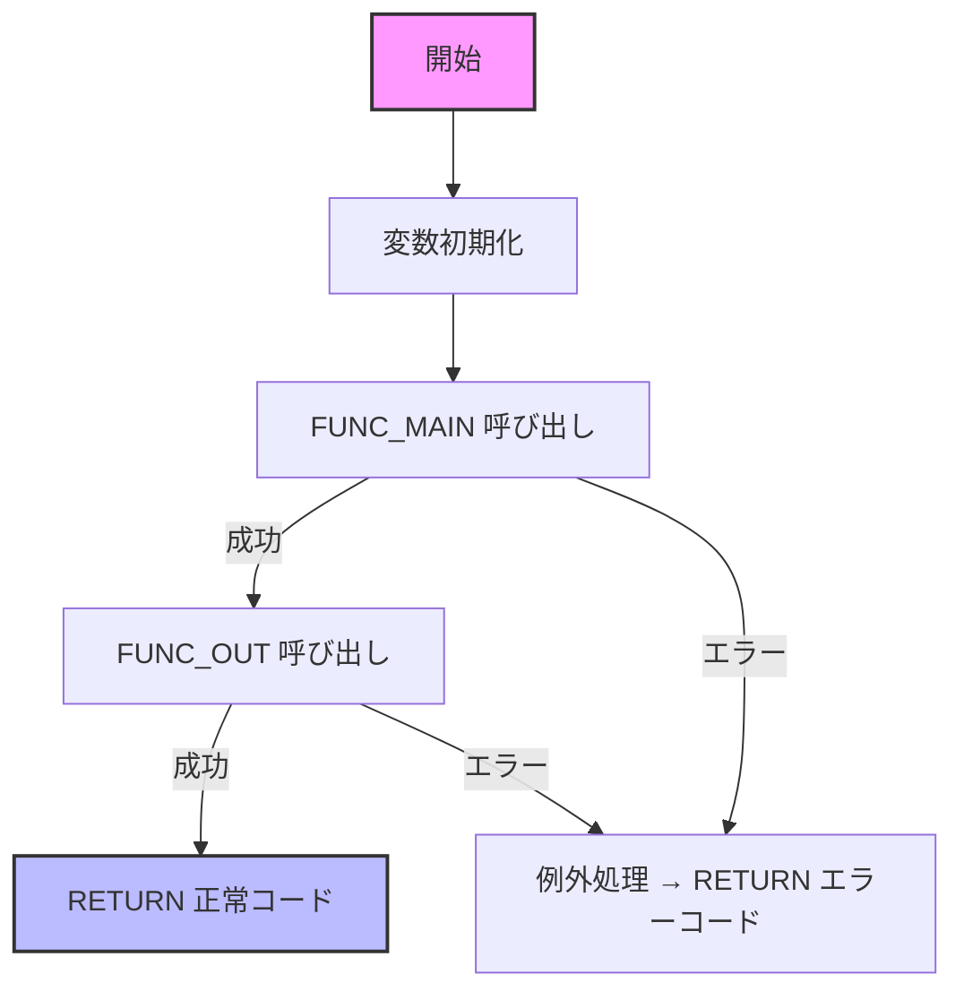

# GKBFKHMCTRL 関数 Wiki

**ファイルパス**  
`code/plsql/GKBFKHMCTRL.SQL`

---

## 📖 概要
`GKBFKHMCTRL` は、**本名使用制御判定** を行う PL/SQL 関数です。  
宛名番号・帳票 ID・保護者区分・システム制御設定という 4 つの入力情報から、氏名（カナ・漢字）・生年月日を取得し、呼び出し元に `OUT` パラメータで返します。  
主に教育系システムの印字・帳票生成ロジックで利用され、**「どの名前・どの生年月日を出力すべきか」** を一元管理します。

---

## 🛠️ パラメータ

| 方向 | 名前 | 型 | 説明 |
|------|------|----|------|
| IN | `i_nKOJIN_NO` | NUMBER | 宛名番号（個人を一意に特定） |
| IN | `i_sCHOHYOID` | NVARCHAR2 | 帳票 ID（帳票種別） |
| IN | `i_nHOGOSYA_KAN` | NUMBER | 保護者区分 (0: 制御しない, 1: 制御する) |
| IN | `i_nSYS_KAN` | NUMBER | システム制御設定 (0‑12 までのコード) |
| OUT | `o_sSHIMEIKANA` | NVARCHAR2 | 氏名カナ（最終出力） |
| OUT | `o_sSHIMEI` | NVARCHAR2 | 氏名漢字（最終出力） |
| OUT | `o_sBIRTHDAY` | NVARCHAR2 | 生年月日（西暦 or 和暦） |
| IN (デフォルト) | `i_nRIREKI_RENBAN` | NUMBER | 履歴連番（省略時 0） |

> **戻り値**: `PLS_INTEGER` – 0 が正常終了、0 以外はエラーコード。

---

## 🔄 主な処理フロー

1. **変数初期化** (`g_nFCRTN = 0`)  
2. **FUNC_MAIN**  
   - ① 児童/保護者の基本情報（氏名・生年月日）を `GABTATENAKIHON`、`GABTJUKIIDO`、`GKBTGAKUREIBO` から取得。  
   - ② 本名使用制御管理テーブル `GKBTSHIMEIJKN` から設定コード (`NAIYO_CD`) を取得し、`g_nHONMYO_KAN` に格納。  
3. **FUNC_OUT**  
   - `g_nHONMYO_KAN` と `i_nSYS_KAN` の組み合わせで **出力ロジック** を分岐。  
   - 例: `i_nSYS_KAN = 0` → 通称名＋和暦、`i_nSYS_KAN = 1` → 本名＋西暦、…  
   - 保護者区分 (`i_nHOGOSYA_KAN`) に応じて、住基・学齢簿の通称名も参照。  
4. **エラーハンドリング**  
   - 例外はすべて `g_nRTN` にエラーコードを設定し、最終的に `RETURN`。

---

## 📦 主要変数概要

| 変数 | 型 | 用途 |
|------|----|------|
| `g_nRTN` | PLS_INTEGER | 関数の最終戻り値 |
| `g_nCHOHYO_NO` | NUMBER | 帳票連番（内部使用） |
| `g_rSEINENGAPI` / `g_rWAREKI_SEINENGAPI` | NVARCHAR2(1000) | 西暦・和暦生年月日文字列 |
| `g_rSHIMEI_KANA` / `g_rSHIMEI_KANJI` | 同上 | 氏名（カナ/漢字） |
| `g_rHONMYO_KANA` / `g_rHONMYO_KANJI` | 同上 | 本名（カナ/漢字） |
| `g_rTSUSHOMEI_*` 系列 | 同上 | 通称名（児童・保護者・住基・学齢簿） |
| `g_nHONMYO_KAN` | NUMBER | 本名使用制御管理設定コード |
| `g_NAIYO_CD` | NUMBER | 設定内容コード（`GKBTSHIMEIJKN` から取得） |
| `g_eOTHERS` | EXCEPTION | 汎用例外ハンドラ |

---

## 📅 変更履歴（抜粋）

| 日付 | 担当 | 内容 |
|------|------|------|
| 2024/08/12 | ZCZL.QINYUE | `i_nRIREKI_RENBAN` デフォルト追加 |
| 2024/09/02 | ZCZL.GUANHONG | 横展開ロジック追加 |
| 2024/10/10 | ZCZL.WANGMING | `i_nSYS_KAN = 4` のロジック修正 |
| 2025/11/10 | CTC.GL | QA22992 対応（バージョン 1.0.205.000） |
| 2025/02/13 | JPJYS.GONGYANYAN | ST 障害対応（ST_GKB_TMP00029） |
| … | … | 以降多数のバグ修正・機能追加 |

> 完全な変更履歴はファイル冒頭のコメントをご参照ください。

---

## ⚠️ 注意点・改善ポイント

| 項目 | 説明 |
|------|------|
| **SQL 結合の外部結合 (`(+)`)** | Oracle の旧式外部結合構文を使用しているため、将来的に ANSI JOIN へリファクタリングが必要。 |
| **ハードコーディングされたコード** | `i_nSYS_KAN` の分岐が 0‑12 のリテラルで記述されている。設定テーブル化すれば拡張性が向上。 |
| **例外処理の一元化** | `g_eOTHERS` で捕捉した例外はすべて同一コードで返すが、エラーログ出力が無い。監査要件がある場合は `DBMS_OUTPUT` かロギングテーブルへ記録を追加。 |
| **パフォーマンス** | `FUNC_MAIN` で 3 つのテーブルを結合し、外部結合を多用。インデックス最適化と `EXISTS` 句への置換で実行計画改善が期待できる。 |
| **テストカバレッジ** | `i_nSYS_KAN` の全組み合わせと `i_nHOGOSYA_KAN` の 0/1 の組み合わせで網羅的テストが必要。特に `g_nHONMYO_KAN = 0` 時のデフォルト分岐は見落としがち。 |

---

## 🔗 関連 Wiki ページ

- [GABTATENAKIHON テーブル定義](http://localhost:3000/projects/test_new/wiki?file_path=code%2Fplsql%2FGABTATENAKIHON.SQL)  
- [GKBTSHIMEIJKN 本名使用制御管理テーブル](http://localhost:3000/projects/test_new/wiki?file_path=code%2Fplsql%2FGKBTSHIMEIJKN.SQL)  
- [GKBTGAKUREIBO 学齢簿テーブル](http://localhost:3000/projects/test_new/wiki?file_path=code%2Fplsql%2FGKBTGAKUREIBO.SQL)  

---

## 📚 まとめ

`GKBFKHMCTRL` は **「どの名前・どの生年月日を帳票に出すか」** を一元的に判定する重要ロジックです。  
- 入力パラメータと本名使用制御コードに基づき、**氏名・生年月日** を動的に切り替える。  
- 変更履歴が豊富で、業務要件の細かな差分に対応してきた実績があります。  
- 将来的な保守性向上のため、SQL の ANSI JOIN 化、設定テーブル化、例外ロギングの追加を検討してください。  