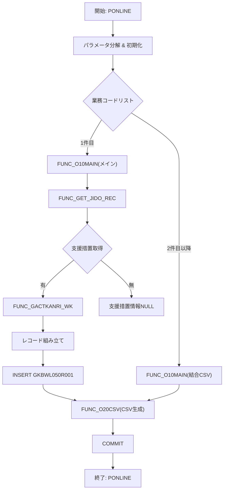

# 📄 GKBPA00040B.SQL – 児童・保護者情報レポート生成パッケージ  

> **対象読者**：このモジュールを初めて触る開発者、保守担当者、テストエンジニア  
> **目的**：児童・保護者の支援措置情報を取得し、CSV（GKBWL050R001）へ出力／帳票印刷用に整形するバッチロジック  

---  

## 目次
1. [概要](#概要)  
2. [主要機能](#主要機能)  
3. [主要プロシージャ / 関数](#主要プロシージャ--関数)  
4. [ロジックフロー](#ロジックフロー)  
5. [データ構造・テーブル概要](#データ構造テーブル概要)  
6. [変更履歴・実装ポイント](#変更履歴実装ポイント)  
7. [設計上の留意点・潜在課題](#設計上の留意点潜在課題)  
8. [改善・リファクタリング案](#改善リファクタリング案)  
9. [リンク集](#リンク集)  

---  

## 概要
`GKBPA00040B.SQL` は **GKB（支援措置）システム** のレポート生成ロジックを PL/SQL で実装したパッケージです。  
- 児童（本人）と保護者の基本情報、住所、支援措置開始・終了日、学校区分、抑止区分等を取得  
- 取得したデータを **GKBWL050R001** テーブルへ INSERT（CSV 出力用）し、後続の帳票作成プロセスへ受け渡す  
- 業務コード・帳票 ID に応じて **オンライン（リアルタイム）** と **バッチ** の 2 種類のフローをサポート  

---

## 主要機能
| 機能 | 説明 |
|------|------|
| **FUNC_GET_JIDO_REC** | 児童・保護者情報取得の中心ロジック。複数のカーソル（`GAKUREIBO`, `GACTKANRI`）を駆使し、支援措置情報・学校情報・住所情報を組み合わせてレコードを生成 |
| **FUNC_O10MAIN** | メイン処理ラッパー。ログ出力 → 既存 CSV データ削除 → `FUNC_GET_JIDO_REC` 呼び出し → `FUNC_O20CSV`（CSV 生成）を実行 |
| **PONLINE** | 外部呼び出しエントリポイント。パラメータ分解、初期化、ステップ制御、トランザクション管理（COMMIT/ROLLBACK）を行う |
| **支援措置区分判定** | `nGAITO_KARA`（開始日）と `nGAITO_MADE`（終了日）を比較し、`支援中` / `支援終了` を算出 |
| **住所生成** | `GAAPK0010.FADDRESSEDIT` を利用し、児童・保護者の住所文字列を組み立て |
| **外国人名・保護者名処理** | `GKBFKHMCTRL` で外国人か判定し、かな・漢字表記を切り替えるロジックが埋め込まれている |

---

## 主要プロシージャ / 関数

| 名前 | 種別 | 主な引数 | 戻り値 | 役割 |
|------|------|----------|--------|------|
| `FUNC_GET_JIDO_REC` | 関数 | なし | `NUMBER`（成功コード） | 児童・保護者情報取得、レコード組み立て、`GKBWL050R001` へ INSERT |
| `FUNC_O10MAIN` | 関数 | `i_sGYOUMUCODE`, `i_sCHOHYOID` | `BOOLEAN` | ログ開始 → `FUNC_GET_JIDO_REC` → CSV 生成 (`FUNC_O20CSV`) |
| `PONLINE` | 手続き | 各種リスト文字列、担当者コード、端末番号、出力パラメータ | なし | パラメータ分解、ステップ制御、トランザクション管理 |
| `FUNC_GACTKANRI_WK` | 関数（内部） | `v_KOJIN_NO` | `NUMBER` | 支援措置情報取得用カーソル `GACTKANRI` のラッパー |
| `FUNC_GET_ZENJUSHO` | 関数（内部） | `KOJIN_NO` | `NVARCHAR2` | 児童・保護者の「前住所」取得 |
| `FUNC_O20CSV` | 関数（外部） | `i_sGYOUMUCODE`, `i_sTABLE`, `i_sCHOHYOID` | `BOOLEAN` | `GKBWL050R001` から CSV ファイルを書き出す（実装は別ファイル） |

---

## ロジックフロー

### 主要ステップ
1. **PONLINE** が呼び出され、業務コード・帳票 ID のリストを `KKBPK5551.FSplitStr` で配列化。  
2. `FUNC_O00INIT` → `FUNC_O01PINIT` → `FUNC_O02PINIT` で共通パラメータ・ステップパラメータを取得。  
3. **最初の業務コード** で `FUNC_O10MAIN`（メイン）を実行。  
   - 既存 CSV データ削除 (`DELETE FROM GKBWL050R001 …`)  
   - `FUNC_GET_JIDO_REC` が **児童・保護者情報** を取得し、`GKBWL050R001` にレコードを INSERT。  
   - `FUNC_O20CSV` がテーブル内容を CSV にエクスポート。  
4. **2 件目以降** は `FUNC_O10MAIN` に結合フラグ (`c_CSVCOMBINATOR`) を付与し、同様に CSV へ追記。  
5. 全ステップ完了後 `COMMIT`、エラー時は `ROLLBACK` して終了。  

---

## データ構造・テーブル概要

| テーブル | 主なカラム（レポート側） | 用途 |
|----------|------------------------|------|
| `GKBWL050R001` | `NO`, `JISHU_KBN`, `TAISYOSYA_KBN`, `GAITO_KARA`, `GAITO_MADE`, `JIDO_HONMYO_KANA` … | CSV 出力用の一時テーブル。レコードは 1 件の児童情報に対し **複数回**（`g_sHAKOUTEXT`）INSERT され、`NO` でソート |
| `GAKUREIBO` | 児童・保護者基本情報、住所コード、学校コード等 | `FUNC_GET_JIDO_REC` の最初のカーソル |
| `GACTKANRI` | 支援措置対象者管理（申出者情報） | `FUNC_GACTKANRI_WK` が取得 |
| `GABTATENAKIHON` / `GABTSOFUSAKI` | 保護者・児童の詳細情報（氏名・住所） | `GAAPK0030.FGETATENA` で取得 |
| `GKBTTSUCHISHOKANRITY` | 帳票番号情報（書類番号） | `FUNC_GET_JIDO_REC` の最後で帳票番号結合に使用 |

> **注**：本パッケージは外部のユーティリティ関数（`KKAPK0020.FDAYEDIT20`, `GKAFKGKNGTEQ` など）に依存しています。実装は別 PL/SQL ライブラリに格納されているため、変更時は **バージョン管理** を徹底してください。

---

## 変更履歴・実装ポイント

| バージョン | 日付 | 更新者 | 主な変更点 |
|------------|------|--------|------------|
| 0.2.000.000 | 2024/01/05 | ZCZL.ZHANGLEI | 初期実装、基本ロジック構築 |
| 0.3.000.000 | 2024/07/01 | ZCZL.WANGQIWEI | 標準化対応（端末番号・バッチ区分の定数化） |
| 0.3.000.003 | 2024/11/02 | ZCZL.WANGMING | 支援措置開始日・終了日の文字列変換ロジックを `GKAPK00020.FGETSTRDATE_SLASH` に置換 |
| 0.3.000.004 | 2024/12/03 | JPJYS.SHAXUE | 外国人児童・保護者名の表示ロジック追加 |
| 0.3.000.005 | 2025/02/06 | JPJYS.GONGYANYAN | 区分別学年情報に「学年」文字列付与、不要削除コードのコメント化 |
| 0.3.000.006 | 2025/02/07 | JPJYS.LIZIZHONG | `TOKUSOKU`（督促）項目の出力ロジックを固定値（`TOKUSOKU_BI1_OUT` など）に変更 |
| 0.3.000.007 | 2025/06/04 | CTC.LIUJUNHAO | 支援措置対象者全員に「対象」フラグを印字するロジック追加 |
| 0.3.000.008 | 2025/06/27 | CTC.HJF | `FUNC_GET_JIDO_REC` の抑止区分判定ロジックを簡素化 |
| 0.3.000.009 | 2025/01/31 | JPJYS.GL | `TOKUSOKU` ループの例外ハンドリング強化 |
| 0.3.000.010 | 2025/06/27 | CTC.HJF | `FUNC_GET_JIDO_REC` の `TOKUSOKU` 取得ロジックを `TOKUSOKU_BI1_OUT` 系に統一 |
| 0.3.000.011 | 2025/06/04 | CTC.LIUJUNHAO | 支援措置対象者区分（`対象` / `対象ではない`）判定ロジックの範囲拡大 (`0 < nYOKUSHIKBN < 99`) |

> **ポイント**：多くの変更は「**対応（UPDATE）**」コメントでマークされており、リリース番号と日付が明示されています。新規要件やバグ修正が頻繁に入りやすい箇所ですので、**変更コメント** を検索しやすいように `-- 202X/XX/XX` の形式で残すことが推奨されます。

---

## 設計上の留意点・潜在課題
| 項目 | 内容 | 影響 |
|------|------|------|
| **カーソルの多重使用** | `FUNC_GET_JIDO_REC` で `GAKUREIBO` と `GACTKANRI` の 2 つのカーソルを同時にオープンし、内部で配列（PL/SQL コレクション）に展開している | カーソルのオープン・クローズ漏れが例外時にリソースリークを招く可能性。例外ハンドラで必ず `CLOSE` しているが、**冗長** |
| **ハードコーディングされた定数** | `c_ONLINE`, `c_OK`, `c_ERR` などはパッケージ外部で定義されているが、コード内に直接数値が散在（例：`IF I_RTN = 0 THEN`） | 可読性低下、テスト時に期待値が不明確になる |
| **日付文字列変換ロジック** | `TO_CHAR(TO_DATE(...,'YYYY/MM/DD'),'YYYY/MM/DD')` → `GKAPK00020.FGETSTRDATE_SLASH` に置換済みだが、**一部残存**（例：`v_SHIENSOCHIKAISHIBI(i)` の直接変換） | 日付フォーマットが統一されていないと、帳票出力時に不整合が起きやすい |
| **NULL 判定の曖昧さ** | `IF v_TAISHOSHAKBN(i) IS NOT NULL OR v_SHIENSOCHIKBN(i) IS NOT NULL THEN` など、**OR** 条件で支援開始日が取得できるケースが増えている | ビジネスロジックが複雑化し、テストケースが増大 |
| **配列サイズ上限** | `TOKUSOKU_BI` と `TOKUSOKU_NAIYO` の配列は最大 **6 件**（`N = 6`）にハードリミット | 児童数が 6 件を超えると情報が切り捨てられるリスク。将来的に拡張が必要 |
| **文字列全角化処理** | 郵便番号や電話番号を `TRANSLATE` で全角に変換しているが、**ハードコード** (`'1234567890-' → '１２３４５６７８９０−'`) | 国際化・ロケール対応が困難 |
| **例外ハンドリング** | `WHEN OTHERS THEN` で `SQLCODE` と `SQLERRM` を結合し `g_sMESSAGE` に格納しているが、**スタックトレース** が失われる | デバッグ時に根本原因が不明瞭になる可能性あり |

---

## 改善・リファクタリング案

1. **カーソル管理の統一**  
   - `OPEN … FOR SELECT …` → `FOR rec IN (SELECT …) LOOP` の形に変更し、**自動クローズ** を利用。  
   - 例外ハンドラでの `IF cursor%ISOPEN THEN CLOSE` を削減。

2. **定数・ステータスコードの集中管理**  
   - パッケージヘッダーに `GKBPA00040C` などの **定数パッケージ** を作成し、`c_OK`, `c_ERR`, `c_ONLINE` などを一元化。  
   - これによりコードレビュー時に **マジックナンバー** が排除される。

3. **日付変換ユーティリティのラップ**  
   - `FUNC_FMT_DATE(p_date IN NVARCHAR2) RETURN NVARCHAR2` を作り、全ての `TO_CHAR/TO_DATE` → `FGETSTRDATE_SLASH` 呼び出しを統一。  
   - 変更が必要になった際に **1 カ所** のみ修正で済む。

4. **配列サイズの動的拡張**  
   - `TOKUSOKU_BI` と `TOKUSOKU_NAIYO` の配列は `A_CONS_PRM` の `EXTEND` で **必要数だけ** 拡張し、ハードリミット（6 件）を撤廃。  
   - ループ条件を `FOR i IN 1..TOKUSOKU_BI.COUNT` に変更。

5. **ロギング・エラーハンドリングの標準化**  
   - `FUNC_SETLOG` の呼び出しを **ラッパー関数**（例：`LOG_START(msg)`、`LOG_END(msg, rc)`）で包み、**例外情報** を自動付与。  
   - `SQLCODE` と `SQLERRM` を `EXCEPTION` オブジェクトに格納し、スタックトレースを保持。

6. **テスト容易性の向上**  
   - 取得ロジック（`FUNC_GET_JIDO_REC`）を **サブプロシージャ** に分割し、**UTL_FILE** での CSV 書き込みは別モジュールに切り出す。  
   - これにより **ユニットテスト** が可能になり、バッチロジックと CSV 出力ロジックの独立テストが実施できる。

7. **国際化対応**  
   - 全角変換は `NLS_CHARACTERSET` に依存させ、ハードコードの `TRANSLATE` を削除。  
   - 郵便番号・電話番号は **正規化テーブル** に格納し、表示時にフォーマットだけを適用。

---

## リンク集
| リンク | 説明 |
|--------|------|
| `GKBPA00040` パッケージ本体 | `https://{your-wiki}/projects/test_new/code/plsql/GKBPA00040B.SQL` |
| `GKBWL050R001` テーブル定義 | `[テーブル定義ページ]`（※別ファイル） |
| `KKBPK5551.FSplitStr` ユーティリティ | `[ユーティリティコード]` |
| `FUNC_O20CSV` 実装 | `[CSV生成ロジック]` |
| 変更履歴（JIRA） | `https://jira.example.com/projects/GKB/issues` |

---  

> **まとめ**：`GKBPA00040B.SQL` は支援措置レポートの核となるロジックを集約したパッケージです。  
> - **取得ロジック** と **CSV 出力** が密結合しているため、保守時は **データ取得** と **帳票生成** の境界を意識して変更してください。  
> - 上記の **改善案** を段階的に導入すれば、可読性・テスト容易性・拡張性が大幅に向上します。  

*Happy coding!* 🚀  