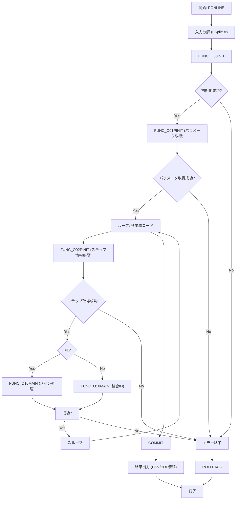

# 📄 GKBPA00050 パッケージボディ（PL/SQL） Wiki  

**ファイルパス**  
`D:\code-wiki\projects\test_new\code\plsql\GKBPA00050B.SQL`

---

## 目次
1. [概要](#概要)  
2. [バージョン履歴 & 修正履歴](#バージョン履歴--修正履歴)  
3. [定数・グローバル変数](#定数・グローバル変数)  
4. [主要関数・手続き一覧](#主要関数・手続き一覧)  
5. [処理フロー（メインロジック）](#処理フローメインロジック)  
6. [設計上のポイント・考慮事項](#設計上のポイント考慮事項)  
7. [拡張・改善のヒント](#拡張改善のヒント)  
8. [関連リンク](#関連リンク)  

---

## 概要
**サブシステム**：GKB（教育）  
**プログラム名**：就学時健康診断結果通知書即時作成  
**機能**：  
- 受診結果を元に、教育委員会宛の通知書（PDF/EMF）と CSV データを生成  
- 受診者・保護者情報、学校情報、教育委員会情報を結合し、帳票レイアウトに合わせて出力  

> **対象読者**：本パッケージを保守・拡張する PL/SQL エンジニア、または新規に同様の帳票生成ロジックを実装する開発者向け  

---

## バージョン履歴 & 修正履歴
| バージョン | 日付 | 担当者 | 主な変更点 |
|---|---|---|---|
| 0.2.000.000 | 2024/01/06 | ZCZL.LIKEWEN | 初版作成 |
| 0.3.000.000 | 2024/07/05 | ZCZL.GUANJINGHENG | WizLIFE 2 次開発（標準化） |
| 0.3.000.001 | 2024/08/20 | ZCZL.WANGMING | IT_GKB_00018 対応 |
| 0.3.000.002 | 2024/09/13 | ZCZL.LIUCHANGQUAN | 8月1日認識合わせ横展開 |
| 0.3.000.003 | 2024/11/05 | ZCZL.WANGYUNING | IT_GKB_00433 対応 |
| 0.3.000.004 | 2024/11/15 | ZCZL.WANGYUNING | IT_GKB_00539 横展開 |
| 0.3.000.005 | 2024/11/21 | ZCZL.ZHANGLEI | IT_GKC_00329 横展開 |
| 0.3.000.006 | 2024/12/19 | JPJYS.SONGSHIHAO | IT_GKB_10053‑10057 対応 |
| 1.0.003.000 | 2025/05/08 | CTC.LIUJUNHAO | 宛先氏名印字不具合修正 |
| 1.0.010.001 | 2025/07/01 | CTC.HJF | GKB_QA17602 |
| 1.0.010.001 | 2025/07/18 | CTC.HJF | GKB_QA17896 |
| 1.0.102.000 | 2025/08/18 | CTC.GYY | GKB_QA19542 |
| 1.0.106.000 | 2025/09/18 | CTC.XIAOMINGBO | GKB_QA20943 |
| 1.0.010.001 | 2025/07/01 | CTC.HJF | GKB_QA17602（再掲） |

---

## 定数・グローバル変数

### 定数
| 定数名 | 値 | 意味 |
|---|---|---|
| `c_ONLINE` | 1 | オンライン処理フラグ |
| `c_OK` | 0 | 正常終了コード |
| `c_ERR` | -1 | 異常終了コード |
| `c_EMF` | 1 | EMF 印刷ファイル区分 |
| `c_PDF` | 2 | PDF 印刷ファイル区分 |
| `c_EMFANDPDF` | 3 | EMF+PDF 両方 |
| `c_ISUCCESS` | 0 | 内部成功コード |
| `c_INOT_SUCCESS` | -1 | 内部失敗コード |
| `c_CHOHYO_KBN` | 5 | 帳票区分（健康診断通知書） |
| `c_IS` | 0/1 | バッチ/オンライン区分（内部で使用） |

### グローバル変数（主なもの）
| 変数名 | 型 | 用途 |
|---|---|---|
| `g_nJOBNUM` | NUMBER | ジョブ番号（バッチ実行単位） |
| `g_sTANTOCODE` | CHAR(12) | 担当者コード |
| `g_sWSNUM` | NVARCHAR2(63) | 端末番号 |
| `g_sRECUPDKBNCODE` | CHAR(2) | 更新処理区分コード |
| `g_sBUNSHONUMLIST` | NVARCHAR2(1000) | 文書番号リスト |
| `g_sMESSAGE` | NVARCHAR2(4000) | エラーメッセージ格納 |
| `g_rOPRT` | `KKATOPRT%ROWTYPE` | オンラインジョブステップ情報 |
| `g_sCSV_RCNT` / `g_sCSVFILENAME` / `g_sPRTFILENAME` | NVARCHAR2(1000) | CSV/印刷ファイル情報（出力結果） |
| `g_sSTARTDATE` | NVARCHAR2(23) | 処理開始日時（文字列） |
| `g_sNKOJIN_NO` / `g_sNRIREKI_RENBAN` | NUMBER | 個人番号・履歴連番（入力パラメータ） |
| `g_nCHOHYO_KBN` | NUMBER | 帳票区分（内部ロジック） |
| `g_sNHASSO_BI` | NUMBER | 発送日（入力パラメータ） |
| `g_sNIINKAI` | NUMBER | 教育委員会連番 |
| `g_sBUNSHOLIST` | NVARCHAR2(1000) | 文書番号リスト（追加） |
| `g_nSHIENSOCHIKBN` | NUMBER | 支援措置対象住所非表示フラグ |
| `g_nHAKKOSU` | NUMBER | 発行部数 |
| `g_sMESSAGE` | NVARCHAR2(4000) | エラーメッセージバッファ |
| `g_nRTN` | NUMBER | 外部関数呼び出し結果（例：`GKBFKHMCTRL`） |

---

## 主要関数・手続き一覧

| 名称 | 種別 | パラメータ | 戻り値 | 主な役割 |
|---|---|---|---|---|
| `FUNC_SETLOG` | 関数 | `i_sSTEP_NANE, i_nDEBUG_KBN, i_nSTATUSID, i_sSQLCODE, i_sSQLERRM, i_sERRMSG` | `BOOLEAN` | ログ出力ラッパー（`KKBPK5551.FSETOLOG` 呼び出し） |
| `FUNC_O00INIT` | 関数 | なし | `BOOLEAN` | 処理開始時に開始日時を取得 |
| `FUNC_O01PINIT` | 関数 | `i_sPARAM` (CSV 文字列) | `BOOLEAN` | パラメータ文字列を CSV に分解し、グローバル変数へ展開 |
| `FUNC_O02PINIT` | 関数 | `i_sGYOUMUCODE, i_sCHOHYONUM` | `BOOLEAN` | 業務コード・帳票番号からオンラインジョブステップ情報取得 |
| `FUNC_O20CSV` | 関数 | `i_sGYOUMUCODE, i_TBLNAME, i_sCHOHYOID` | `BOOLEAN` | CSV と印刷ファイル（EMF/PDF）を生成 |
| `FUNC_GET_JIDO_REC` | 関数 | なし | `NUMBER` (IFRET) | 児童・保護者・学校・教育委員会情報を結合し、`GKBWL060R001` テーブルへレコード挿入 |
| `FUNC_O10MAIN` | 関数 | `i_sGYOUMUCODE, i_sCHOHYOID` | `BOOLEAN` | メインロジック：基準日設定 → `FUNC_GET_JIDO_REC` → `FUNC_O20CSV` |
| `PONLINE` | 手続き (外部) | 多数（業務コードリスト、帳票番号リスト、パラメータ等） | なし | エントリーポイント：入力分解 → 初期化 → 各ステップ実行 → コミット／ロールバック |
| `PROC_GET_YMD` / `PROC_GET_YMD1` | 手続き | 日付 → 文字列 | なし | 和暦・西暦変換ロジック（`KKAPK0020.FDAYEDIT` など） |
| `FUNC_PRMFLGSET` | 関数 | `i_KOJIN_NO, i_SHIMEIPRM, o_NAIYO_CD` | `NUMBER` | 本名使用制御フラグの設定 |
| `FUNC_SEIGYO_SET` | 関数 | `i_HONMYO, i_SHIMEI, o_SET` | `NUMBER` | 本名／かなの優先順位制御 |
| `GET_EQRENRAKUSAKI` | 関数 | `i_SEIGYORENBAN, i_EQNAME, i_EQTELNO, i_EQNAISENNO` | `VARCHAR2` | 教育委員会連絡先文字列生成 |

> **注**：多くのロジックは外部パッケージ（`KKBPK5551`, `KKAPK0020`, `GAAPK0030` など）に委譲されているため、実装詳細はそれらのパッケージを参照してください。

---

## 処理フロー（メインロジック）

**ポイント**  
- `PONLINE` がエントリーポイント。  
- 入力文字列は `KKBPK5551.FSplitStr` で配列化。  
- 1 回目のループはメイン帳票（`i=1`）を生成し、以降は結合帳票（CSV 結合子 `c_CSVCOMBINATOR`）を生成。  
- 例外は `ePRMEXCEPTION`（パラメータ取得失敗）と `eSHORIEXCEPTION`（処理失敗）で分岐し、ロールバックして終了。  

---

## 設計上のポイント・考慮事項

| 項目 | 内容 | 推奨/注意点 |
|---|---|---|
| **外部パッケージ依存** | 多くのロジックは `KKBPK5551`, `KKAPK0020`, `GAAPK0030` などに委譲 | 変更時は依存パッケージのインターフェース互換性を必ず確認 |
| **パラメータ分解** | CSV 文字列 → PL/SQL 配列 (`MAXNAME_ARRAY`) | 文字列長が 1000 行を超える場合は `file_read` の 1000 行制限に注意（本体は文字列なので影響なし） |
| **帳票区分** | `c_CHOHYO_KBN = 5` が健康診断通知書 | 将来的に別帳票を追加する場合は定数追加と `FUNC_GET_JIDO_REC` の分岐拡張が必要 |
| **エラーロギング** | `FUNC_SETLOG` が全ての例外で呼び出される | ログレベル（`i_nDEBUG_KBN`）を活用し、開発・本番で出力量を調整 |
| **文字コード変換** | `TRANSLATE` で全角数字へ変換、`TO_MULTI_BYTE` で全角変換 | 日本語環境での郵便番号・住所は必ず全角に統一 |
| **支援措置対象住所非表示** | `g_nSHIENSOCHIKBN = 1` の場合、住所を隠すロジックが散在 | 条件分岐が多いため、将来的に共通関数化すると可読性向上 |
| **トランザクション管理** | `COMMIT` は全ステップ成功後に一括実行、失敗時は `ROLLBACK` | 大量レコード処理時はバッチサイズ（`g_nHAKKOSU`）で分割 INSERT しているが、DB のロックや UNDO 領域に注意 |
| **バージョン管理** | コメントヘッダーに大量の修正履歴が埋め込まれている | 変更履歴は Git のコミットログに移行し、コード内は概要だけに留めると可読性が上がる |

---

## 拡張・改善のヒント

1. **パラメータ分解ロジックの抽象化**  
   - `FUNC_O01PINIT` の `CASE` 文は新項目が増えるたびに修正が必要。  
   - `aCSV_TBL` → `record` 型にマッピングし、`FOR i IN 1..aCSV_TBL.COUNT` で自動割り当てできるようにすると保守性向上。

2. **帳票レイアウトの外部化**  
   - 現在はハードコーディングされた項目名 (`VDATE_MEI1` 〜 `VKOMOKU_MEI10`) が多数。  
   - 帳票定義テーブル（例：`GKB_TBL_LAYOUT`）を作り、動的に取得すれば新様式追加が容易。

3. **ロギングレベルの統一**  
   - `FUNC_SETLOG` の `i_nDEBUG_KBN` が 0/1 のみ。  
   - `DEBUG`, `INFO`, `WARN`, `ERROR` の 4 段階に拡張し、`c_DEBUG`, `c_INFO` など定数で管理すると運用が楽。

4. **テスト自動化**  
   - PL/SQL のユニットテストフレームワーク（UTPLSQL）で `FUNC_GET_JIDO_REC` の出力レコードを検証。  
   - `PONLINE` のエラーパス（例外）もシナリオ化し、CI に組み込む。

5. **エラーメッセージの国際化**  
   - 現在は日本語固定。将来的に多言語対応が必要なら、メッセージコード化し、リソーステーブルで取得する設計へ変更。

---

## 関連リンク

| ページ | 説明 |
|---|---|
| [KKBPK5551 パッケージ](http://localhost:3000/projects/test_new/wiki?file_path=KKBPK5551) | CSV 分割・ログ出力・印刷ファイル生成のユーティリティ |
| [KKAPK0020 ユーティリティ](http://localhost:3000/projects/test_new/wiki?file_path=KKAPK0020) | 日付変換・年齢計算ロジック |
| [GAAPK0030 住所・教育委員会情報取得](http://localhost:3000/projects/test_new/wiki?file_path=GAAPK0030) | 住所編集・教育委員会連絡先取得 |
| [GKBFKHMCTRL 関数](http://localhost:3000/projects/test_new/wiki?file_path=GKBFKHMCTRL) | 本名使用制御判定ロジック |
| [GKBWL060R001 テーブル定義](http://localhost:3000/projects/test_new/wiki?file_path=GKBWL060R001) | 最終帳票レコード格納テーブル |

--- 

**最終更新日**：2025‑09‑18  
**作成者**：Code‑Wiki AI（自動生成）  

> この Wiki は **新規開発者が GKBPA00050 パッケージの全体像と主要ロジックを把握しやすく** なるよう設計されています。質問や改善提案はプロジェクトの Issue トラッカーへご投稿ください。