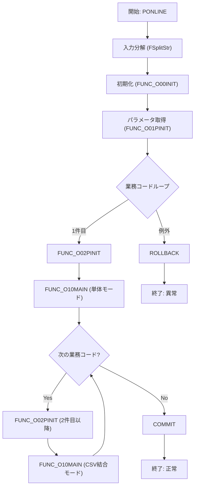

# 📄 GKBPA00060 パッケージ（PL/SQL）

> **対象ファイル**  
> `code/plsql/GKBPA00060B.SQL`  
> **プロジェクト** `test_new`  

---

## 目次
1. [概要](#概要)  
2. [パッケージ構成](#パッケージ構成)  
3. [主要プロシージャ／関数](#主要プロシージャ関数)  
4. [処理フロー（メインロジック）](#処理フロー)  
5. [主要変数・定数](#主要変数)  
6. [変更履歴（コメント）](#変更履歴)  
7. [設計上の留意点・改善提案](#設計上の留意点)  
8. [関連リンク（Wiki）](#関連リンク)  

---

## 1. 概要
`GKBPA00060` パッケージは、**転（編）入学通知書** の生成ロジックを担うバッチ／オンライン処理です。  
- 入力パラメータ（業務コード・帳票ID など）を受け取り、必要なマスタ取得・制御フラグ判定を行う。  
- 住民情報・保護者情報をカーソルで取得し、レコード単位で帳票レイアウト（CSV）へマッピング。  
- 生成した CSV を `FUNC_O20CSV` でファイル化し、必要に応じて印刷（EMF/PDF）も実行。  

> **読者対象**  
> 新規参画エンジニア、保守担当者、テスト担当者向けに「何をやっているか」だけでなく「なぜこのように実装したか」も意識した解説を提供します。

---

## 2. パッケージ構成
| 要素 | 種別 | 主な役割 |
|------|------|----------|
| `FUNC_GET_JIDO_REC` | 関数 | 住民・保護者情報をカーソル `GAKUREIBO` で取得し、レコード構造体 `r_CHOHYO_001` に詰めて `GKBWL070R001` テーブルへ INSERT |
| `FUNC_O10MAIN` | 関数 | メインロジック：パラメータ取得 → CSV 作成 → `FUNC_GET_JIDO_REC` 呼び出し → エラーハンドリング |
| `PONLINE` | プロシージャ | 外部から呼び出されるエントリポイント。業務コード・帳票ID のリストを分解し、`FUNC_O10MAIN` を順次実行 |
| 補助関数/変数 | - | `FUNC_SETLOG`, `FUNC_O00INIT`, `FUNC_O01PINIT`, `FUNC_O02PINIT`, `FUNC_O20CSV` など、共通ロジックやログ出力を提供 |

---

## 3. 主要プロシージャ／関数

### 3.1 `FUNC_GET_JIDO_REC`
- **戻り値**: `NUMBER`（成功は `c_ISUCCESS`、失敗は `c_INOT_SUCCESS`）  
- **主な処理**  
  1. カーソル `GAKUREIBO` をオープンし、住民・保護者レコードを取得。  
  2. 取得したデータを元に、以下の項目を `r_CHOHYO_001` に設定  
     - 児童氏名・生年月日、保護者氏名・住所、郵便番号、学校情報、各種フラグ制御（例: `g_nSHIENSOCHIKBN`）  
  3. `INSERT INTO GKBWL070R001 VALUES r_CHOHYO_001;`（ループで複数行挿入）  
  4. 例外ハンドリング：`NO_DATA_FOUND` → 正常終了、`OTHERS` → エラーログ取得 & カーソルクローズ  

> **ポイント**  
> - 住所・郵便番号の全角変換は `TRANSLATE` で実施。  
> - 住民情報が無い場合は `NHOGOSYA_KOJIN_NO` に代替値を設定し、後続ロジックで統一的に扱えるようにしている。  

### 3.2 `FUNC_O10MAIN`
- **引数**  
  - `i_sGYOUMUCODE`：業務コード（例: `GKB`）  
  - `i_sCHOHYOID`：帳票 ID  
- **戻り値**: `BOOLEAN`（`TRUE`＝正常、`FALSE`＝異常）  
- **主な処理**  
  1. ログ開始 (`FUNC_SETLOG`)  
  2. 既存 CSV データ削除、制御フラグ取得 (`KKAPK0030.FPRMSHUTOKU`)  
  3. 文書番号・日付取得ロジック（`KKBPK5551.FBunNumInf`）  
  4. `FUNC_GET_JIDO_REC` 呼び出し → 住民情報取得・テーブル投入  
  5. `FUNC_O20CSV` で CSV 出力  
  6. ログ終了、例外捕捉でエラーログ出力  

### 3.3 `PONLINE`
- **エントリポイント**（外部から呼び出される）  
- **入力**  
  - 業務コードリスト、帳票番号リスト、帳票 ID リスト、パラメータ文字列、文書番号リスト、担当者コード、端末番号  
- **出力**  
  - `o_nRESULT`（`c_OK` / `c_ERR`）  
  - CSV 件数・ファイル名・印刷ファイル名、エラーメッセージ  
- **処理概要**  
  1. 引数を `KKBPK5551.FSplitStr` で配列化。  
  2. 初期化 (`FUNC_O00INIT`) → パラメータ取得 (`FUNC_O01PINIT`)  
  3. 業務コードごとに `FUNC_O02PINIT` → `FUNC_O10MAIN` を実行（1 番目は単体、2 番目以降は CSV 結合モード）  
  4. 成功時は `COMMIT`、失敗時は `ROLLBACK`  

---

## 4. 処理フロー（メインロジック）

- **例外ハンドリング**は `PONLINE` 内で `ePRMEXCEPTION` / `eSHORIEXCEPTION` / `OTHERS` の 3 種類に分岐し、結果コード `c_ERR` と共にロールバックします。

---

## 5. 主要変数・定数

| 変数 | 型 | 用途・備考 |
|------|----|------------|
| `g_vTOIAWASESAKI1~3` | `VARCHAR2` | 教育委員会名・住所・電話（制御パラメータ） |
| `g_rBUNNUMSRCINF`, `g_rBUNNUMEDITKEKA` | カスタムレコード | 文書番号取得・編集結果 |
| `g_nGKBPA00060_INDEX` | `NUMBER` | `EQSHIMEI` 制御フラグのインデックス |
| `g_vGKBPA00060_CTL` | `NUMBER` | 転（編）入学通知書の出力制御フラグ |
| `VACONSPRM1~3` | PL/SQL 配列 | 制御パラメータ（フラグ、長さ） |
| `c_ISUCCESS`, `c_INOT_SUCCESS`, `c_OK`, `c_ERR` | 定数 | 成功/失敗コード（パッケージ外部定義） |
| `r_CHOHYO_001` | カスタムレコード | CSV 出力用レコード構造体（`GKBWL070R001` テーブルに INSERT） |
| `NHOGOSYA_KOJIN_NO` | `NUMBER` | 住民・保護者の個人番号（NULL/0 の場合は代替ロジック） |
| `HASSOBI`, `ISAKUSEIBI` | `NUMBER` | 発送日・使用日（デフォルトは当日） |

---

## 6. 変更履歴（コメント抜粋）

| 日付 | 担当者 | 内容 |
|------|--------|------|
| 2024/07/05 | ZCZL.sunyue | **新WizLIFE2次開発の標準化対応**：多数の変数初期化・制御ロジック追加 |
| 2024/11/05 | ZCZL.WANGYUNING | `IT_GKB_00433` 対応：文書日付取得ロジック修正 |
| 2025/01/14 | JPJYS.GONGYANYAN | **住記遷移カーソル修正**：`NHOGOSYA_KOJIN_NO` の NULL/0 判定ロジック追加 |
| 2025/06/05 | CTC.GL | `GKB_QA13590` 対応：CSV 出力項目追加 |
| 2025/09/16 | CTC.GL | `GKB_QA21005` 対応：宛先上段ロジック分岐追加 |
| 2025/11/14 | CTC.HJF | `GKB_QA23161` 対応：発送日取得ロジックの条件分岐追加 |
| 2025/01/22 | JPJYS.LIUJUNHAO | 児童氏名・生年月日カナ修正 |
| 2025/04/23 | ZCZL.LIYUWEI | `GK_QA13297`：校長宛の場合の郵便番号空欄化 |
| 2026/01/05 | CTC.XW | `GKB_QA25619`：宛先郵便番号クリア |

> **ポイント**：コメントは「Add」「Update」「Delete」等のタグでバージョン管理されており、機能追加やバグ修正の履歴が追跡しやすくなっています。

---

## 7. 設計上の留意点・改善提案

| 項目 | 現状 | 改善案 |
|------|------|--------|
| **例外処理** | `FUNC_GET_JIDO_REC` で `WHEN OTHERS THEN` のみ捕捉し、エラーメッセージを文字列結合で保持。 | - エラーログをテーブル `GKB_ERROR_LOG` に INSERT し、後続の障害分析を容易にする。 - 例外情報（スタックトレース）取得に `DBMS_UTILITY.FORMAT_ERROR_BACKTRACE` を活用。 |
| **ハードコーディング** | 文字列リテラル（例: `'GKB'`, `'00RENBAN'`）が多数。 | - 定数テーブルまたはパッケージ定数に集約し、変更時の影響範囲を限定。 |
| **制御フラグ配列** (`VACONSPRM*`) | 配列サイズが固定（8, 3, 1）で `WHILE` ループで拡張。 | - `PL/SQL` の `associative array`（インデックスベース）に切り替え、サイズ可変化を自然に扱う。 |
| **文字列全角変換** | `TRANSLATE` で手動マッピング。 | - `NLS` 設定や `UTL_I18N` パッケージでロケール依存の変換を統一。 |
| **CSV 出力ロジック** | `FUNC_O20CSV` が外部に委譲されているが、テーブル `GKBWL070R001` の構造が暗黙的。 | - CSV 出力用レコード定義（列名・型）をパッケージヘッダーにコメントで明示し、テーブルスキーマ変更時にコンパイルエラーで検出できるようにする。 |
| **テスト容易性** | カーソル `GAKUREIBO` のクエリが暗黙的に `SELECT *` で取得。 | - カーソル定義を `SELECT col1, col2, ...` に変更し、取得列が明示的になるようにする。 |
| **ロジック分割** | `FUNC_GET_JIDO_REC` が 600 行超の巨大関数。 | - 住所組み立て、郵便番号変換、氏名制御などのサブロジックを独立したプライベート関数に切り出し、可読性と単体テストのしやすさを向上。 |

---

## 8. 関連リンク（Wiki）

| 項目 | URL |
|------|-----|
| `FUNC_GET_JIDO_REC` の詳細 | [関数 FUNC_GET_JIDO_REC](http://localhost:3000/projects/test_new/wiki?file_path=code/plsql/GKBPA00060B.SQL#L1) |
| `FUNC_O10MAIN` の概要 | [関数 FUNC_O10MAIN](http://localhost:3000/projects/test_new/wiki?file_path=code/plsql/GKBPA00060B.SQL#L200) |
| `PONLINE` エントリポイント | [プロシージャ PONLINE](http://localhost:3000/projects/test_new/wiki?file_path=code/plsql/GKBPA00060B.SQL#L400) |
| 定数・共通ロジック (`FUNC_SETLOG` など) | [共通ユーティリティパッケージ](http://localhost:3000/projects/test_new/wiki?file_path=code/plsql/CommonUtil.SQL) |

---

> **次のステップ**  
> - 上記改善提案を踏まえてリファクタリングを計画し、テストケース（UT）を追加してください。  
> - 変更履歴はコメントタグを活用し、CI/CD のリリースノート自動生成に活かすと運用が楽になります。  