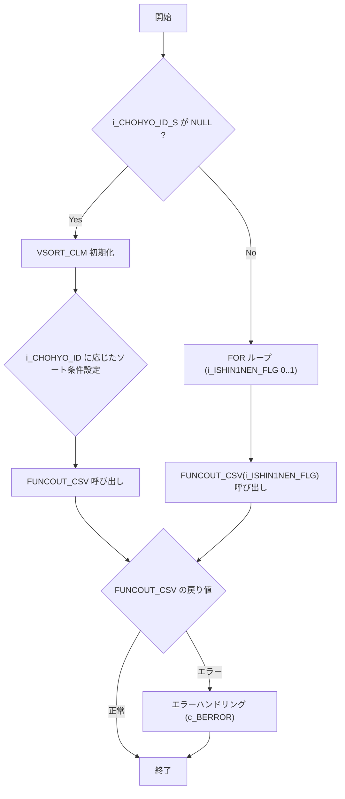

## GKBSKIDOTCH プロシージャ

### 概要
`GKBSKIDOTCH` は教育関連システム（GKB）において、**異動通知 CSV** を生成するメインプロシージャです。  
- 入力パラメータで処理対象の日付・端末・職員情報・帳票 ID などを受け取り、内部で複数のサブ関数／サブプロシージャを呼び出しながら CSV を作成します。  
- バッチ実行（`i_BATCH`）や新１年生用帳票（`i_CHOHYO_ID_S`）の有無に応じて処理フローが分岐します。  
- 変更履歴が豊富で、認証コード取得機能や複数バージョンへの対応が随時追加されています。

> **対象読者**：このモジュールを初めて触る開発者、または CSV 出力ロジックの保守・拡張を行うエンジニア向け。

---

## 目次
1. [パラメータ一覧](#パラメータ一覧)  
2. [主要定数・変数](#主要定数・変数)  
3. [処理フロー概観](#処理フロー概観)  
4. [サブプロシージャ・関数の概要](#サブプロシージャ関数の概要)  
5. [バージョン履歴と主な変更点](#バージョン履歴と主な変更点)  
6. [設計上の留意点・改善ポイント](#設計上の留意点改善ポイント)  
7. [関連テーブル・レコード構造](#関連テーブルレコード構造)  
8. [外部リンク（Wiki）](#外部リンクwiki)  

---

## パラメータ一覧
| パラメータ | モード | 型 | 説明 |
|------------|--------|----|------|
| `i_SHORI_BI` | IN | NUMBER | 処理日（システム日付） |
| `i_SHORI_JIKAN` | IN | NUMBER | 処理時間 |
| `i_TANMATU` | IN | VARCHAR2 | 端末番号 |
| `i_SHOKUIN_NO` | IN | VARCHAR2 | 職員個人番号 |
| `i_CHOHYO_ID` | IN | VARCHAR2 | 帳票 ID（例: `GKB090R001`） |
| `i_CHOHYO_ID_S` | IN | VARCHAR2 (DEFAULT NULL) | 新１年生用帳票 ID（2 つの CSV を同時生成する際に使用） |
| `i_NRENBAN` | IN | NUMBER | ジョブ番号 |
| `i_vKOINFILENAME` | IN | VARCHAR2 | **認証コード名取得** 用パラメータ（2025 追加） |
| `i_vKATAGAKI1` | IN | VARCHAR2 | **認証コード名取得** 用パラメータ |
| `i_vSHUCHOMEI` | IN | VARCHAR2 | **認証コード名取得** 用パラメータ |
| `i_BATCH` | IN (DEFAULT 2) | PLS_INTEGER | バッチ区分（デフォルト 2） |

---

## 主要定数・変数
| 定数/変数 | 型 | 用途 |
|-----------|----|------|
| `c_BERROR` | BOOLEAN | エラー時の戻り値（`FALSE`） |
| `c_BNORMALEND` | BOOLEAN | 正常終了時の戻り値（`TRUE`） |
| `c_ISIN1NEN_FLG_SHIN1NEN` | PLS_INTEGER | 「新1年生」フラグ＝1 |
| `c_ISIN1NEN_FLG_NOT_SHIN1NEN` | PLS_INTEGER | 「新1年生」フラグ＝0 |
| `BRTN` | BOOLEAN | 各サブ関数の実行結果ステータス |
| `I_RTN` | PLS_INTEGER | 汎用戻り値（例: `PROC_DAYEDIT` の結果） |
| `VSQL` | VARCHAR2(4000) | 動的 SQL 文（`SELECT * FROM GKBWIDOTSUCHI`） |
| `VSORT_CLM` | NVARCHAR2(2000) | CSV 出力時の ORDER BY 句 |

---

## 処理フロー概観

### 主要ロジック
1. **ソート条件設定**  
   - `i_CHOHYO_ID` が `GKB290R002`（変更通知書）または `GKB290R003`（変更通知リスト）の場合に特定カラムでソート。  
2. **CSV 作成本体** (`FUNCOUT_CSV`)  
   - `i_CHOHYO_ID` に応じて `FUNC_CREATE_CSV_004`（認証コード取得版）等を呼び出す。  
   - `FUNC_CREATE_CSV_004` は動的 SQL で取得したレコードを `GKBWL090R001` テーブルへ INSERT し、最終的に CSV が生成される想定。  
3. **エラーハンドリング**  
   - `FUNCOUT_CSV` が `FALSE` を返したら例外 `EXCP` を発生させ、外側で `c_BERROR` を返す。  

---

## サブプロシージャ・関数の概要

| 名称 | 種別 | 主な役割 |
|------|------|----------|
| `PROC_DAYEDIT` | 手続き | 日付文字列を整形し、マルチバイト変換を行う。 |
| `FUNC_CREATE_CSV_004` | 関数 | **認証コード名取得** 用 CSV 作成ロジック。 `i_vKOINFILENAME`・`i_vKATAGAKI1`・`i_vSHUCHOMEI` を直接レコードにマッピング。 |
| `FUNCOUT_CSV` | 関数 | `i_CHOHYO_ID` に応じた CSV 作成関数をディスパッチ。 |
| `FUNC_CREATE_CSV_001~003` | コメントアウト | 旧バージョン（変更通知書・リスト）用ロジック（現在は削除）。 |
| `FUNC_CREATE_CSV_005` | コメントアウト | 教育異動通知書（即時）_OL 用ロジック（削除）。 |

> **注**：`FUNC_CREATE_CSV_001~003` と `FUNC_CREATE_CSV_005` はコード上はコメントアウトされており、実行対象外です。将来的に再利用する場合はコメントを外す必要があります。

---

## バージョン履歴と主な変更点

| バージョン | 日付 | 作者 | 主な変更点 |
|------------|------|------|------------|
| 0.2.000.001 | 2024/03/13 | ZCZL.LIKEWEN | 教育残作業対応 |
| 0.2.000.002 | 2024/05/08 | ZCZL.WUCAO | 512_GKB_00034 対応（日付編集ロジック追加） |
| 0.3.000.000 | 2024/06/03 | ZCZL.muzl | 新 WizLIFE 2 次開発（削除/追加多数） |
| 0.3.000.003 | 2024/11/12 | ZCZL.ZHANGLEI | IT_GKB_00468 仕様変更 |
| 0.3.000.004 | 2024/12/23 | JPJYS.LIUHUAIQI | 品質強化（IT_GKB_10106/10107） |
| 1.0.004.000 | 2025/05/20 | ZCZL.wanghj | **認証コード名取得** 機能追加（`i_vKOINFILENAME` など） |

---

## 設計上の留意点・改善ポイント

| 項目 | 現状 | 推奨改善 |
|------|------|----------|
| **パラメータ数** | 10 以上の IN パラメータがあり、呼び出し側が把握しにくい | パラメータ構造体（レコード型）にまとめ、名前付き引数で呼び出す |
| **ハードコーディング** | `VSQL` が固定 `SELECT * FROM GKBWIDOTSUCHI` | テーブル名やカラムリストを外部設定（プロパティテーブル）に委譲 |
| **エラーハンドリング** | `WHEN OTHERS THEN RETURN(c_BERROR)` のみで詳細情報が失われる | ログテーブルへエラーメッセージ・スタックトレースを書き込む |
| **コメントアウトコード** | 多数の `-- FUNCTION ...` が残存 | 不要なら削除、将来再利用するなら別ブランチで管理 |
| **日付処理** | `PROC_DAYEDIT` が文字列ベースで複数分岐 | PL/SQL の `TO_DATE`/`TO_CHAR` を統一的に利用し、ロケール依存を排除 |
| **テスト容易性** | 動的 SQL が文字列結合で構築 | バインド変数使用に変更し、SQL インジェクションリスクを低減 |
| **バッチ実行** | `i_BATCH` のデフォルトが固定 2 | バッチ種別を ENUM（定数）で管理し、意味を明示 |

---

## 関連テーブル・レコード構造

| テーブル | 主なカラム（抜粋） | 用途 |
|----------|-------------------|------|
| `GKBWIDOTSUCHI` | `SHORI_BI`, `SHORI_JIKAN`, `KYOIKU_KOIN_MEI`, `SHUCHO_MEI` など | 異動通知の中間データ（元データ） |
| `GKBWL090R001` | `NO`, `KOIN_SHUCHO`, `SHIKUCHOSON_KATAGAKI`, `SHIKUCHOSON_CHOMEI`, `NEW_JUSHO1` など | CSV 出力用の一時テーブル（INSERT 後に外部ツールで CSV 化） |
| `GKBWL290R001` / `GKBWL290R002` / `GKBWL290R003` | 旧バージョン用テーブル（現在はコメントアウト） | 変更通知書・リスト用 |
| `GKBWL600R001` | 教育異動通知書（即時）_OL 用 | 削除済みだが、過去実装の参照先 |

> **備考**：テーブル定義は本リポジトリ内に `DDL` が無い場合があります。必要に応じて DB 管理者へ問い合わせてください。

---

## 外部リンク（Wiki）

- **[GKBSKIDOTCH プロシージャ概要](http://localhost:3000/projects/test_new/wiki?file_path=code/plsql/GKBSKIDOTCH.SQL)**  
- **[PROC_DAYEDIT 実装詳細](http://localhost:3000/projects/test_new/wiki?file_path=code/plsql/PROC_DAYEDIT.SQL)**（存在すれば）  
- **[認証コード取得機能設計書](http://localhost:3000/projects/test_new/wiki?file_path=design/auth_code.md)**（2025 追加分）  

---

### まとめ
`GKBSKIDOTCH` は **異動通知 CSV** を生成する中心的ロジックで、バージョンアップに伴い認証コード取得や新１年生対応が追加されています。  
保守時は **パラメータ整理**、**エラーロギング**、**ハードコーディングの解消** に注力すると、将来的な機能拡張が容易になります。  

---