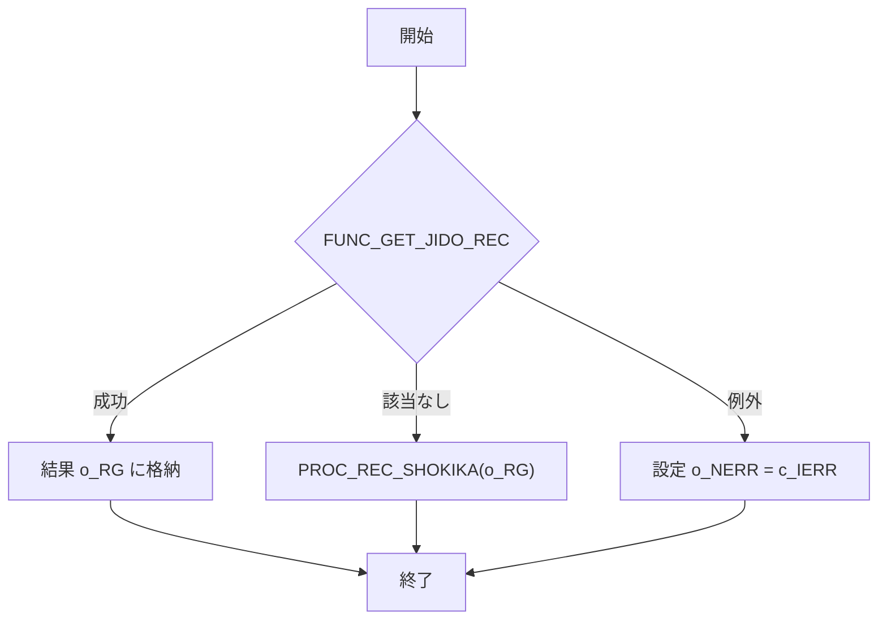

# GKBSKJDOG プロシージャ Wiki

**ファイルパス**  
`code/plsql/GKBSKJDOG.SQL`

---

## 目次
1. [概要](#概要)  
2. [変更履歴](#変更履歴)  
3. [定数・変数定義](#定数・変数定義)  
4. [カーソル定義](#カーソル定義)  
5. [ヘルパー手続き](#ヘルパー手続き)  
6. [メインロジック](#メインロジック)  
7. [エラーハンドリング](#エラーハンドリング)  
8. [呼び出し例](#呼び出し例)  
9. [設計上の留意点](#設計上の留意点)  
10. [関連リンク](#関連リンク)  

---

## 概要
`GKBSKJDOG` は **児童情報取得サブ** として、個人番号（`i_NKOJIN_NO`）をキーに `GKBTGAKUREIBO` テーブルから児童の学齢簿レコードを取得し、`o_RG`（`GKBTGAKUREIBO%ROWTYPE`）に格納して返すストアドプロシージャです。  

- 正常終了 → `o_NERR = 0`（`c_IOK`）  
- 該当なし → `o_NERR = 1`（`c_INOTFOUND`）  
- その他エラー → `o_NERR = 2`（`c_IERR`）  

---

## 変更履歴
| 日付 | 作成者 | バージョン | 内容 |
|------|--------|------------|------|
| 2024/01/06 | ZCZL.LIKEWEN | 0.3.000.000 | 初版作成 |
| 2024/06/04 | ZCZL.wangyunhan | 0.3.000.000 | WizLIFE 2次開発向け項目追加 |
| 2024/06/04 | ZCZL.wangyunhan | 0.3.000.000 | 例外処理・コメント更新 |

---

## 定数・変数定義
### 定数
| 定数 | 型 | 意味 |
|------|----|------|
| `c_BERROR` | BOOLEAN | 常に `FALSE`（未使用） |
| `c_BNORMALEND` | BOOLEAN | 常に `TRUE`（未使用） |
| `c_ISUCCESS` | PLS_INTEGER | `0` – 正常 |
| `c_INOT_SUCCESS` | PLS_INTEGER | `-1` – 異常 |
| `c_IOK` | PLS_INTEGER | `0` – 正常（戻り値） |
| `c_INOTFOUND` | PLS_INTEGER | `1` – 該当なし |
| `c_IERR` | PLS_INTEGER | `2` – その他エラー |

### 変数
| 変数 | 型 | 用途 |
|------|----|------|
| `N_SQL_CODE` | NUMBER | SQLエラーコード |
| `V_SQL_MSG` | NVARCHAR2(255) | SQLエラーメッセージ |
| `I_RTN` | PLS_INTEGER | `FUNC_GET_JIDO_REC` の戻り値 |
| `IMRIREKI_RENBAN` | PLS_INTEGER | 取得対象の履歴連番（MAX） |
| `RCJIDO` | `CJIDO1%ROWTYPE` | カーソルから取得した1行レコード |

---

## カーソル定義
```plsql
CURSOR CJIDO1(p_NKOJIN_NO IN NUMBER) IS
  SELECT <約300列> FROM GKBTGAKUREIBO
  WHERE KOJIN_NO = p_NKOJIN_NO
    AND RIREKI_RENBAN = IMRIREKI_RENBAN;
```
- **目的**：個人番号と最新履歴連番で絞り込んだ児童情報を取得。  
- **ポイント**：`IMRIREKI_RENBAN` は `FUNC_GET_JIDO_REC` の冒頭で `MAX(RIREKI_RENBAN)` を取得して設定。

---

## ヘルパー手続き
### `PROC_REC_SHOKIKA`
- **役割**：`GKBTGAKUREIBO%ROWTYPE` の全フィールドをデフォルト値（数値は `0`、文字列は空白 `' '`）で初期化。  
- **呼び出しタイミング**  
  - `FUNC_GET_JIDO_REC` のレコード取得前に必ず実行。  
  - エラー時や該当なし時に再初期化としても使用。

### `FUNC_GET_JIDO_REC`
- **シグネチャ**  
  ```plsql
  FUNCTION FUNC_GET_JIDO_REC(i_REC OUT GKBTGAKUREIBO%ROWTYPE) RETURN NUMBER;
  ```
- **処理フロー**  
  1. 最新履歴連番 `IMRIREKI_RENBAN` を取得。  
  2. カーソル `CJIDO1` をオープンし、1 行取得。  
  3. `PROC_REC_SHOKIKA` でレコードを初期化。  
  4. 取得した `RCJIDO` の各カラムを `i_REC` にマッピング。  
  5. 正常終了時は `c_ISUCCESS`、該当なしは `c_INOTFOUND`、例外は `c_IERR` を返す。

---

## メインロジック
```plsql
BEGIN
    I_RTN := FUNC_GET_JIDO_REC(o_RG);

    IF I_RTN <> c_ISUCCESS OR o_NERR = c_INOTFOUND THEN
        PROC_REC_SHOKIKA(o_RG);  -- エラーまたは該当なし時に初期化
    END IF;
EXCEPTION
    WHEN OTHERS THEN
        o_NERR := c_IERR;        -- 予期しない例外は共通エラーコードへ
END GKBSKJDOG;
/
```

### フローチャート（Mermaid）



---

## エラーハンドリング
| 例外 | 設定値 | コメント |
|------|--------|----------|
| `NO_DATA_FOUND` | `o_NERR = c_INOTFOUND` | 該当レコードが無い（正常終了扱い） |
| `OTHERS` | `o_NERR = c_IERR`、`N_SQL_CODE`/`V_SQL_MSG` にエラー情報 | 予期しない例外全般 |
| メインブロック `WHEN OTHERS` | `o_NERR = c_IERR` | プロシージャ全体の保護 |

---

## 呼び出し例
```sql
DECLARE
    v_rg GKBTGAKUREIBO%ROWTYPE;
    v_nerr NUMBER;
BEGIN
    GKBSKJDOG(
        i_NKOJIN_NO => 123456,
        o_RG        => v_rg,
        o_NERR      => v_nerr
    );

    IF v_nerr = 0 THEN
        DBMS_OUTPUT.PUT_LINE('取得成功: ' || v_rg.KOJIN_NO);
    ELSIF v_nerr = 1 THEN
        DBMS_OUTPUT.PUT_LINE('該当なし');
    ELSE
        DBMS_OUTPUT.PUT_LINE('エラー発生');
    END IF;
END;
/
```

---

## 設計上の留意点
- **カラム数が非常に多い**（300+）ため、保守時は `PROC_REC_SHOKIKA` とマッピング部分の同期が必須。  
- **履歴連番取得ロジック**は `MAX(RIREKI_RENBAN)` に依存。履歴テーブルの削除やリセットが行われた場合、取得対象が変わる可能性がある。  
- **例外情報取得**は `SQLCODE` と `SQLERRM` のみで、スタックトレースは取得できない点に注意。  
- **パフォーマンス**：`GKBTGAKUREIBO` が大規模テーブルの場合、インデックス（`KOJIN_NO`, `RIREKI_RENBAN`）が必須。  
- **将来的な拡張**：新規項目追加は `PROC_REC_SHOKIKA` と `SELECT` カラムリストの両方に反映が必要。

---

## 関連リンク
- [GKBTGAKUREIBO テーブル定義](http://localhost:3000/projects/test_new/wiki?file_path=code%2Fplsql%2FGKBTGAKUREIBO.SQL)  
- [エラーハンドリングガイドライン](http://localhost:3000/projects/test_new/wiki?file_path=docs%2FErrorHandling.md)  

--- 

*この Wiki は Code Wiki プロジェクトの自動生成テンプレートに基づき作成されました。内容の正確性はコードベースに依存しますので、変更時は必ずレビューを行ってください。*