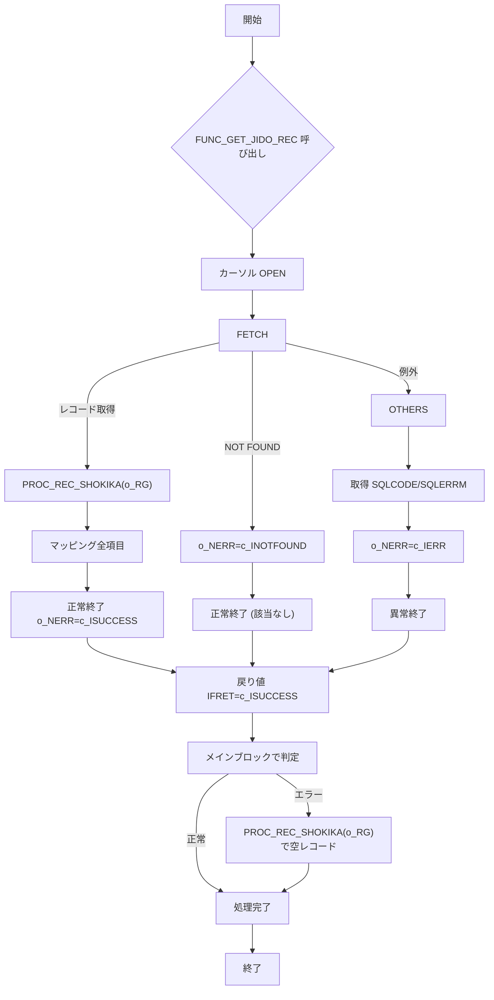

# GKBSKJDOG2 プロシージャ Wiki

> **対象ファイル**  
> `D:\code-wiki\projects\test_new\code\plsql\GKBSKJDOG2.SQL`

---

## 目次
1. [概要](#概要)  
2. [バージョン履歴](#バージョン履歴)  
3. [パラメータ一覧](#パラメータ一覧)  
4. [定数・変数](#定数・変数)  
5. [カーソル定義](#カーソル定義)  
6. [主要ロジック](#主要ロジック)  
   - [レコード初期化 `PROC_REC_SHOKIKA`](#レコード初期化-proc_rec_shokika)  
   - [レコード取得 `FUNC_GET_JIDO_REC`](#レコード取得-func_get_jido_rec)  
   - [メインブロック](#メインブロック)  
7. [エラーハンドリング](#エラーハンドリング)  
8. [設計上のポイント・留意点](#設計上のポイント留意点)  
9. [フローチャート](#フローチャート)  
10. [関連リンク](#関連リンク)  

---

## 概要
`GKBSKJDOG2` は **児童情報取得サブ** として、**個人番号** と **履歴連番**（および枝番）をキーに、学齢簿テーブル `GKBTGAKUREIBO` から対象児童の詳細情報を取得し、呼び出し元に返す PL/SQL ストアドプロシージャです。  
主に **WizLIFE 2次開発**（2024/06/04 追加）で利用され、教育系システムのデータ取得層を担います。

---

## バージョン履歴
| バージョン | 日付 | 作者 | 変更概要 |
|-----------|------|------|----------|
| 0.3.000.000 | 2024/06/04 | ZCZL.wangyunhan | WizLIFE 2次開発に伴う枝番（`RIREKI_RENBAN_EDA`）追加、カーソル・ロジック修正 |
| 0.1.000.000 | 2024/01/06 | ZCZL.LIKEWEN | 初版作成 |

---

## パラメータ一覧
| パラメータ | 方向 | データ型 | 説明 |
|------------|------|----------|------|
| `i_NKOJIN_NO` | IN | NUMBER | 児童個人番号（主キー） |
| `i_RIREKI_RENBAN` | IN | NUMBER | 履歴連番 |
| `i_RIREKI_RENBAN_EDA` | IN | NUMBER | **枝番**（2024/06/04 追加） |
| `o_RG` | OUT | `GKBTGAKUREIBO%ROWTYPE` | 取得した学齢簿レコード（出力） |
| `o_NERR` | OUT | NUMBER | 変換結果コード（0: 正常, 1: 該当なし, 2: その他エラー） |

---

## 定数・変数

### 定数
| 定数名 | 型 | 値 | 説明 |
|--------|----|----|------|
| `c_BERROR` | BOOLEAN | FALSE | エラーフラグ（未使用） |
| `c_BNORMALEND` | BOOLEAN | TRUE | 正常終了フラグ（未使用） |
| `c_ISUCCESS` | PLS_INTEGER | 0 | 正常終了コード |
| `c_INOT_SUCCESS` | PLS_INTEGER | -1 | 異常終了コード |
| `c_IOK` | PLS_INTEGER | 0 | 正常戻り値 |
| `c_INOTFOUND` | PLS_INTEGER | 1 | 該当なし |
| `c_IERR` | PLS_INTEGER | 2 | その他エラー |

### 変数
| 変数名 | 型 | 用途 |
|--------|----|------|
| `N_SQL_CODE` | NUMBER | SQL エラーコード取得 |
| `V_SQL_MSG` | NVARCHAR2(255) | SQL エラーメッセージ取得 |
| `I_RTN` | PLS_INTEGER | `FUNC_GET_JIDO_REC` の戻り値 |
| `IMRIREKI_RENBAN` | PLS_INTEGER | 未使用（予約変数） |
| `RCJIDO` | `CJIDO1%ROWTYPE` | カーソルから取得した1行レコード |

---

## カーソル定義
```plsql
CURSOR CJIDO1(
    p_NKOJIN_NO          IN NUMBER,
    p_RIREKI_RENBAN      IN NUMBER,
    p_RIREKI_RENBAN_EDA  IN NUMBER
) IS
SELECT
    KOJIN_NO,
    RIREKI_RENBAN_EDA,
    GENZON_KBN,
    ZO_JIYU_CD,
    ZO_NENGAPI,
    -- 省略（約200項目） --
    SYS_TANMATU_NO
FROM GKBTGAKUREIBO
WHERE KOJIN_NO = p_NKOJIN_NO
  AND RIREKI_RENBAN = p_RIREKI_RENBAN
  AND RIREKI_RENBAN_EDA = p_RIREKI_RENBAN_EDA;
```
* **目的**：個人番号・履歴連番・枝番で唯一レコードを取得。  
* **変更点**：2024/06/04 に `RIREKI_RENBAN_EDA` 条件を追加。

---

## 主要ロジック

### レコード初期化 `PROC_REC_SHOKIKA`
- `GKBTGAKUREIBO%ROWTYPE` の全フィールドを **デフォルト値**（数値は `0`、文字列は `' '`）で初期化。
- 以降の `FETCH` 前に必ず呼び出し、未取得項目の残存値を防止。

### レコード取得 `FUNC_GET_JIDO_REC`
1. **カーソルオープン**  
   `OPEN CJIDO1(i_NKOJIN_NO, i_RIREKI_RENBAN, i_RIREKI_RENBAN_EDA);`
2. **FETCH** → `RCJIDO` に格納。  
3. **レコードが無い場合** → `o_NERR := c_INOTFOUND;` で抜ける。  
4. **レコードが取得できたら**  
   - `PROC_REC_SHOKIKA(o_RG);` で出力レコードを初期化。  
   - `RCJIDO` の全カラムを `i_REC`（＝`o_RG`）へマッピング。  
   - `o_NERR := c_ISUCCESS;` で正常終了。  
5. **例外処理**  
   - `NO_DATA_FOUND` → 正常終了（該当なし）  
   - `OTHERS` → `SQLCODE`/`SQLERRM` 取得し `o_NERR := c_IERR;`

### メインブロック
```plsql
BEGIN
    I_RTN := FUNC_GET_JIDO_REC(o_RG);
    IF I_RTN <> c_ISUCCESS OR o_NERR = c_INOTFOUND THEN
        PROC_REC_SHOKIKA(o_RG);  -- エラー時は空レコードで初期化
    END IF;
EXCEPTION
    WHEN OTHERS THEN
        o_NERR := c_IERR;
END GKBSKJDOG2;
```
- `FUNC_GET_JIDO_REC` の結果が正常でない、または該当なしの場合は空レコードで上書きし、呼び出し側が必ずレコード構造を受け取れるようにする。

---

## エラーハンドリング
| 例外 | 対応 | 戻り値 |
|------|------|--------|
| `NO_DATA_FOUND` | 該当なしとして `c_INOTFOUND` を設定 | 正常終了 (`c_ISUCCESS`) |
| `OTHERS` | `SQLCODE`/`SQLERRM` を取得し `c_IERR` を設定 | `c_INOT_SUCCESS` |
| メインブロックの `OTHERS` | `o_NERR := c_IERR;` | 例外情報は呼び出し側に伝搬 |

---

## 設計上のポイント・留意点
1. **枝番対応**  
   - 2024/06/04 の改修で `RIREKI_RENBAN_EDA` を追加。過去データとの互換性を保つため、呼び出し側は必ず枝番を渡す必要がある。  
2. **レコードマッピングの網羅性**  
   - `GKBTGAKUREIBO` の全カラム（約200項目）を手動でマッピングしているため、テーブル構造変更時は **必ずこのプロシージャも更新** すること。  
3. **初期化の徹底**  
   - `PROC_REC_SHOKIKA` によるレコード初期化は、取得失敗時の **残存データ汚染防止** に必須。  
4. **エラーログ**  
   - 現状はエラーコードのみ返す。運用上は **監査ログテーブル** へ `N_SQL_CODE` と `V_SQL_MSG` を保存する拡張が推奨される。  
5. **パフォーマンス**  
   - カーソルは **単一レコード取得** に限定されているため、インデックス（`KOJIN_NO`, `RIREKI_RENBAN`, `RIREKI_RENBAN_EDA`）が必須。  

---

## フローチャート


---

## 関連リンク
- **テーブル定義**  
  `[GKBTGAKUREIBO テーブル定義](http://localhost:3000/projects/test_new/wiki?file_path=code%2Fplsql%2FGKBTGAKUREIBO.SQL)`

- **他の取得プロシージャ**  
  `[GKBSKJDOG1 (旧版)](http://localhost:3000/projects/test_new/wiki?file_path=code%2Fplsql%2FGKBSKJDOG1.SQL)`

- **エラーログ管理**  
  `[エラーログテーブル設計](http://localhost:3000/projects/test_new/wiki?file_path=code%2Fplsql%2FERROR_LOG.SQL)`

--- 

*この Wiki は **Code Wiki** プロジェクトの標準テンプレートに沿って作成されています。変更が必要な場合は、プロジェクトのドキュメントガイドラインをご参照ください。*