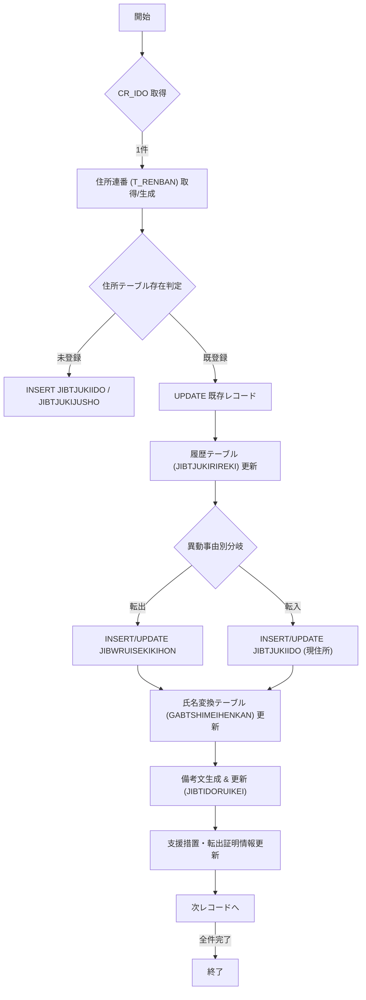

# 📄 JIBSOIEUPDB.SQL – 住基住所・履歴更新バッチ  

**対象モジュール**：`JIBSOIEUPDB.SQL`（PL/SQL）  
**プロジェクト**：`test_new/code/plsql`  

---

## 1️⃣ ファイル概要  

| 項目 | 内容 |
|------|------|
| **目的** | 住基（JIB）システムにおける個人情報（住所・氏名・履歴等）の一括更新・履歴管理を行うバッチ処理。 |
| **主な対象テーブル** | `JIBTJUKIIDO`, `JIBTJUKIKIHON`, `JIBTJUKIJUSHO`, `JIBTJUKIRIREKI`, `GABWRUISEKIKIHON`, `JIBTIDORUIKEI`, `JIBTJUKIBIKO` など。 |
| **エントリポイント** | PL/SQL の `FOR` ループで `CR_IDO`（住基異動情報）を走査し、個人ごとに以下の処理を実行。 |
| **更新対象** | 住所連番、履歴連番、異動事由、氏名変換テーブル、備考文、支援措置情報等。 |
| **変更履歴** | コメント行（`--YYYY/MM/DD DIS.xxx Update …`）でバージョン・担当者・対象機能が明示されている。 |

> **※ 本ファイルは 2026/02/25 時点で 1,200 行以上に及ぶ大規模 PL/SQL スクリプトです。**  
> 以降のドキュメントは「なぜこのロジックが必要か」に焦点を当て、実装の詳細は要所だけ抜粋して解説します。

---

## 2️⃣ 主な処理フロー  



---

## 3️⃣ 重要ロジック別解説  

### 3.1 住所連番（`T_RENBAN`）の取得・生成  

```plsql
SELECT COUNT(*) INTO I_CNT1 FROM JIBTJUKIJUSHO
  WHERE KOJIN_NO = T_KOJIN_NO;
IF I_CNT1 = 0 THEN
    T_RENBAN := 0;                     -- 初回は 0
ELSE
    SELECT MAX(JUSHO_REN) INTO T_RENBAN
      FROM JIBTJUKIJUSHO
     WHERE KOJIN_NO = T_KOJIN_NO;
    T_RENBAN := T_RENBAN + 1;          -- 既存最大+1
END IF;
```

* **目的**：同一個人が複数の住所を持つ場合に、連番で管理しやすくする。  
* **設計上のポイント**  
  * `MAX(JUSHO_REN)` が 0 の場合は `1` から開始。  
  * 住所が削除されても連番はスキップせず、**連続性は保証しない**（履歴の正確性が重要）。

---

### 3.2 住基住所テーブル（`JIBTJUKIIDO` / `JIBTJUKIJUSHO`）の INSERT / UPDATE  

```plsql
INSERT INTO JIBTJUKIIDO (KOJIN_NO, ... ) VALUES (...);
INSERT INTO JIBTJUKIJUSHO (KOJIN_NO, JUSHO_REN, ...) VALUES (...);
```

* **INSERT 条件**：`I_CNT1 = 0`（住所未登録）  
* **UPDATE 条件**：`I_CNT1 > 0` かつ **異動事由** が対象（例：`150,160,280` など）  

> **※** 住所項目は **全カラム**（`OAZA_CD`, `HONBAN`, `EDABAN1~3`, `KATAGAKI_CD` など）を網羅的に更新。  
> 変更履歴コメントで追加・削除された項目（例：`KETAPRM`, `KOKUMEI_CD`）が随時反映されている。

---

### 3.3 履歴テーブル（`JIBTJUKIRIREKI`）への書き込み  

```plsql
INSERT INTO JIBTJUKIRIREKI
  (KOJIN_NO, RIREKI_RENBAN, RIREKI_EDABAN, ... )
VALUES
  (T_KOJIN_NO,
   WK_RIREKI_RENBAN,
   CASE WHEN CR_IDO.IDO_JIYU = 412 THEN R_BUPD_ATENA.RIREKI_EDABAN+1 ELSE 1 END,
   ... );
```

* **履歴枝番 (`RIREKI_EDABAN`)** は異動事由 `412`（誤記修正）時に `+1`、それ以外は `1`。  
* **履歴連番 (`RIREKI_RENBAN`)** は `WK_RIREKI_RENBAN`（10 の単位でインクリメント）を使用。  

---

### 3.4 異動事由別の分岐処理  

| 事由コード | 主な処理 |
|------------|----------|
| `150,160,280` | 住所・履歴の **転出**（`INSERT INTO GABWRUISEKIKIHON`） |
| `110,111` | **転入**（`UPDATE JIBTJUKIIDO` の `GENJUSHO_REN` 等） |
| `410,412,411,416,417` | 誤記修正・職権修正系（履歴枝番 `+1`） |
| `210,211` | **国内/国外転出** → 支援措置テーブル `GACTKANRI_MOUSHIDE` 更新 |
| `520` | **記載順位訂正** → 処理スキップ |

> **実装上の注意**：事由コードは **外部定義**（マスタテーブル）に依存しているため、追加・変更時は必ず **コードコメント** と **マスタ定義** を同期させること。

---

### 3.5 氏名変換テーブル（`GABTSHIMEIHENKAN`）の更新  

```plsql
SELECT COUNT(*) INTO I_CNT1 FROM GABTSHIMEIHENKAN
  WHERE SHIMEI_KBN = 1
    AND YOMI_KANA = T_YOMI_KANA_SEI
    AND HENKANYO_KANJI = T_HENKANYO_KANJI_SEI;
IF I_CNT1 = 0 THEN
    INSERT INTO GABTSHIMEIHENKAN ( ... ) VALUES ( ... );
ELSE
    UPDATE GABTSHIMEIHENKAN SET SHIYO_KAISU = SHIYO_KAISU+1, ... ;
END IF;
```

* **目的**：氏名検索の高速化と、同一氏名の使用回数を管理。  
* **設計上のポイント**  
  * **姓・名** を別テーブル（`SHIMEI_KBN = 1/2`）で管理。  
  * `SHIYO_KAISU`（使用回数）をインクリメントし、**頻出氏名** の統計取得に活用。

---

### 3.6 備考文（`BIKO_BUN`）の生成ロジック  

1. **対象者の本籍情報取得**（`JIBTJUKIIDO` / `JIBTJUKIJUSHO`）  
2. **本籍が変わったか判定** → 変化があれば **備考文** に追記。  
3. **文字列長制限**（120 文字）を超える場合は `SUBSTR` で切り捨て。  

> **実装上の留意点**：備考文は **全員分をまとめて更新** するため、`UPDATE JIBTIDORUIKEI` が大量に走る可能性がある。バッチ実行時間が長くなる場合は **分割更新**（`WHERE KOJIN_NO IN (...)`）を検討。

---

### 3.7 支援措置・転出証明情報の更新  

* **支援措置**（`GACTKANRI_MOUSHIDE`）は `IDO_JIYU IN (210,211)` の場合に **履歴連番 +10**、**仮支援措置フラグ** を設定。  
* **転出証明**（`JIBTJNTENSHUTSUKOJIN` / `JIBTJNTENSHUTSUKYOTU`）は `IDO_JIYU IN (110,111)` かつ `i_FUKI_FLG = 1` のときに **フラグ更新**。

---

## 4️⃣ 設計上の留意点・潜在的課題  

| 項目 | 説明 | 改善案 |
|------|------|--------|
| **大量更新のパフォーマンス** | `UPDATE JIBTIDORUIKEI`、`INSERT INTO GABWRUISEKIKIHON` などが全件走査。 | バッチを **日次/時間帯別に分割**、または **インデックス最適化**（`KOJIN_NO`, `SETAI_NO`） |
| **ハードコーディングされた事由コード** | 事由コードが直接 PL/SQL に埋め込まれている。 | 事由コードを **マスタテーブル** で管理し、`CASE` 文で参照するようリファクタリング |
| **エラーハンドリングが限定的** | `EXCEPTION WHEN OTHERS THEN` で 0 代入するだけ。 | 例外情報を **ログテーブル** に書き込み、**再試行ロジック** を追加 |
| **コメントが日本語・英語混在** | コメントは日本語が主体だが、一部英語やコードが混在。 | コメントを **統一フォーマット**（例：`-- YYYY/MM/DD <担当> Update <バージョン>: <概要>`）に統一 |
| **テーブルカラム増減の追従** | 新規カラム（例：`KETAPRM`, `KOKUMEI_CD`）が随時追加。 | **DDL 変更管理**（Liquibase 等）でスキーマ変更を管理し、コード生成ツールで自動反映 |

---

## 5️⃣ 今後の改善提案  

1. **モジュール分割**  
   * 住所更新、履歴更新、氏名変換、備考文生成を **独立したストアドプロシージャ** に切り出す。  
   * テスト容易性と再利用性が向上。

2. **トランザクション制御の明示化**  
   * 現在は暗黙的に `COMMIT` が走るが、**明示的な `BEGIN … COMMIT/ROLLBACK`** に変更し、失敗時に全体ロールバックできるようにする。

3. **ロギング・監査**  
   * 重要な分岐（事由コード判定、備考文生成）に **ログ出力**（`INSERT INTO BATCH_LOG`）を追加し、障害解析を容易に。

4. **パラメータ化**  
   * `i_SHORIBI`, `i_SYSTIME` などのシステム日付は **バインド変数** で渡すか、**パラメータテーブル** に格納して管理。

5. **テスト自動化**  
   * PL/SQL ユニットテストフレーム（utPLSQL 等）で **主要ロジック**（住所連番生成、履歴枝番ロジック）をテストケース化。

---

## 6️⃣ 参考リンク（他 Wiki ページ）  

- [JIBTJUKIIDO テーブル定義](http://localhost:3000/projects/test_new/wiki?file_path=code/plsql/JIBTJUKIIDO.SQL)  
- [GABTSHIMEIHENKAN 変換テーブル設計](http://localhost:3000/projects/test_new/wiki?file_path=code/plsql/GABTSHIMEIHENKAN.SQL)  
- [支援措置管理テーブル (GACTKANRI_MOUSHIDE)](http://localhost:3000/projects/test_new/wiki?file_path=code/plsql/GACTKANRI_MOUSHIDE.SQL)  

---

## 7️⃣ まとめ  

`JIBSOIEUPDB.SQL` は **住基システムのコアバッチ** として、個人の住所・履歴・氏名・備考文・支援措置を一括で管理する重要なロジックです。  
設計上は「**事由コードごとの分岐**」と「**履歴・住所連番の管理」」が中心であり、**変更履歴コメント** が頻繁に追加されている点から、**保守性の高いドキュメント化** と **コード分割・テスト化** が今後の課題です。  

---  

*このドキュメントは Code Wiki プロジェクトの「コード → Wiki」自動生成テンプレートに基づき作成されました。*  