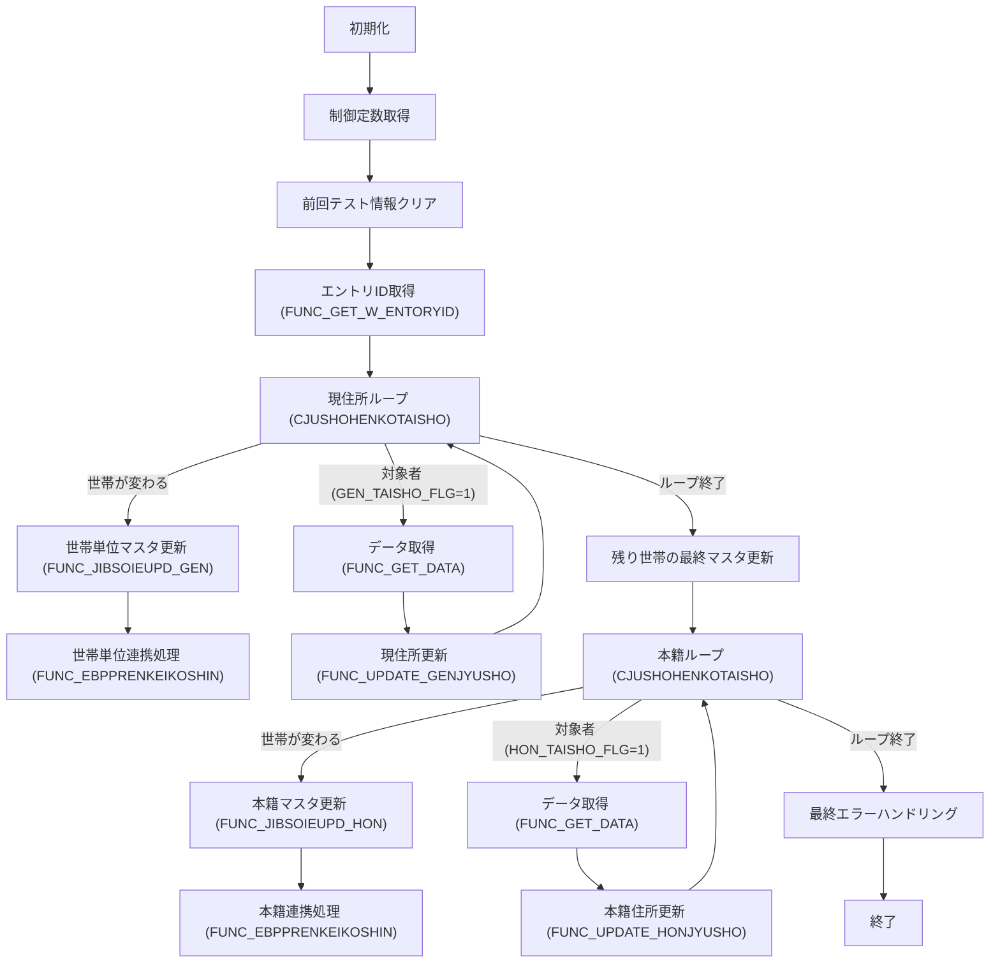

# 📚 JIBSOJHJIBUPD.SQL – 住所変更証明書管理バッチ

> **対象読者**  
> 本モジュールを初めて触る開発者、保守担当者、または機能追加を検討しているエンジニア向けに、コードの全体像・主要ロジック・設計上の留意点をまとめました。  

---  

## 目次
1. [概要](#概要)  
2. [主要コンポーネント一覧](#主要コンポーネント一覧)  
3. [主要関数・プロシージャの解説](#主要関数プロシージャの解説)  
4. [バッチ全体フロー](#バッチ全体フロー)  
5. [エラーハンドリング方針](#エラーハンドリング方針)  
6. [設計上のポイント・改善余地](#設計上のポイント改善余地)  
7. [関連ドキュメント・リンク](#関連ドキュメントリンク)  

---  

## 概要
`JIBSOJHJIBUPD.SQL` は **住所変更証明書（JIBTJUSHOHENKO）** のバッチ処理を実装した PL/SQL スクリプトです。  
- **対象**：現住所・本籍住所の変更対象者（フラグ `GEN_TAISHO_FLG` / `HON_TAISHO_FLG` が 1 のレコード）  
- **目的**：  
  1. 変更対象者の **宛名基本・住基情報・住基異動・住基住所** の中間テーブル（IES 用）へデータを格納  
  2. 中間テーブルの内容を元に **マスタテーブル**（JIBTJUSHOHENKO、JIBWIES 系）を更新  
  3. 更新結果に応じて **フラグ** をリセットし、エラー時はロールバック的に中間テーブルを削除  
- **実行単位**：世帯（`SETAI_NO`）ごとにエントリ ID（`W_ENTORYID`）を取得し、世帯単位でまとめてコミット  

---  

## 主要コンポーネント一覧
| コンポーネント | 種別 | 主な役割 |
|----------------|------|----------|
| `FUNC_SET_JUKIJUSHO` | 関数 | 住基住所中間テーブル `JIBWIES_JUKIJUSHO` へ INSERT |
| `FUNC_SET_IES_JUKIJOHO` | 関数 | 住基情報中間テーブル `JIBWIES_JUKIJOHO` へ INSERT |
| `INIT_EBT_JUSHOHENKO` | 手続き | `o_EBT_JUSHOHENKO` レコードの初期化 |
| `FUNC_SET_JUSHOHENKO` | 関数 | 住所変更証明書管理テーブル `JIBTJUSHOHENKO` へ INSERT |
| `FUNC_CHECK_GENJYUSHO_TAISHO` | 関数 | 現住所対象者の整合性チェック・フラグ更新 |
| `FUNC_CHECK_HONJYUSHO_TAISHO` | 関数 | 本籍住所対象者の整合性チェック・フラグ更新 |
| `FUNC_GET_DATA` | 関数 | 宛名基本・住基異動テーブルから対象者データ取得 |
| `FUNC_UPDATE_GENJYUSHO` | 関数 | 現住所変更ロジック（中間テーブル登録・世帯データ退避） |
| `FUNC_UPDATE_HONJYUSHO` | 関数 | 本籍住所変更ロジック（同上） |
| `FUNC_GET_W_ENTORYID` | 関数 | エントリ ID（シーケンス）取得ロジック |
| `FUNC_JIBSOIEUPD_GEN` | 関数 | 現住所分のマスタ更新（`JIBSOIEUPD` 呼び出し） |
| `FUNC_JIBSOIEUPD_HON` | 関数 | 本籍住所分のマスタ更新 |
| `FUNC_EBPPRENKEIKOSHIN` | 関数 | 住基連携（国民年金等）テーブル更新 |
| **メインブロック** | PL/SQL ブロック | バッチ全体の制御フロー（世帯単位ループ、エラーハンドリング） |

---  

## 主要関数・プロシージャの解説  

### 1. `FUNC_SET_JUKIJUSHO`
```plsql
FUNCTION FUNC_SET_JUKIJUSHO(R_TAISHO JIBTJUSHOHENKO_TAISHO%ROWTYPE)
  RETURN PLS_INTEGER IS
  RTN_CD PLS_INTEGER := C_INOT_SUCCESS;
BEGIN
  -- 住基住所中間テーブルへレコード作成
  o_EBT_IES_JUKIJUSHO := ...   -- 各項目を R_TAISHO からマッピング
  INSERT INTO JIBWIES_JUKIJUSHO VALUES o_EBT_IES_JUKIJUSHO;
EXCEPTION
  WHEN OTHERS THEN
    o_NSQL_CODE := SQLCODE;
    o_VSQL_MSG  := SUBSTR(TO_CHAR(SQLERRM),1,255);
    RTN_CD := C_INOT_SUCCESS;
END;
RETURN RTN_CD;
END FUNC_SET_JUKIJUSHO;
```
- **目的**：住基住所情報を IES 用中間テーブルに保存。  
- **ポイント**：エラー時は `C_INOT_SUCCESS` を返し、呼び出し側でロールバック処理へ遷移。  

### 2. `FUNC_CHECK_GENJYUSHO_TAISHO`
```plsql
FUNCTION FUNC_CHECK_GENJYUSHO_TAISHO(R_TAISHO JIBTJUSHOHENKO_TAISHO%ROWTYPE)
  RETURN PLS_INTEGER IS
BEGIN
  -- 現住所情報取得
  SELECT A.* INTO o_GEN_GABTJUKIJUSHO
  FROM JIBTJUKIJUSHO A, JIBTJUKIIDO B
  WHERE A.KOJIN_NO = B.KOJIN_NO
    AND A.KOJIN_NO = R_TAISHO.KOJIN_NO
    AND A.JUSHO_REN = B.GENJUSHO_REN;
EXCEPTION
  WHEN NO_DATA_FOUND THEN
    FLAG := TRUE;
END;
-- 不一致チェック → FLAG が TRUE なら対象フラグを更新
...
RETURN RTN_CD;
END FUNC_CHECK_GENJYUSHO_TAISHO;
```
- **役割**：現住所の整合性をチェックし、**非現存**・**項目不一致** の場合に `GEN_TAISHO_FLG`（テストフラグ）を更新。  
- **設計意図**：データ不整合があってもバッチは止めず、フラグで後続処理に回す。  

### 3. `FUNC_GET_DATA`
```plsql
FUNCTION FUNC_GET_DATA(R_TAISHO JIBTJUSHOHENKO_TAISHO%ROWTYPE)
  RETURN PLS_INTEGER IS
BEGIN
  -- 宛名基本取得
  SELECT * INTO o_GABTATENAKIHON FROM JIBTJUKIKIHON WHERE KOJIN_NO = R_TAISHO.KOJIN_NO;
  -- 住基異動取得
  SELECT * INTO o_GABTJUKIIDO FROM JIBTJUKIIDO WHERE KOJIN_NO = R_TAISHO.KOJIN_NO;
EXCEPTION
  WHEN OTHERS THEN
    o_NSQL_CODE := SQLCODE;
    o_VSQL_MSG  := SUBSTR(TO_CHAR(SQLERRM),1,255);
    RTN_CD := C_INOT_SUCCESS;
END;
RETURN RTN_CD;
END FUNC_GET_DATA;
```
- **目的**：対象者の **宛名基本** と **住基異動** を取得し、後続の中間テーブル登録に使用。  
- **注意**：取得失敗時は即座に `C_INOT_SUCCESS` を返し、呼び出し側でエラーフローへ。  

### 4. `FUNC_UPDATE_GENJYUSHO`
```plsql
FUNCTION FUNC_UPDATE_GENJYUSHO(R_TAISHO JIBTJUSHOHENKO_TAISHO%ROWTYPE)
  RETURN PLS_INTEGER IS
BEGIN
  I_RTN := FUNC_CHECK_GENJYUSHO_TAISHO(R_TAISHO);
  IF I_RTN <> C_ISUCCESS_EXEC THEN RETURN I_RTN; END IF;

  -- 中間テーブル登録
  I_RTN := FUNC_SET_ATENAKIHON(R_TAISHO);
  I_RTN := FUNC_SET_IES_JUKIJOHO(R_TAISHO);
  I_RTN := FUNC_SET_JUKIIDO(R_TAISHO);
  I_RTN := FUNC_SET_JUKIJUSHO(R_TAISHO);
  -- 世帯データ退避
  MRENKEIDATA(I_CNT).NRIREKI_RENBAN := o_EBT_IES_ATENAKIHON.RIREKI_RENBAN;
  ...
  RETURN RTN_CD;
EXCEPTION
  WHEN OTHERS THEN
    o_NSQL_CODE := SQLCODE;
    o_VSQL_MSG  := SUBSTR(TO_CHAR(SQLERRM),1,255);
    RTN_CD := C_INOT_SUCCESS;
END;
```
- **フロー**：  
  1. 対象者チェック → 失敗時は即リターン  
  2. 4 つの中間テーブルへ **INSERT**（`FUNC_SET_*` 系）  
  3. 世帯内データを `MRENKEIDATA` に退避（後続のマスタ更新で使用）  

### 5. `FUNC_JIBSOIEUPD_GEN`
```plsql
FUNCTION FUNC_JIBSOIEUPD_GEN RETURN PLS_INTEGER IS
BEGIN
  -- 中間テーブルからマスタ更新（JIBSOIEUPD 呼び出し）
  JIBSOIEUPD(TO_NUMBER(W_ENTORYID), i_VTANMATSU_NO, ...);
  -- ID 管理テーブル（シーケンス）更新
  UPDATE KKFTNEXTIDKANRI SET NEXTID = NEXTID + 1 WHERE GYOMUCODE='JIB' AND KUBUN=1;
  -- 現住所対象フラグを「更新済」へ
  UPDATE JIBTJUSHOHENKO_TAISHO SET GEN_TAISHO_FLG = C_KOSINZUMI
    WHERE KOJIN_NO IN (w_V_GEN_KOJIN_NO);
  RETURN C_ISUCCESS;
EXCEPTION
  WHEN OTHERS THEN
    o_NSQL_CODE := SQLCODE;
    o_VSQL_MSG  := SUBSTR(TO_CHAR(SQLERRM),1,255);
    RTN_CD := C_INOT_SUCCESS;
END;
```
- **役割**：世帯単位で **現住所** のマスタ更新を実行し、シーケンス管理・フラグ更新も同時に行う。  

### 6. `FUNC_EBPPRENKEIKOSHIN`
```plsql
FUNCTION FUNC_EBPPRENKEIKOSHIN(W_GHKBN IN NVARCHAR2) RETURN PLS_INTEGER IS
BEGIN
  FOR ISETAI_LOOP IN 1..NVL(MRENKEIDATA.COUNT,0) LOOP
    -- 国民年金異動報告
    NKBSOJIDO(...);
    -- 住所変更証明書管理テーブル更新
    I_RTN := FUNC_SET_JUSHOHENKO(R_TAISHO);
  END LOOP;
  RETURN C_ISUCCESS;
EXCEPTION
  WHEN OTHERS THEN
    o_NSQL_CODE := SQLCODE;
    o_VSQL_MSG  := SUBSTR(TO_CHAR(SQLERRM),1,255);
    RTN_CD := C_INOT_SUCCESS;
END;
```
- **ポイント**：世帯内の全対象者に対し、**国民年金** 連携と **住所変更証明書管理** の更新を行う。  
- **引数** `W_GHKBN` は「現住所」(`C_GEN`) か「本籍」(`C_HON`) を示すフラグ。  

---  

## バッチ全体フロー
以下は **メインブロック** の処理を簡略化したフローチャートです。  



### 主要ステップの概要
| ステップ | 主な処理 | 失敗時の挙動 |
|----------|----------|--------------|
| 初期化 | 日付・時間変数設定、テストフラグ判定 | `GOTO SECTION` → エラーハンドリングへ |
| エントリID取得 | `FUNC_GET_W_ENTORYID` → `KKFTNEXTIDKANRI` からシーケンス取得 | 取得失敗時は `W_ENTORYID=1`（フォールバック） |
| 現住所ループ | 世帯単位で `GEN_TAISHO_FLG=1` のレコードを処理 | 各関数が `C_INOT_SUCCESS` を返したら `GOTO SECTION` |
| 本籍ループ | 同上、`HON_TAISHO_FLG=1` のレコードを処理 | 同上 |
| 世帯単位マスタ更新 | `FUNC_JIBSOIEUPD_GEN` / `FUNC_JIBSOIEUPD_HON` | 失敗時はフラグを `C_SONOTA`（未更新）に設定し、後続処理はスキップ |
| 連携処理 | `FUNC_EBPPRENKEIKOSHIN`（国民年金等） | 失敗時は同様に `GOTO SECTION` |
| エラーハンドリング (`<<SECTION>>`) | フラグを「未更新」へ、全中間テーブル削除、`RTN_CD` を `C_INOT_SUCCESS` に設定 | 例外情報は `o_NSQL_CODE` / `o_VSQL_MSG` に格納 |

---  

## エラーハンドリング方針
1. **例外捕捉は全関数で `WHEN OTHERS`**  
   - `SQLCODE` と `SQLERRM` を `o_NSQL_CODE` / `o_VSQL_MSG` に保存。  
   - 戻り値は `C_INOT_SUCCESS`（失敗）に統一。  

2. **メインブロックの `<<SECTION>>`**  
   - 失敗が検知されたら **全中間テーブル削除**（`DELETE FROM JIBWIES_* WHERE ENTRY_ID = W_ENTORYID`）  
   - フラグは `C_SONOTA`（未更新）にリセットし、次世帯へ処理を継続。  

3. **ロギング**  
   - `DBMS_OUTPUT.PUT_LINE(SQLERRM);` が散在しているが、実運用では `UTL_FILE` 等に差し替えることを推奨。  

---  

## 設計上のポイント・改善余地
| 項目 | 現状 | 推奨改善 |
|------|------|----------|
| **トランザクション管理** | 各関数は個別に `INSERT/UPDATE` を行い、失敗時は手動でロールバック相当の削除処理。 | `SAVEPOINT` / `ROLLBACK TO SAVEPOINT` を利用し、失敗時に自動的にロールバックできるようにする。 |
| **エラーメッセージの一元化** | `o_VSQL_MSG` に文字列を格納し、呼び出し側で再利用。 | エラーメッセージは共通パッケージに集約し、コード番号・メッセージテンプレートで管理。 |
| **ハードコーディング** | フラグ定数（`C_GEN`, `C_HON` など）はパッケージ定数として外部化済みだが、SQL 文中に文字列リテラルが散在。 | 全定数・SQL 文は `constant` 変数に置き換え、変更時の影響範囲を限定。 |
| **バッチ実行時間** | 世帯単位で `DBMS_LOCK.SLEEP(1)` を入れているが、スループットに影響。 | エントリID 取得はシーケンスで代替し、スリープは不要か検証。 |
| **テストフラグ** | `i_TEST_FLG` が 1 のときは `*_TEST_FLG` を更新。 | テストモードと本番モードの分離をパラメータテーブルで管理し、コード内の `IF` 分岐を削減。 |
| **コード重複** | `FUNC_UPDATE_GENJYUSHO` と `FUNC_UPDATE_HONJYUSHO` のロジックがほぼ同一。 | 共通ロジックをサブプロシージャに切り出し、`W_UPDKUBUN` とフラグだけを引数で切り替える。 |
| **コメントの日本語/英語混在** | コメントは日本語が中心だが、一部英語が混在。 | コメントは統一して日本語にし、必要なら英語版を別途用意。 |

---  

## 関連ドキュメント・リンク
| 項目 | 説明 | リンク |
|------|------|-------|
| `FUNC_SET_JUKIJUSHO` | 住基住所中間テーブル INSERT | [FUNC_SET_JUKIJUSHO](http://localhost:3000/projects/test_new/wiki?file_path=code/plsql/JIBSOJHJIBUPD.SQL) |
| `FUNC_SET_IES_JUKIJOHO` | 住基情報中間テーブル INSERT | [FUNC_SET_IES_JUKIJOHO](http://localhost:3000/projects/test_new/wiki?file_path=code/plsql/JIBSOJHJIBUPD.SQL) |
| `FUNC_GET_W_ENTORYID` | エントリ ID（シーケンス）取得 | [FUNC_GET_W_ENTORYID](http://localhost:3000/projects/test_new/wiki?file_path=code/plsql/JIBSOJHJIBUPD.SQL) |
| `FUNC_JIBSOIEUPD_GEN` | 現住所マスタ更新ロジック | [FUNC_JIBSOIEUPD_GEN](http://localhost:3000/projects/test_new/wiki?file_path=code/plsql/JIBSOJHJIBUPD.SQL) |
| `FUNC_EBPPRENKEIKOSHIN` | 国民年金連携処理 | [FUNC_EBPPRENKEIKOSHIN](http://localhost:3000/projects/test_new/wiki?file_path=code/plsql/JIBSOJHJIBUPD.SQL) |
| `メインバッチ` | 全体制御フロー（PL/SQL ブロック） | [メインバッチ](http://localhost:3000/projects/test_new/wiki?file_path=code/plsql/JIBSOJHJIBUPD.SQL) |

---  

## まとめ
`JIBSOJHJIBUPD.SQL` は **住所変更証明書** のバッチ処理を担う中心的な PL/SQL スクリプトです。  
- **世帯単位** でエントリ ID を取得し、**現住所** と **本籍住所** の両方を個別に処理  
- 中間テーブル（IES 用）へのデータ投入 → **マスタ更新** → **フラグリセット** のサイクルを繰り返す  
- エラーは **フラグを未更新に戻す** と同時に中間テーブルを削除し、次世帯へ処理を継続  

今後は **トランザクション管理の強化**、**コード重複の削減**、**ロギング基盤の統一** などを検討すると、保守性・可観測性が向上します。  

---  

*この Wiki は Code Wiki プロジェクトの自動生成テンプレートに基づき、最新のコードベースから抽出・整理されています。*  