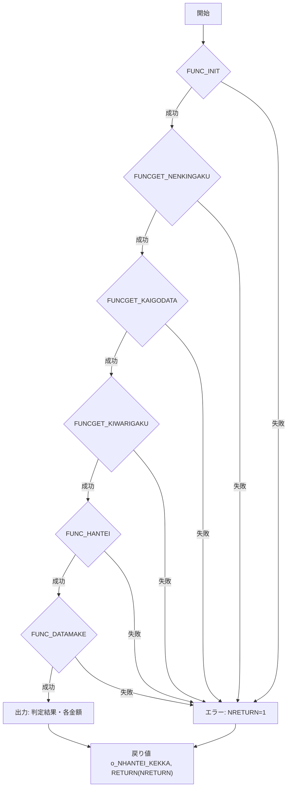

# ZLBFCCALHALFHT 関数 Wiki  

**ファイルパス**  
`D:\code-wiki\projects\new_test\ソース\ZLBFCCALHALFHT.SQL`

---

## 目次
1. [概要](#概要)  
2. [業務情報](#業務情報)  
3. [パラメータ一覧](#パラメータ一覧)  
4. [定数・コード一覧](#定数コード一覧)  
5. [内部サブルーチン](#内部サブルーチン)  
   - [FUNC_INIT](#func_init)  
   - [FUNCGET_NENKINGAKU](#funcget_nenkingaku)  
   - [FUNCGET_KAIGODATA](#funcget_kaigodata)  
   - [FUNCGET_KIWARIGAKU](#funcget_kiwarigaku)  
   - [FUNC_HANTEI](#func_hantei)  
   - [FUNC_DATAMAKE](#func_datamake)  
6. [メイン処理フロー](#メイン処理フロー)  
7. [戻り値・出力](#戻り値出力)  
8. [エラーハンドリング](#エラーハンドリング)  
9. [変更履歴](#変更履歴)  
10. [作成者・バージョン](#作成者バージョン)  

---

## 概要
`ZLBFCCALHALFHT` は、**国民健康保険税（国保税）** における **賦課計算 1/2 判定** を行うストアドファンクションです。  
対象世帯の年金受給額・介護保険料・期割額を取得し、以下の 4 つの判定結果のいずれかを算出します。

| 判定コード | 意味 |
|-----------|------|
| 1 | 1/2 以下（介護保険料＋期割額 ≤ 年金保険料） |
| 2 | 1/2 以上（介護保険料＋期割額 > 年金保険料） |
| 3 | 金額 0（介護保険料が 0） |
| 4 | 期割保険料が 0 |

---

## 業務情報
| 項目 | 内容 |
|------|------|
| 業務名 | ZLB（国民健康保険税） |
| PG名 | ZLBFCCALHALFHT |
| 名称 | 賦課計算1/2判定処理 |
| 処理概要 | 国保税保険料が特別徴収可能かどうか判定する |
| 作成者 | ZCZL.DUYUANYUAN |
| 作成日 | 2023/08/01 |
| バージョン | 0.2.000.000 |

---

## パラメータ一覧
| パラメータ | モード | 型 | 説明 |
|------------|--------|----|------|
| `i_NKOKU_SETAI_NO` | IN | NUMBER | 国保世帯番号 |
| `i_NDANTAICD` | IN | NUMBER | 算定団体コード |
| `i_NCHOTEINENDO` | IN | NUMBER | 年度 |
| `i_NNENDOBUN` | IN | NUMBER | 年度分 |
| `i_NTSUCHI_NO` | IN | NUMBER | 通知書番号 |
| `i_NKOJIN_NO` | IN | NUMBER | 個人番号 |
| `i_VSYS_TANMATSU_NO` | IN | NVARCHAR2 | 端末番号 |
| `o_NHANTEI_KEKKA` | OUT | NUMBER | 判定結果 (1‑4) |
| **戻り値** | RETURN | NUMBER | 処理結果 (0: 正常, 1: 異常) |

---

## 定数・コード一覧
| 定数名 | 値 | 説明 |
|--------|----|------|
| `c_NGYOMUCD_KOKU` | 15 | 業務コード（国保税） |
| `c_NGYOMUSCD_TOK` | 2 | 業務詳細コード（特徴） |
| `c_NGYOMUSCD_FU` | 1 | 業務詳細コード（普徴） |
| `c_SHORI_OK` | 0 | 正常終了コード |
| `c_SHORI_NG` | 1 | 異常終了コード |
| `c_KEKKA_UNDER` | 1 | 判定 1/2 以下 |
| `c_KEKKA_OVER` | 2 | 判定 1/2 以上 |
| `c_KEKKA_ZERO` | 3 | 判定 金額0（介護特徴中止） |
| `c_KEKKA_HZERO` | 4 | 判定 特徴依頼保険料0円 |
| `c_TUTI_IRAI` | `'01'` | 通知内容コード（特徴依頼情報） |
| `c_TUIKA_IRAI` | `'31'` | 通知内容コード（特徴追加依頼通知） |

---

## 内部サブルーチン

### FUNC_INIT
- **目的**: 変数の初期化とリターンコードのリセット。  
- **戻り値**: `TRUE`（正常） / `FALSE`（例外）  

### FUNCGET_NENKINGAKU
- **目的**: `ZLBTTOKU_HOSOKU` から対象個人の **年金受給額** と **基礎年金番号** を取得。  
- **ロジック**:  
  1. `i_NKOJIN_NO` と `i_NCHOTEINENDO` で絞り込み。  
  2. `SAKUSEI_BI` の最大日付を取得し、最新レコードを取得。  
- **エラー**: 取得失敗時は `IRTN := c_SHORI_NG` とし `FALSE` を返す。

### FUNCGET_KAIGODATA
- **目的**: 介護保険料（`KINGAKU1`, `KINGAKU2`）を取得。  
- **手順**:  
  1. `NKISO_NENKIN_NO`（基礎年金番号）で `ZLBT_TOKUTYO_TAISHOUSHA` を降順取得。  
  2. 最初のレコードの `KINGAKU1` → `NKAIGOHOKENRYO`、`KINGAKU2` → `NKAIGOHOKENRYO2` に格納。  
- **エラー**: カーソル操作例外時は `IRTN := c_SHORI_NG`。

### FUNCGET_KIWARIGAKU
- **目的**: 期割額（10月分）を算出。  
- **主要ステップ**  
  1. **年税合計**（基礎、介護、支援、子ども）を `ZLBTKIHON_CAL` 系テーブルから取得し `NwKIWARIMAE` に合算。  
  2. **仮徴収額**（普徴・特徴）を `ZLBTKIBETSU_N` から取得し `NwCHOTEI_K` に合算。  
  3. `NwKIWARIMAE < NwCHOTEI_K` ならエラー (`FALSE`)。  
  4. 8月特徴金額の有無で計算分岐し、最終的に `NKIWARIGAKU`（10月期割額）を決定。  
- **変更点**: 2025/08/11 に子ども子育て支援金対応として `NwKIHON_KDM`（子ども税）を加算。

### FUNC_HANTEI
- **目的**: 判定ロジック（1/2 判定）を実行。  
- **ロジック**  
  1. `IGETSUGAKU = FLOOR(((NNENKINGAKU / 6) / 2))` → 月額年金額（小数点以下切捨て）。  
  2. `NKAIGOHOKENRYO = 0` → 判定 3 (`c_KEKKA_ZERO`)。  
  3. それ以外は `NKAIGOHOKENRYO + NKIWARIGAKU` と `IGETSUGAKU` を比較し、判定 1 または 2 を設定。  
  4. `NKIWARIGAKU = 0` の場合は判定 4 (`c_KEKKA_HZERO`) に上書き。  

### FUNC_DATAMAKE
- **目的**: 判定結果と取得データを `ZLBWHALFHANTEI` テーブルへ INSERT。  
- **INSERT カラム**  
  `i_NKOKU_SETAI_NO, i_NCHOTEINENDO, i_NNENDOBUN, NHANTEI_KEKKA, NKAIGOHOKENRYO, NKIWARIGAKU, NNENKINGAKU, i_NTSUCHI_NO, i_NKOJIN_NO`

---

## メイン処理フロー

---

## 戻り値・出力
| 項目 | 内容 |
|------|------|
| `RETURN(NRETURN)` | `0` → 正常終了、`1` → いずれかのサブルーチンでエラー |
| `o_NHANTEI_KEKKA` (OUT) | 判定結果コード (1‑4) |
| `DBMS_OUTPUT.PUT_LINE` | 判定結果、受給年金額、介護保険料、期割額（10月）をコンソールに出力 |

---

## エラーハンドリング
- 各サブルーチンは **例外捕捉** (`WHEN OTHERS THEN`) で `FALSE` を返し、`IRTN` に `c_SHORI_NG` を設定。  
- メイン処理はサブルーチンの戻り値が `FALSE` の場合、`NRETURN` を `1` に設定し以降のステップをスキップ。  
- 最終的に `RETURN(NRETURN)` が呼び出し元へ返される。

---

## 変更履歴
| 日付 | 担当者 | 内容 |
|------|--------|------|
| 2025/08/11 | ZCZL.WANGMING | 子ども子育て支援金対応（`NwKIHON_KDM` 追加、判定ロジック更新） |
| 2025/08/11 | ZCZL.WANGMING | 同上：`FUNCGET_KIWARIGAKU` に子ども税合算ロジックを追加 |
| 2025/08/11 | ZCZL.WANGMING | 同上：コメント `ADD 1.1.200.000` を付与 |
| 2023/08/01 | ZCZL.DUYUANYUAN | 初版作成 |

---

## 作成者・バージョン
- **作成者**: ZCZL.DUYUANYUAN  
- **バージョン**: 0.2.000.000  

---

### 関連リンク
- [ZLBFCCALHALFHT 関数本体](http://localhost:3000/projects/new_test/wiki?file_path=D:\code-wiki\projects\new_test\ソース\ZLBFCCALHALFHT.SQL)  

---  

*この Wiki は Code Wiki プロジェクトの標準テンプレートに従い、提供されたコード情報のみを元に作成されています。*