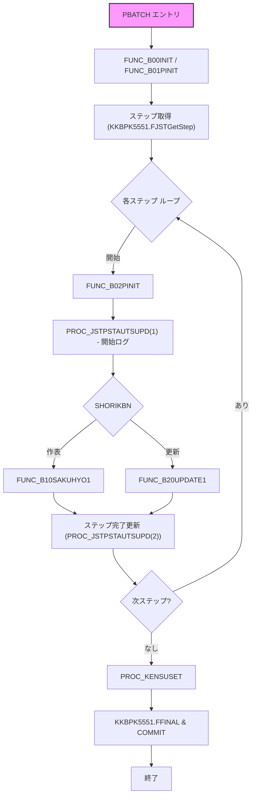

# ZLBPC10200B.SQL – 本算定課税計算バッチ

## 概要
`ZLBPC10200B.SQL` は、国保税（ZLB）子システムにおける **本算定課税計算** を実行するバッチプログラムです。  
画面から入力された年度・基準日を基に、処理対象の抽出、臨時テーブル生成、CSV 出力、ログ記録、排他制御、バックアップ等を一連のフローで行います。

---

## 目次
1. [責務](#責務)  
2. [主要定数・グローバル変数](#主要定数・グローバル変数)  
3. [主要関数・プロシージャ](#主要関数・プロシージャ)  
4. [バッチ全体フロー](#バッチ全体フロー)  
5. [作表処理 (`FUNC_B10SAKUHYO1`)](#作表処理-func_b10sakuho1)  
6. [更新処理 (`FUNC_B20UPDATE1`)](#更新処理-func_b20update1)  
7. [件数表出力 (`PROC_KENSUSET`)](#件数表出力-proc_kensuset)  
8. [エラーハンドリング・ログ](#エラーハンドリング・ログ)  
9. [外部依存・呼び出しパッケージ](#外部依存・呼び出しパッケージ)  

---

## 責務
- **本算定課税計算** の実行（バッチ起動 → パラメータ取得 → 条件読込 → 処理範囲更新 → 排他制御 → 計算対象抽出 → 臨時表生成 → CSV 出力 → ログ記録）  
- **作表処理** と **更新処理** の切り替え制御（`g_rJSTP.SHORIKBN` に基づく）  
- **件数表** の集計・出力  
- **年度バックアップ**（対象テーブルの Truncate / Create）  

---

## 主要定数・グローバル変数
| 定数/変数 | 用途 |
|-----------|------|
| `c_BATCH`, `c_OK`, `c_ERR` | バッチ処理のステータス |
| `c_NRTN_*` | 各種戻りコード |
| `g_nJOBNUM` | ジョブ番号 |
| `g_sTANTOCODE` | 担当者コード |
| `g_sWSNUM` | 端末番号 |
| その他（日付・カウント・エラーメッセージ用ローカル変数） | 各処理で一時的に使用 |

---

## 主要関数・プロシージャ
| 関数/プロシージャ | 主な役割 |
|-------------------|----------|
| `FUNC_SETLOG` | ステップ名・ステータス・SQL エラー・メッセージを統一的にログへ書き込む |
| `FUNC_B00INIT` | バッチ起動時の初期化 |
| `FUNC_B01PINIT` | 画面パラメータ取得 |
| `FUNC_B02PINIT` | ステップ情報取得 |
| `PBPRMCHK` | 画面入力（年度・基準日）の妥当性チェック |
| `PROC_JSTPSTAUTSUPD` | バッチステップテーブルの状態更新（開始・終了・CSV 情報） |
| `FUNC_B11CSV` | CSV/印刷ファイル出力とステップ状態記録 |
| `KOJIN_CHENGEKBN` | 月次資格区分変更（`ZLBSKCALCGKBN` 呼び出し） |
| `FNC_SHORI_HANI` | 処理範囲テーブルの既処理チェック |
| `JYOKEN_READ` | システム条件テーブル `ZLBTJOKEN` 読み込み、決算月算出 |
| `FUNC_TESTCAL` | テストモード時の計算対象抽出のみ実行 |
| `FUNC_BACKUP` | 重要テーブルの年度バックアップ（存在すれば Truncate、無ければ CREATE） |
| `FUNC_CHECK_KENSUU` | カウントテーブル `g_oKENSU_LIST` のチェック・更新 |
| `FUNC_B10SAKUHYO1` | **作表処理** のメインロジック |
| `FUNC_B20UPDATE1` | **更新処理**（簡易ロジック） |
| `PROC_KENSUSET` | カウントリスト走査 → 外部パッケージ `KKBPK5551.FSETCNT` で件数表書き込み |
| `PBATCH` | バッチエントリーポイント、全体制御・例外捕捉・トランザクション管理 |

---

## バッチ全体フロー

---

## 作表処理 (`FUNC_B10SAKUHYO1`)

### 目的
本算定課税計算の **作表** を実行し、以下を完結させる  
- 臨時テーブル作成  
- バックアップ取得  
- 複数段階の課税計算（`ZLBSKMAKETMP` 〜 `ZLBSCHHCALPACK`）  
- 資格区分更新 (`KOJIN_CHENGEKBN`)  
- 計算対象世帯リスト生成・CSV 出力  
- 処理範囲テーブル更新  
- 排他ロック取得・解放  

### 主な手順
1. **開始ログ** → `FUNC_SETLOG("作表処理開始")`、グローバル変数初期化  
2. **画面パラメータ解析** → 調整年度・基準日・決算月算出  
3. **システム条件読込** (`JYOKEN_READ`) → 失敗時はエラーログ記録・終了  
4. **処理範囲更新** (`ZLBFCCALSRUPD`) → 戻り値に応じてログ出力  
5. **排他ロック確認** (`FNC_SHORI_HANI`) → 既処理が無ければ `ZLBFKHAITACLR` でロッククリア  
6. **排他ロック取得** (`ZLBFKHAITASET`) → 成功/競合をログに残す  
7. **臨時テーブル作成** (`ZLBSKMAKETMP` など) → バックアップ (`FUNC_BACKUP`) も同時実行  
8. **課税計算パック実行**  
   - `ZLBSKCALPACK`、`ZLBSCH4CALPACK`、`ZLBSCHHCALPACK`  
9. **資格区分変更新** (`KOJIN_CHENGEKBN`) → `ZLBSKCALCGKBN` 呼び出し  
10. **CSV 出力** (`FUNC_B11CSV`) → ステップ状態更新  
11. **処理範囲テーブル更新** (`ZLBFCCALSRUPD` 再実行)  
12. **排他ロック解放** (`ZLBFKHAITACLR`)  
13. **終了ログ** → `FUNC_SETLOG("作表処理完了")`  

---

## 更新処理 (`FUNC_B20UPDATE1`)

- **目的**：作表以外の簡易更新ロジック（例：ステータス変更や補助的なデータ更新）  
- **手順**：開始ログ → 必要な更新処理（詳細はコード内実装） → 終了ログ  
- **備考**：本バッチでは作表処理と同様にステップ状態は `PROC_JSTPSTAUTSUPD` で管理されます。

---

## 件数表出力 (`PROC_KENSUSET`)

1. グローバルカウントリスト `g_oKENSU_LIST` を走査  
2. 各エントリに対し外部パッケージ `KKBPK5551.FSETCNT` を呼び出し、件数表へ書き込み  
3. 完了後、`KKBPK5551.FFINAL` でバッチ全体を確定し `COMMIT`  

---

## エラーハンドリング・ログ

| 場面 | 例外種別 | 処理 |
|------|----------|------|
| パラメータ不正 (`PBPRMCHK`) | `ePARAMETEREXCEPTION` | `FUNC_SETLOG` にエラーメッセージ、ステップ状態 `c_ERR` |
| システム条件読込失敗 (`JYOKEN_READ`) | `eSYSTEMEXCEPTION` | エラーログ記録、ステップ状態更新、以降処理中止 |
| 排他ロック競合 (`ZLBFKHAITASET`) | `eLOCKEXCEPTION` | 競合ログ出力、リトライまたは中止（実装に依存） |
| 任意の業務例外 (`eSHORIEXCEPTION`) | 任意 | `PROC_JSTPSTAUTSUPD(2, o_nRESULT)` でエラーコード設定、`ROLLBACK` へ遷移 |
| 予期しない例外 | `eUNKNOWN` | 例外捕捉 → `FUNC_SETLOG` にスタックトレース、`ROLLBACK`、ステップ状態 `c_ERR` |

全てのステップは `FUNC_SETLOG` により **開始・成功・失敗** を明示的に記録し、`PROC_JSTPSTAUTSUPD` でステップテーブルに反映されます。

---

## 外部依存・呼び出しパッケージ

| パッケージ | 主な機能 |
|------------|----------|
| `KKBPK5551.FJSTGetStep` | バッチステップ情報取得 |
| `KKBPK5551.FSETCNT` | 件数表へのレコード書き込み |
| `KKBPK5551.FFINAL` | バッチ最終処理（コミット） |
| `ZLBSKCALCGKBN` | 資格区分変更新ロジック |
| `ZLBFCCALSRUPD` | 処理範囲テーブル更新 |
| `ZLBFKHAITASET / ZLBFKHAITACLR` | 排他ロック取得・解除 |
| `ZLBSKMAKETMP` 〜 `ZLBSCHHCALPACK` | 各課税計算パック（詳細は別モジュール） |

---

## まとめ

`ZLBPC10200B.SQL` は、**本算定課税計算** をバッチで実行するための中心的ロジックを提供します。  
- **作表処理** と **更新処理** を `SHORIKBN` に応じて切り替え、  
- **排他制御**・**バックアップ**・**CSV 出力**・**件数表集計** を一括管理し、  
- **統一ログ (`FUNC_SETLOG`)** と **ステップテーブル (`PROC_JSTPSTAUTSUPD`)** により、実行状況とエラーを可視化します。

本ドキュメントは、提供されたサマリ情報に基づき作成しています。実装の詳細はソースコードをご参照ください。