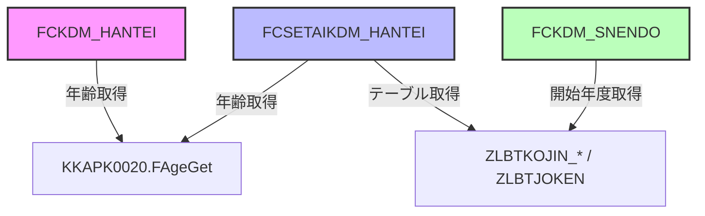

# ZLBPK00140 パッケージ (子ども判定パッケージ)

## 1. パッケージ概要
**業務名** : ZLB_国民健康保険税  
**パッケージ名** : ZLBPK00140  
**目的** : 国保子ども子育て支援金均等割減額に係る子ども判定ロジックを提供する。  
**作成者** : ZCZL.HAODAPENG  
**バージョン** : 1.1.200.00  

このパッケージは、以下の3つの関数を通じて子どもの人数・年齢区分・対象年度を取得し、呼び出し側に「正常(0)／異常(1)」のステータスを返す。

| 関数名 | 主な役割 |
|--------|----------|
| `FCKDM_HANTEI` | 指定世帯・年度・基準日・宛名番号から子どもの人数を取得 |
| `FCSETAIKDM_HANTEI` | 18歳以上・未満の人数を月別・資格区分別に集計 |
| `FCKDM_SNENDO` | 子ども・子育て支援金対象の開始年度を取得 |

---

## 2. 変更履歴
| 日付 | 担当者 | 内容 |
|------|--------|------|
| 2025/10/16 | ZCZL.LIUHUAJUN | `FCSETAIKDM_HANTEI` における資格区分判定ロジックを拡張（除外コードに `5,30,40` を追加） |
| 2025/08/11 | ZCZL.HAODAPENG | 初版作成（バージョン 1.1.200.000） |

---

## 3. 関数一覧・詳細

### 3.1 `FCKDM_HANTEI`
**概要** : 子どもの人数を取得する共通部品。  
**シグネチャ**

```plsql
FUNCTION FCKDM_HANTEI (
    i_NKOKU_SETAI_NO   IN NUMBER,      -- 国保世帯番号
    i_NNENDOBUN        IN NUMBER,      -- 年度分
    i_NKIJUNBI         IN NUMBER,      -- 基準日
    i_NKOJIN_NO        IN NUMBER,      -- 宛名番号
    o_NKDM_CNT         OUT NUMBER,     -- 子ども人数（OUT）
    i_VSYS_TANMATSU_NO IN NVARCHAR2    -- 端末番号
) RETURN NUMBER;                     -- 0: 正常, 1: 異常
```

**主な処理フロー**
1. `o_NKDM_CNT` を 0 で初期化。  
2. 基準日 `INENREI_KIJUN_BI` を ` (i_NNENDOBUN+1)*10000 + 331` で算出。  
3. `GABTATENAKIHON` から生年月日取得。取得できなければ `ZLBWSETAIIN` から代替取得。取得失敗時は `0`。  
4. 生年月日が有効 (`>0`) の場合、`KKAPK0020.FAgeGet` で年齢算出。  
5. 年齢 ≤ 18 → `o_NKDM_CNT` をインクリメント。  
6. 例外 (`OTHERS`) が発生したら `1` を返す。

**戻り値**  
- `0` : 正常終了  
- `1` : 例外発生  

**備考**  
- `i_VSYS_TANMATSU_NO` は端末識別に使用され、代替取得時の検索条件に組み込まれる。  
- `KKAPK0020.FAgeGet` は外部年齢計算関数（本パッケージ外）に依存。

---

### 3.2 `FCSETAIKDM_HANTEI`
**概要** : 18歳以上・未満の人数を月別・資格区分別に集計し、文字列化して返す。  
**シグネチャ**

```plsql
FUNCTION FCSETAIKDM_HANTEI (
    i_NKOKU_SETAI_NO   IN NUMBER,      -- 国保世帯番号
    i_NNENDOBUN        IN NUMBER,      -- 年度分
    i_NKIJUNBI         IN NUMBER,      -- 基準日
    i_NSHORIKBN        IN NUMBER,      -- 処理区分
    i_VSYS_TANMATSU_NO IN NVARCHAR2,   -- 端末番号
    o_V18IJYO_CNT      OUT NVARCHAR2, -- 18歳以上人数（文字列、15項目×2桁）
    o_V18SITA_CNT      OUT NVARCHAR2, -- 18歳未満人数（文字列、15項目×2桁）
    i_VTABLENAME       IN NVARCHAR2,  -- テーブル名（省略可）
    i_NCHOTEI_NENDO    IN NUMBER,      -- 調定年度
    i_NTSUCHI_NO       IN NUMBER       -- 通知書番号
) RETURN NUMBER;                     -- 0: 正常, 1: 異常
```

**ロジック概要**
1. **初期化**  
   - 15 要素の配列 `MUNDER_18_NINSU`（未満） と `MOVER_18_NINSU`（以上） を `0` で埋める。  
2. **SQL 動的生成**  
   - `i_VTABLENAME` が指定されていない場合は `i_NSHORIKBN` に応じて `ZLBTKOJIN_CAL` または `ZLBTKOJIN_ZER` を使用。  
   - 必要なカラム（`KOJIN_NO`、各月・資格区分）を SELECT。  
   - 条件は世帯番号・年度・端末番号・調定年度・通知書番号。  
3. **カーソルでレコード取得**  
   - 各レコードについて生年月日を `GABTATENAKIHON` → `ZLBWSETAIIN` の順で取得。取得失敗時は `0`。  
   - 生年月日が有効なら `KKAPK0020.FAgeGet` で年齢算出。  
   - **年齢 ≥ 18** → 各月・資格区分の「対象外コード」(`2,5,30,32,40,42` など) で除外判定し、該当項目の `MOVER_18_NINSU` をインクリメント。  
   - **年齢 < 18** → 同様に `MUNDER_18_NINSU` をインクリメント。  
4. **集計結果文字列化**  
   - `LPAD(...,2,'0')` で 2 桁ゼロ埋めし、1〜15 の順に連結して `o_V18IJYO_CNT` / `o_V18SITA_CNT` に設定。  
5. **例外処理**  
   - 例外発生時はカーソルをクローズし `1` を返す。

**重要な変更点（2025/10/16）**  
- 除外コードに `5,30,40` が追加され、判定ロジックが拡張された。  
- `NEW_SHIK_KBN` と `F4_SHIK_KBN` の除外コードにも同様に追加。

**戻り値**  
- `0` : 正常終了  
- `1` : 例外発生  

**出力例**（仮想）  
```
o_V18IJYO_CNT = '010203040506070809101112131415'   -- 18歳以上人数（各項目2桁）
o_V18SITA_CNT = '000000000000000000000000000000'   -- 18歳未満人数（各項目2桁）
```

---

### 3.3 `FCKDM_SNENDO`
**概要** : 子ども・子育て支援金対象の開始年度（最小 NENDO）を取得する。  
**シグネチャ**

```plsql
FUNCTION FCKDM_SNENDO (
    o_KAISHI_NENDO OUT NUMBER   -- 開始年度（OUT）
) RETURN NUMBER;                -- 0: 正常, 1: 異常
```

**処理内容**
1. `ZLBTJOKEN` テーブルから `KINTO_KDM18 <> 0` のレコードの最小 `NENDO` を取得。  
2. 取得できなければ `9999` を代替値として設定。  
3. 正常終了時は `0`、例外時は `o_KAISHI_NENDO = 9999` として `1` を返す。

**戻り値**  
- `0` : 正常終了  
- `1` : 例外発生  

---

## 4. 使用上の注意点

| 項目 | 内容 |
|------|------|
| **エラーハンドリング** | すべての関数は例外捕捉 (`WHEN OTHERS`) で `1` を返す。呼び出し側は戻り値で正常/異常を判定すること。 |
| **OUT パラメータ** | `FCKDM_HANTEI` は子ども人数、`FCSETAIKDM_HANTEI` は 30 桁（15項目×2桁）の文字列、`FCKDM_SNENDO` は開始年度を `OUT` で取得。 |
| **依存テーブル** | `GABTATENAKIHON`, `ZLBWSETAIIN`, `ZLBTKOJIN_CAL`, `ZLBTKOJIN_ZER`, `ZLBTJOKEN` など。テーブル構造変更はロジックに影響する可能性がある。 |
| **外部関数** | `KKAPK0020.FAgeGet`（年齢計算）に依存。変更があれば本パッケージの結果も変わる。 |
| **パラメータ制約** | `i_VSYS_TANMATSU_NO` は端末番号として必須。`i_VTABLENAME` が `NULL` の場合は内部テーブルが自動選択される。 |

---

## 5. 関数間の関係図



---

## 6. 参照リンク（例）

- `[FCKDM_HANTEI](http://localhost:3000/projects/new_test/wiki?file_path=D:/code-wiki/projects/new_test/ソース/ZLBPK00140B.SQL#FCKDM_HANTEI)`
- `[FCSETAIKDM_HANTEI](http://localhost:3000/projects/new_test/wiki?file_path=D:/code-wiki/projects/new_test/ソース/ZLBPK00140B.SQL#FCSETAIKDM_HANTEI)`
- `[FCKDM_SNENDO](http://localhost:3000/projects/new_test/wiki?file_path=D:/code-wiki/projects/new_test/ソース/ZLBPK00140B.SQL#FCKDM_SNENDO)`

---

## 7. まとめ

`ZLBPK00140` は国民健康保険の子ども・子育て支援金に関わる判定ロジックを集中管理するパッケージです。  
- **子ども人数取得** → `FCKDM_HANTEI`  
- **年齢区分別集計** → `FCSETAIKDM_HANTEI`（2025/10/16 のロジック拡張に注意）  
- **対象開始年度取得** → `FCKDM_SNENDO`  

呼び出し側は戻り値 `0/1` と `OUT` パラメータを組み合わせて、正常/異常を判定しつつ結果を利用してください。  

---